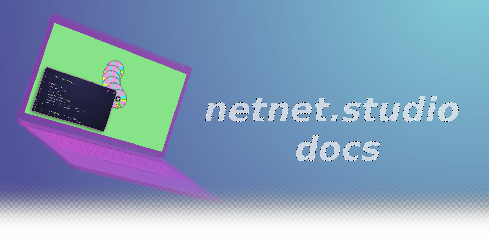

## Welcome netizens to the netnet.studio docs! Here you'll find general info on what netnet is and how it works, as well as guides for how to help support and contribute to the netnet.studio repo!

#[I'm a student and want to learn how to use netnet.studio!]()

#[I'm a teacher and want to learn how to use netnet in my class!]()

#[I'm a developer and want to help contribute to this repo!]()

#[I'm an advocate and want to help support this project!](advocates)
