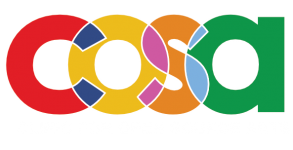

# Support netnet.studio

netnet.studio is a <a href="http://netizen.org" target="_blank">netizen.org</a> project being designed and developed by <a href="http://nickbriz.com/" target="_blank">Nick Briz</a> and <a href="https://www.sarahrooney.net/" target="_blank">Sarah Rooney</a> with help from a handful of [other contributors](https://github.com/netizenorg/netnet.studio/graphs/contributors). The current <BETA-3.0> version of netnet was made possible thanks to financial support from the <a href="http://clinicopensourcearts.com/" target="_blank">Clinic for Open Source Arts</a>, the <a href="https://www.saic.edu/academics/departments/contemporary-practices" target="_blank">Contemporary Practices Department at the School of the Art Institute of Chicago</a> and <a href="https://cms.uchicago.edu/undergraduate/major-minor/minor-media-arts-and-design" target="_blank">Media Arts and Design at the University of Chicago</a>.

|  |  |  |
|:---:|:---:|:---:|

netnet.studio is constantly evolving and is currently seeking financial support from individuals and institutions who benefit from open access to this platform and who support our mission to reclaim creative agency on the Internet and to nurture and grow the hand-crafted expressive parts of the World Wide Web.

### How can institutions support?

netnet.studio has been implemented into University curriculum around the world during our beta development phase (see testimonials below). We are aiming to launch for the public summer 2025. As part of this launch, we will begin offering support and integration services for universities and other educational institutions looking to use netnet.studio in their curriculum. Our institutional license fee of $2,500 a year includes a yearly pedagogy workshop and curricular plan customized for your institution's educational needs. Email hi@netizen.org for more info.

### How can individuals support?

netnet.studio is a non-profit open-source project and needs all the help it can get! There are different ways you can help support it's development as an individual:

- if you notice any bugs or have any feedback feel free to open a new [issue](https://github.com/netizenorg/netnet.studio/issues) on this repo or send us an email: hi@netizen.org

- if you'd like to contribute edits to the project yourself check out our [contributors guide](../developers)

- if you're an educator teaching web art/design coding courses for creatively inclined individuals and want to help us improve netnet by providing feedback/thoughts/examples or please reach out so we can chat about what that can look like: hi@netizen.org

- netizen.org is a 501(c)3 tax deductible organization, so you might consider making a donation! We're working on setting up multiple avenues for financial contributions alongside our official launch this summer 2025, but for now you can make donations to the org using our [donorbox](https://donorbox.org/netizen) account or get in touch if you'd like to help support netnet.studio directly: hi@netizen.org

### Testimonials

For almost 5 years, netnet.studio has been in beta, meaning we’ve been developing it iteratively alongside creative coding educators and students using it in the classroom. It’s been used by hundreds of students across multiple universities including, The School of the Art Institute of Chicago, the University of Chicago and the University of Waterloo among others. Professors like Greg Smith (University of Waterloo) have noted the difference using netnet in their classroom’s have made.

> I'm once again using netnet in my web design class! I've had 120 Uwaterloo students happily working with it this semester and 60 more slated for the winter. It's going really well, and I can't stress enough how netnet makes my life a little easier! 🙂 [...] THANK YOU AGAIN FOR MAKING THIS GREAT TOOL! Please pass my gratitude on to your team.

Students have also responded overwhelmingly positive in anonymous evaluations, saying:

> netnet is awesome and really thoughtfully built.

> Since it’s a browser–based platform, I didn’t have to worry about setting up a local development environment or dealing with installations, which made it much easier to focus on learning HTML and CSS right away. The simplicity of NetNet allowed me to jump straight into writing and experimenting with code without being overwhelmed by extra setup steps.

> "[netnet] was one of the coolest parts of the class. I really appreciated the interactivity of the software, as it allowed me to learn by doing as well as listening."

> "The interactive tutorials were fun and more engaging! Even though I have experience with HTML and CSS from other classes, I still felt that it was a good foundation for rally understanding how HTML works and found the tutorials valuable."

> "Coding on netnet really highlights the creative aspect of coding and obscures the more boring technical parts like git and version control etc. I think it's great for beginners and super user-friendly."

> "netnet was great because I could see all of my changes take place immediately [this] allowed me to experiment more."

> I liked netnet as a code editor! I've previously used other IDEs and netnet was really use[r] friendly [...] Its integration with github was really easy to use and understand especially considering the amount of issues I've previously run into with merge conflicts and even just setting up the github repo.

> I found that the interactive nature of the NetNet.Studio tutorials really helped reinforce my understanding of the material. Being able to experiment with code in real–time and immediately see the results made the learning process more engaging and hands–on. Instead of just passively watching a video or reading through instructions, I was actively writing and adjusting code, which helped solidify key concepts.

> My favorite aspect of this course (and the one that contributed the most to my learning) was NetNet! I loved the lectures, tutorials, etc. There's limitless information to be found/explored on that website. HTML and CSS were explained in a way that was thorough and easily accessible.
