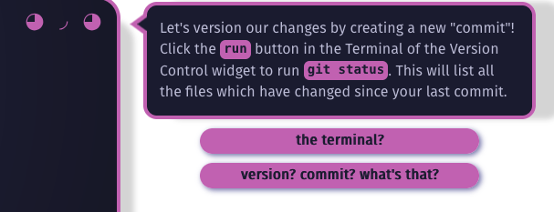

# Convos and Passages

In these docs we'll explain how to edit "passages" (netnet's speech bubbles) as well as how to create new "convos" (a collection of passages associated with a specific widget). These docs assume you've already done the following steps covered in the prior section of [The Docs](the-docs.md):

1. You have [created a GitHub account](https://github.com/signup) and you're currently [logged in](https://github.com/login) to your account.
2. You've created a "[fork](https://docs.github.com/en/pull-requests/collaborating-with-pull-requests/working-with-forks/fork-a-repo)" of the [netnet.studio repo](https://github.com/netizenorg/netnet.studio)

If you're an experienced open source developer and have already [setup a local development environment](contributor-workflow.md), you can alternatively create and/or edit these files in your code editor, refer instead to the [Convo System](convo-system.md) docs.

## Finding a passage in the code

Maybe you noticed a type-o in one of netnet's passage, or maybe you just think there's something that could be worded in a clearer way. In any case, the first step is finding that passage in the code base. All of netnet's passage's are part of of a `convo.js` file associated with one of netnet's widgets, which can all be found in the [`www/widgets`](https://github.com/netizenorg/netnet.studio/tree/main/www/widgets) folder. With a couple of exceptions:

- any passage where netent explains a piece of code that you double-clicked on, these are part of the netitor sub-module.
- any passage where netnet explains an issue or error that appear when you click on an error marker in the line-number gutters, these are also part of the netitor sub-module

It might be immediately obvious which widget the passage you want to edit is a part of, but if not you can always **use GitHub's repo search bar** to find the file that contains the line of dialogue you're trying to edit. We recommend placing your search withing quote marks `" "` to limit the search results to match the exact phrase. However, If you type the entire quoted passage into the GitHub search bar you might not be able to find it, this is because the way the passage appears in the code may not exactly match what you see in netnet, consider this example:



This passage contains a couple of pink code blocks, this is because the passage contains markup, in this case `<code>` tags around the words "run" and "git status". Additionally, because most of the passage's text are stored as JavaScript strings in the code, often when a word has an apostraphe like the first word in this passage, "Let's" it needs to be *escaped* in the code, which means it acctually looks like this: `Let\'s`. Here is how that passage actually appears in netnet's code:

```js
content: 'Let\'s version our changes by creating a new "commit"! Click the <code>run</code> button in the Terminal of the Version Control widget to run <code>git status</code>. This will list all the files which have changed since your last commit.',
```

For this reason it's best to search for small snippets of text from a passage and avoid including any of the markuped text (like code blocks and links) as well as any text with apostraphes in it.

⚠️ **NOTE**: if you have trouble searching your fork of the repo, because GitHub hasn't yet indexed your code for example, you can always [search our main repo](https://github.com/search?q=repo%3Anetizenorg%2Fnetnet.studio&type=code) instead. Your fork should be more or less an exact copy of ours (until you start to make changes) so the convo file should be in the same place.

## Editing a passage

...
