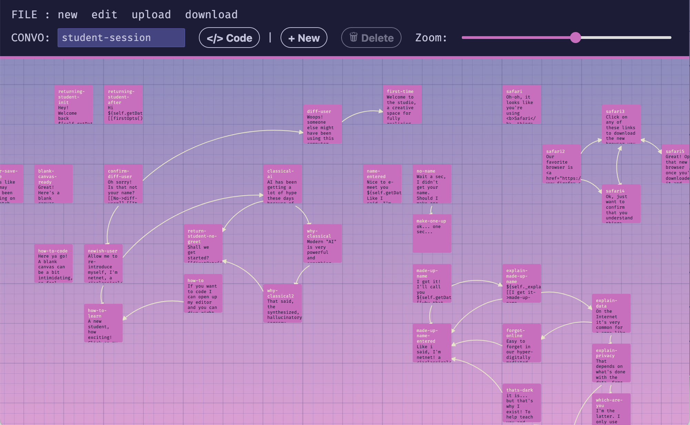
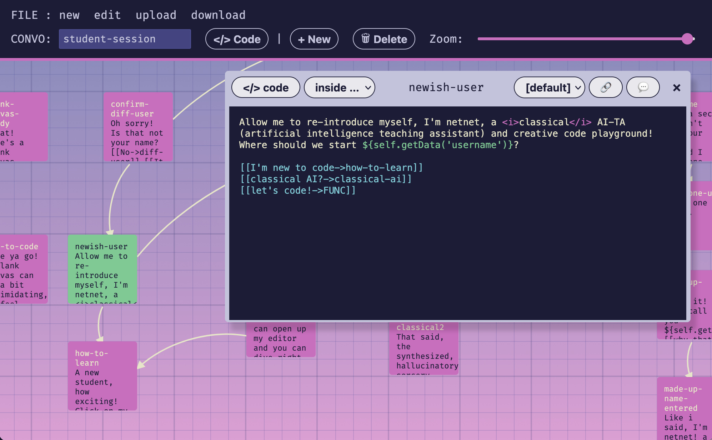
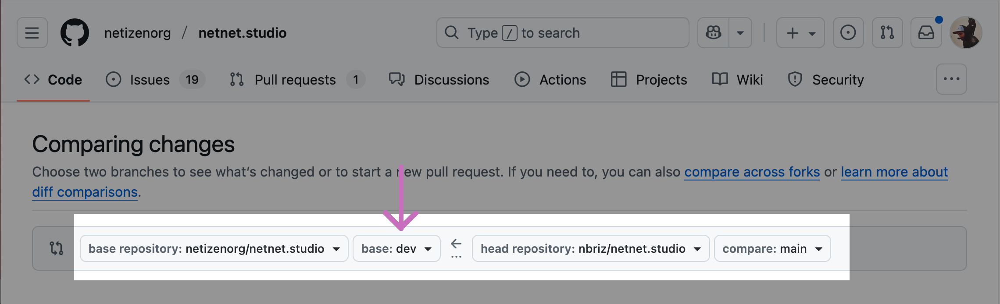

# Convos and Passages

In these docs we'll explain how to edit "passages" (netnet's speech bubbles) as well as how to create new "convos" (a collection of passages associated with a specific widget). These docs assume you've already done the following steps covered in the prior section of [The Docs](the-docs.md):

1. You have [created a GitHub account](https://github.com/signup) and you're currently [logged in](https://github.com/login) to your account.
2. You've created a "[fork](https://docs.github.com/en/pull-requests/collaborating-with-pull-requests/working-with-forks/fork-a-repo)" of the [netnet.studio repo](https://github.com/netizenorg/netnet.studio)
3. You understand how to create a PR (pull request)

If you're an experienced open source developer and have already [setup a local development environment](contributor-workflow.md), you can alternatively create and/or edit these files in your code editor, refer instead to the [Convo System](dialogue-system.md) docs.

## Finding a passage in the code

Maybe you noticed a type-o in one of netnet's passage, or maybe you just think there's something that could be worded in a clearer way. In any case, the first step is finding that passage in the code base. All of netnet's passage's are part of of a `convo.js` file associated with one of netnet's *Widgets*, which can all be found in the [`www/widgets`](https://github.com/netizenorg/netnet.studio/tree/main/www/widgets) folder, or part of one of netnet's *Guided Templates* found in [`data/templates`](https://github.com/netizenorg/netnet.studio/tree/main/data/templates) . With a couple of exceptions:

- any passage where netent explains a piece of code that you double-clicked on, these are part of the netitor sub-module.
- any passage where netnet explains an issue or error that appear when you click on an error marker in the line-number gutters, these are also part of the netitor sub-module

*✏️ TODO: link to netitor sub-module docs when ready*

It might be immediately obvious which widget the passage you want to edit is a part of, but if not you can always **use GitHub's repo search bar** to find the file that contains the line of dialogue you're trying to edit. We recommend placing your search withing quote marks `" "` to limit the search results to match the exact phrase. However, If you type the entire quoted passage into the GitHub search bar you might not be able to find it, this is because the way the passage appears in the code may not exactly match what you see in netnet, consider this example:


This passage contains a couple of pink code blocks, this is because the passage contains markup, in this case `<code>` tags around the words "run" and "git status". Additionally, because most of the passage's text are stored as JavaScript strings in the code, often when a word has an apostraphe like the first word in this passage, "Let's" it needs to be *escaped* in the code, which means it acctually looks like this: `Let\'s`. Here is how that passage actually appears in netnet's code:

```js
content: 'Let\'s version our changes by creating a new "commit"! Click the <code>run</code> button in the Terminal of the Version Control widget to run <code>git status</code>. This will list all the files which have changed since your last commit.',
```

For this reason it's best to search for small snippets of text from a passage and avoid including any of the markuped text (like code blocks and links) as well as any text with apostraphes in it.

⚠️ **NOTE**: if you have trouble searching your fork of the repo, because GitHub hasn't yet indexed your code for example, you can always [search our main repo](https://github.com/search?q=repo%3Anetizenorg%2Fnetnet.studio&type=code) instead. Your fork should be more or less an exact copy of ours (until you start to make changes) so the convo file should be in the same place.

## Editing a passage

You could theoretically edit the `convo.js` file directly on GitHub, just like you do with [the docs](the-docs.md), but since these are `.js` files (not `.md` files) the stakes are a little higher. For example, if you make a "syntax error" in JavaScript (like forgetting the `\` before any apostrophes) it might not be immediately obvious on GitHub and thus could cause an error in the convo logic. It's also difficult to understand which passages connect to which other passages when viewing them in these linear JavaScript files. For these reasons we've created a special widget in netnet called the **Convo Maker** which is used to create and edit these convo files.

To find it, search for "Convo Maker" in netnet's search bar. The widget should open up in it's own pop-up window (outside of netnet), it will be empty by default, but you can click on the "edit" button in the menu to find the specific `convo.js` file you're looking for and open it.



The **Convo Maker** displays all the passages in a conversation file on a two-dimensional grid, with connections between them illustrating which passages link to others. You can use the trackpad to scroll around in the space and can also pinch-to-zoom (or use the zoom slider) to zoom in/out. Clicking on a passage *selects* it, after selecting on a passage you can move it around or delete it. To edit a passage you must double-click it.



This will open up a passage window, there you can edit the text and have the option to write HTML markup and call JavaScript functions.

- **HTML Markup**: like the word `<i>classical</i>` for example, written inside the `<i>` element
- **JavaScript**: use the `${...}` syntax to call upon JavaScript functions which return text. In the screen shot above we're calling `${self.getData('username')}` which will display the specific user's name. Here "self" refers to the current widget whose convo we're editing. In this particular case we're editing the *Student Session Data* widget which has a `getData()` method which can be used to call on any locally saved data. Another common use of the `${...}` JavaScript syntax in these passages is `${utils.hotKey()}` which will display "CMD" for Mac users or "CNTRL" for Windows and Linux users.

To preview your changes you can press the 💬 button on the top right of the passage window, this will display the current passage in netnet.studio so you can review how it will appear in-situ and make sure all the HTML and JS works correctly.

## Editing passage options

Below the passage's content you define what options (the user choices) should appear along side it by writing the options within `[[ ]]` brackets. An option starts with the text you want to display in it, for example "I'm new to code" followed by an arrow `->` and the the name of the passage you want to link to, for example "how-to-learn", together that would be written like this: `[[I'm new to code->how-to-learn]]`

If you want an option that will simply close the passage, rather than link to another one, you can write "HIDE" in place of the name of another passage, for example `[[got it!->HIDE]]`

At times you might come across options that point to "FUNC", this is short for "function" and means that this option will run a custom function when selected (more on that below)

## Other passage details

Most of the time you'll likely only need to edit a passage's text or options, but on occasion there are passages that may need other details addressed. Below you'll find info on all the other editable details as they appear from right-to-left in the passage window:

- 💬 - clicking this button triggers a netnet dialogue so you can preview the passage in netnet.studio.
- 🔗 - when creating a new passage with links to passage id's that don't exist yet, clicking this will auto-create those linked passages
- **[default]** - this keeps netnet's layout as it is, but you can optionally specify a specific layout to guarantee netnet always orients to it when this passage is displayed.
- *passage-id* - you can click on the passage id in order to edit it. Keep in mind, this will break any links from other passages (you'll need to edit those "options" to re-link to the new id)
- **<\/> code** - clicking this will open a code editor so you can edit the code for the specific selection (in the drop-down list next to it). There are different aspects to a passage that can take some optional code, see the Code section below for more on that.


## <\/> code

The last part of the Convo Maker's interface worth discussing are the two **<\/> code** buttons. Both of these open up a code editor, but they each edit different parts of the convo's code. A convo doesn't *need* to have any special code defined, this is optional when a convo file or specific passage requires some special behavior.

#### global <\/> code

The **<\/> code** button in the main menu (next to the convo's name) is the global code editor, here you can define any variables or functions that you want to use in any (or multiple) passages. For example, you can create a variable called `time` that is then referenced in different passages using the `${time}` syntax discussed before. Or you could make a function that returns a string and call it in a passage the same way `${specialString()}`, in some convos there are special functions defined which create custom options object, like the `firstOpts()` function in the Student Session convo, this can then be called inside a single option like `[[firstOpts()]]`

#### passage <\/> code

The **<\/> code** button which appears in the passage's menu is used to edit code for different aspects of the passage. You can specify what part of the passage's code you want to edit by updating the drop-down next to it before clicking the button. Here are the different parts of the passages code you may want to edit:

- **inside netnet**: this is the first choice in the list, any code you add to this will appear inside netnet's code editor the moment the passage appears. But be careful, this will delete any code the student is working on and replace it with your code, this should only be used in very specific circumstances.
- **before run function**: this second choice allows you to code a function which will run just before the passage is displayed. For example you might want to close a specific widget that was opened by a previous passage `WIDGET['name'].close()` or run some other action before the passage appears.
- **after run function**: the third, and last default choice, in the list is an optional function you can define which wil run after the passage is desplayed. For example, maybe you want to switch to a different netnet face like `NNW.menu.switchFace('error')` or run some other action after the passage appears.
- **OPT: ...** : if you create an option in your passage which points to "FUNC", for example `[[let's code!->FUNC]]`, this will automatically add an item to the drop down list below the last one with the prefix *OPT:* followed by the options text, for example `OPT:let's code`. Selecting it and clicking the **<\/> code** button will allow you to write a custom function to run if/when the user selects this option. Keep in mind that if you don't include a call to `e.goTo()` (to link to another passage) or `e.hide()` within you function, then the passage will remain visible even after the student selects this option. Below is an example of what this custom option function might look like:

```js
const LINK = (e) => {
  self._wantsColor = true
  WIDGETS.open('color-widget')
  e.hide()
  // or e.goTo('passage-id')
}
```

## Download the convo.js file

When you're finished working on the passage, or simply want to save your changes locally, you can click the **download** button in the main menu. This will download a file called `convo.js` with all of the conversion data (all the passages, options, code, etc). When you want to keep working on that convo later you can visit netnet.studio, open the **Convo Maker** widget and click **upload** to load up the `convo.js` file you downloaded and had been previously working on.

## Creating a PR (pull request)

As discussed in the section which covers editing [these Docs](the-docs.md) themselves, when you want to share any updates/changes you've made with us you'll need to create a "pull request" on GitHub, letting us know that there are some updates in your "fork" ready for us to review and considering merging into netnet's main code base. But before you do that, you'll need to include these changes in your fork:

1. Login to your GitHub account and navigate to your fork of the netnet.studio repo.
2. Navigate to the folder this convo belongs to, maybe that's a specific widget in the `www/widgets` folder, or maybe that's a specific template in the `data/templates` folder.
3. Once there, you'll click on the **Add file** button and select your `convo.js` file
4. Leave a commit message and click the green <b style="color: green">Commit Changes</b> button to officially add it to your fork.

Then, to create a new PR click on the "Pull requests" tab in the top menu and then the green <b style="color: green">New pull request</b> button


On the next page make sure that the repo listed on the right side of the arrow is yours (yourname/netnet.studio) and on the left side of the arrows is ours (netizenorg/netnet.studio). The arrow between the repos should be pointing *from* your fork and *to* ours.



**⚠️ NOTE:** Updates to convos are something we'll want to test on our dev server before deploying to the main public server, for this reason you'll want to make sure to select **base: dev** next to the *netizenorg/netnet.studio* repo, so that the request comes to our *dev* branch and not our *main* branch. The branch selected next to your forked repo should be whichever branch you committed this new change to (likely your *main*).


## Code Review

Once the PR (pull request) is open we'll get a notification to review your request. If we notice any issues or have any feedback for you, we'll leave a comment on the PR page with instructions. If it's not clear you can respond to us and we can start a conversation on the PR page. Once you've addressed our feedback you won't need to create another PR, any time you commit a new change it will automatically get added to the open PR. When those changes are ready for us to re-review, simply leave a comment on the PR letting us know!

Once we accept and "merge" your pull request, the PR page gets closed and you'll officially become a [contributor](https://github.com/netizenorg/netnet.studio/graphs/contributors) to netnet.studio!
