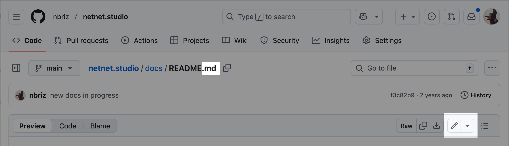
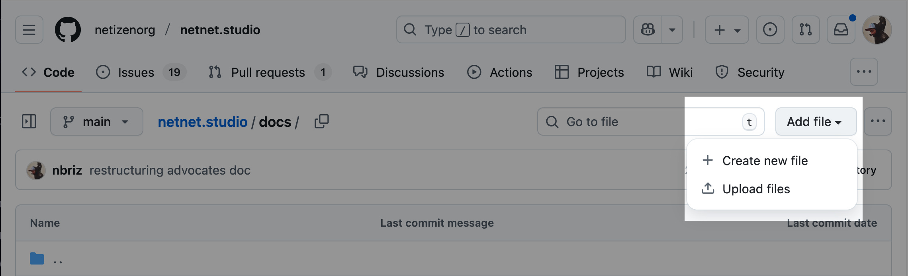
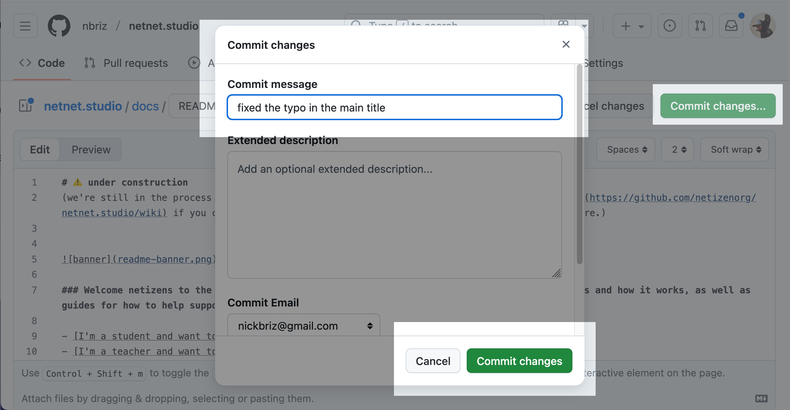
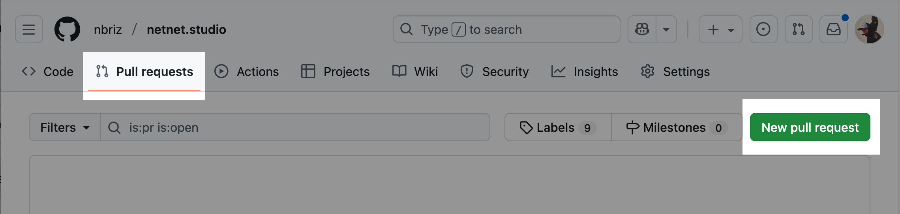
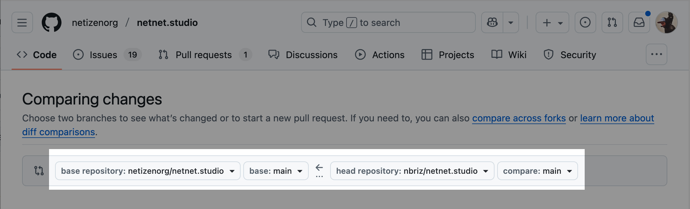

# The Docs

In this doc we're going to explain how to get started contributing to the netnet.studio code base by creating or editing these docs (meta). If you're an experienced open source developer and have already [setup a local development environment](contributor-workflow.md), you can of course create and/or edit the docs in your code editor. If you've never contributed to an open source project before than this is a great place to start!

## Forking the repo

"Forking the repo" is open-source parlance for *creating your own copy of the original code base*, this "fork" (or linked copy of our code) is where you'll make any edits or additions which you'll later contribute back to netnet's main code base in the form of a "pull request" (a request for us to incorporate the changes from your fork into our main code base). All this "forking" and "pulling" takes place on GitHub, which is the platform we use to mange our open source development workflow. It's workth mentioning that GitHub isn't the only platform for this, but it is the most popular.

1. The first step is to [create a GitHub account](https://github.com/signup) or [log-in to your account](https://github.com/login) if you already have one.

2. Once you're logged into your GitHub account, all you need to do is [click here to fork our repo](https://github.com/netizenorg/netnet.studio/fork), after that you'll have a copy of netnet.studio's entire code base on your own account which is linked back to ours (ie. a "fork"). Alternatively, you could navigate to our repo [https://github.com/netizenorg/netnet.studio](https://github.com/netizenorg/netnet.studio), as you would any other on GitHub, and click the "Fork" button towards the top right of the page.

## Editing a file

Once you've forked the repo, the main page for your fork will list the root directory's file structure. There you should see a folder called "docs", click on that folder to navigate into it, and then click on any sub-folder until you find the file you want to edit.

You may notice that there are two files for every doc, the `.md` file and the `.html` file. These have the same name (except for the starting page in any folder, which would be called `README.md` and `index.html` respectively). What you want to edit are the `.md` files. The `.html` files get generated with a special script (which we'll return to later).

Once you find the doc you want to edit, clidk on it's `.md` file to view it in it's own page. Once there, you should see a pencil icon towards the top-right of the file, once you click on that you'll go into edit mode.



The first thing you'll notice is that the docs are written in a language called "markdown", you can [learn the syntax here](https://markdownguide.offshoot.io/basic-syntax/), but here's the basic idea:

```markdown
# headers start with a hash-symbol
### sub-headers have more hash-symbols

Paragraphs are written like normal text like this. If you want something *italicized* you use single asterisks, and for **bold** you use double-asterisks. To create links you write the [word to link](https://url-to-link-to.com) like that. If you want to include an image you would do something similar except with an exclamation mark to start as seen below.


And if you want a bulleted list you can use dashes:
- like this
- and this
```

This is a very common language for writing code documentation. If you've made a project with netnet you might recognize this syntax from the projects' "README" file.

## Creating a new file

To create a new doc, navigate to the folder you want to create it in (either the "docs" folder or one of it's sub-folders) and press the **Add file** button towards the top-right. Here you will have the option to upload a file (like images for example) or create a new file. Give the new file a name, make sure it's all lower-case , no spaces (use dashes instead) and ends with a `.md` extension. Then write the file's content in [markdown syntax](https://markdownguide.offshoot.io/basic-syntax/) and commit your file.



## Commiting your changes

Just as we "commit" changes in netnet when working on a project, we'll need to commit changes here on GitHub after editing any of the `.md` files. To do so you'll click the green <b style="color: green">Commit Changes</b> button towards the top-right. This will open up a modal asking you to leave a commit message.



## Creating a "pull request"

After you've made all the necessary commits and you're ready to submit this back to the main code base you can create a "pull request". This is a *request* for us (the "maintainers" of the netnet.studio repository) to review your code, and if everything looks good to *pull* your changes into our main code base.

To create a new PR (short for "pull request") click on the "Pull requests" tab in the top menu and then the green <b style="color: green">New pull request</b> button



On the next page make sure that the repo listed on the right side of the arrow is yours (yourname/netnet.studio) and on the left side of the arrows is ours (netizenorg/netnet.studio). The arrow between the repos should be pointing *from* your fork and *to* ours.



You may see an additional drop-down list next to the repository names, usually with the label "main". This refers to the "branch" of code, a concept we'll cover in a later doc, for now just know that it should say "main" on both sides. When we discuss more complex contributes later on we'll discuss how we'll be using different branches to ensure the process stays organized.

## Code Review

Once the PR (pull request) is open we'll get a notification to review your request. If we notice any issues or have any feedback for you, we'll leave a comment on the PR page with instructions. If it's not clear you can respond to us and we can start a conversation on the PR page. Once you've addressed our feedback you won't need to create another PR, any time you commit a new change it will automatically get added to the open PR. When those changes are ready for us to re-review, simply leave a comment on the PR letting us know!

Once we accept and "merge" your pull request, the PR page gets closed and you've officially become a [contributor](https://github.com/netizenorg/netnet.studio/graphs/contributors) to netnet.studio!
