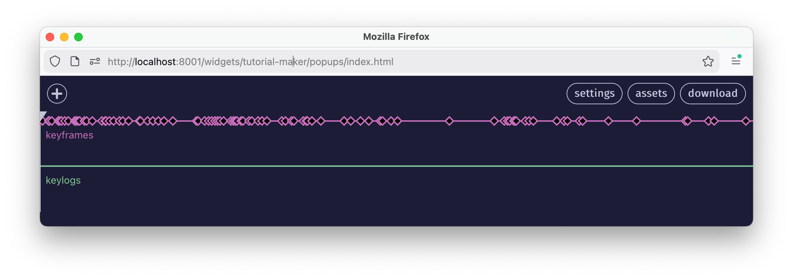

# Creating Interactive Tutorials

<div class="warning">
⚠️ <b>UNDER CONSTRUCTION</b> ⚠️
<br>
these docs are still in progress, if you can't find what you're looking for, or something seems out of date, please <a href="https://github.com/netizenorg/netnet.studio/issues" target="_blank">open an issue</a>
</div>

One of netnet.studio's most dynamic educational components are the interactive tutorials. You can create your own interactive tutorials using our "Tutorial Maker" widget which can be found by using netnet's  search. Like other *meta widgets* (widgets used to create stuff in netnet, like the Convo Maker and the Demo Maker for example), the Tutorial Maker will open in a separate pop-up window (so make sure you've got pop-ups approved in your browser tab's permissions).

## metadata

When the Tutorial Maker first opens you'll be given the option to either create a <b>new</b> tutorial or <b>open</b> a previously saved tutorial. When creating a new tutorial you'll be asked to fill in the following:
- **Tutorial ID**: (required) this id is used behind the scene in a number of places, it should be one word (meaning no spaces) all lower case.
- **Title**: (required) this is the actual public facing title of the tutorial
- **Subtitle**: (optional) any sort of sub-title you may also want listed along side the tutorial's name
- **Author's Name**: (optional) this is your name, when students launch a tutorial netnet will usually credit the author of that tutorial using the value placed in this field
- **Author's Website URL**: (optional) a link to your personal website for further attribution
- **Description**: (optional) this is metatdat displayed in the Learning Guide as well as spoken by netnet when the student asks it what the tutorial is about.
- **Keywords**: (optional) if the student uses netnet's search field, these keywords are used to ensure the tutorial shows up in the results if student searches any of those terms

## video

Once you've filled out the metadata, you'll be taken to a screen where you'll be given the option to either record a video or upload a video file (either as an `.mp4` or `.webm` file). You can think of this video as the tutorial's backbone or timeline, later you'll create widgets and keyframes that appear at various points in the timeline of this video.

If you choose to record a video, rather than uploading one you previously created, you'll also be given the option to "include keylogs", what this means is that anything you type into netnet's editor as you're recording the video generates "keylog" objects which will be included in the timeline (presented in the next step) of the video. If you plan to create an un-edited tutorial, where you code and explain things in realtime, this is a great option.

## keyframes



✏️ TODO: explain keframes

✏️ TODO: explain keylogs

✏️ TODO: explain assets

✏️ TODO: make a note about asset paths: `TUTORIAL_MAKER/[tutorial-id]/`

✏️ TODO: explain download

## tutorial .zip structure

Tutorials are saved as **.zip** files. Like any other zip file, these can be unpacked, the files inside can then be edited and re-zipped (compressed) before loading it in the Tutorial Maker. While this is not advised (it's best to use the Tutorial Maker widget to edit tutorials as described above), there may come a time where some manuel file editing is necessary. Below you'll find important information to keep in mind when performing maneul edits.

Inside the unzipped tutorial folder you'll find the metadata file `tutorial.json` as well as the tutorial's main video file, which will be either a `.mp4` or `.webm` file named after the tutorial's **ID**  (same as the folder) as well as the tutorial's thumbnail, also named after the project's **ID**. You may also have an `init.js` file (explained further below) as well as any other files/folders you uploaded as assets.

```
📁 tutorial-ID
|_ tutorial.json
|_ tutorial-ID.webm (or .mp4)
|_ tutorial-ID.jpg
|_ init.js (optional)
|_ (other folders/files optional)
```

The `tutorial.json` file is the project's main metadata file, the top-level object in the JSON file looks as follows:

```js
{
  metadata: {}, // project's metadata
  widgets: {}, // any custom widgets
  keyframes: [], // array of keyframe objects
  keylogs: [], // array of keylog objects
}
```

The `metadata` property is an object contaning the following:

```js
{
  id: "what-is-code", // this is the project's ID, it should never change
  title: "What Is Code?", // title of the tutorial
  subtitle: '', // optional sub-title
  duration: 1081.274833, // in seconds
  author: "Nick Briz",
  authorURL: "https://nickbriz.com",
  jsfile: true, // if this tutorial contains a init.js (see below)
  description: "Whether or not you've ever written code, this tutorial is a good place to start. In addition to orienting you to the studio (this website), in this lesson we'll cover what code is from both a technical perspective but also a conceptual one. Like all human languages, coding languages are multipurpose. In the same way that the English language can be used to write history, laws, love letters or poems, coding languages can be used to express more than just software. Here we'll introduce the particular creative and experimental vector view that we'll be approaching code from throughout these tutorials.",
  keywords: [
    "code",
    "intro",
    "netnet",
    "coding",
    "computers",
    "programming"
  ],
  thumbnails: [
    "images/analyticalengine.jpg",
    "images/punch-card-machine.jpg"
  ],
  "videoFormat": "webm"
}
```

While most fields, like `author`, `authorURL`, `description`, `keywords`, and `thumbnails` can all be manually edited, there a few we need to be careful with. For example, the project's **id**, because this gets referrenced in multiple places and mis-matched id names will create bugs. If you do need to change it for some reason, you'll also need to change every other instance of it, ex: the zip/folder's name, the video file's name and the thumbnail file's name.

Another example is the duration property. This should always match the length of the tutorial's main video file (in seconds) and should only ever be manually edited in the event that a new video file (of a different duration) was manually added to this folder. In that instance you should also make sure the video file is either an `.mp4` or `.webm` (which should also be noted in the `videoFormat` property) and that its name matches the value of the **id**  field.

The `jsfile` property should only be set to `true` if the project contains an `init.js` file (more on that below)

Returning back to the top-level object, the `widgets` object contains references to all the widgets created using the tutorial maker, a widget. If need be, `title` and `innerHTML` are safe to edit manually, but changing the `key` would also require changing any references to it in any given keyframe object.

```js
// widgets object
{
  "metamedia-commons": { // widget id name
    "key": "metamedia-commons", // key must match widget id
    "title": "The WWWeb", // to be displayed in widget's title bar
    "innerHTML": "<h1>\n  Metamedia Commons\n</h1>", // widget's content
    "type": "Widget"
  },
  // other widgets listed here...
}
```

The `keyframes` propperty contains an array of keyframe objects. Tthe keyframe's properties are safe to change manually if necessary. which look like this:

```js
// a keyframe object (inside the top-level "keyframes" array)
{
  // the timecode in seconds for this keyframe
  timecode: 322.218371,
  // optional keyframe name
  name: "",
  // object containing the HyperVideoPlayer size/position
  video: {
    width: 521,
    height: 447,
    left: 119,
    bottom: 54,
    zIndex: 118
  },
  // array of widgets in this keyframe && their size/position
  widgets: [
    {
      key: "binary",
      width: 200,
      height: 245,
      right: 191,
      top: 48,
      zIndex: 122
    },
    {
      key: "gates1",
      width: 662,
      height: 389,
      left: 50,
      top: 39,
      zIndex: 124
    }
  ],
  // netitor state for this keyframe (code, scroll position, spotlight values and layout)
  netitor: {
    code: "<style>\n  body::after {\n    content: \"\";\n    position: fixed;\n    left: 15px;\n    top: 15px;\n    width: 50vw;\n    height: 50vw;\n    background-color: white;\n    border-color: black;\n    border-style: solid;\n    border-width: 10px;\n    border-radius: 50%;\n  }\n</style>",
    scrollTo: { x: 0, y: 100 },
    spotlight: ['12', '24-28'],
    autoType: false,
    layout: "separate-window"
  },
  // the netnet windows size/posiition (when it's in 'welcome' or 'separate-window' layout)
  netnet: {
    right: 43,
    top: 158,
    width: 721,
    height: 445
  }
}
```

The `keylogs` propperty contains an array of keylog objects. This ones much simpler, int just contains the `timecode` for when this code apperas, and the `code` which should get injected into the editor at that time.

```js
{
  timecode: 392.314305,
  code: "<center>\n  \n  <p>This is a Circle</p>\n</center>"
}
```

### init.js

The `init.js` file is an optional file you can include in your project in order to run arbitrary code in the netnet.studio enironment during a tutorial. This code runs in the global scope and can interact with any of netnet's features. To include one create a file called `init.js` in your preferred code editor and drag+drop it into the assets manager. The file should look like this:

```js
window.TUTORIAL = {
  init: () => {
    // method which gets called soon as the tutorial loads
  },
  callbacks: {
    463.020014: () => {
      // functions which get called at specific time codes (like keyframes)
    }
  }
}
```

The `init` function runs as soon as the tutorial loads and the `callbacks` object contains a dictionary of timecodes with an arbitrary function to execute at that time in the tutorial. Both `init` and `callbacks` are optional, so you don't need to include both if you only need to make use of one or the other.
