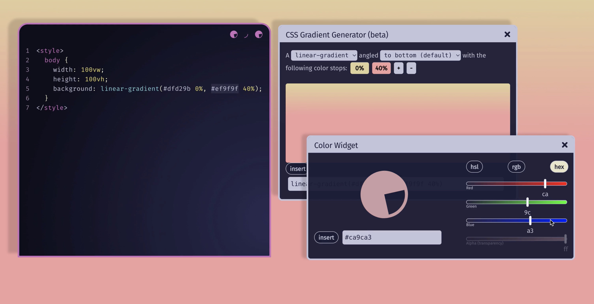
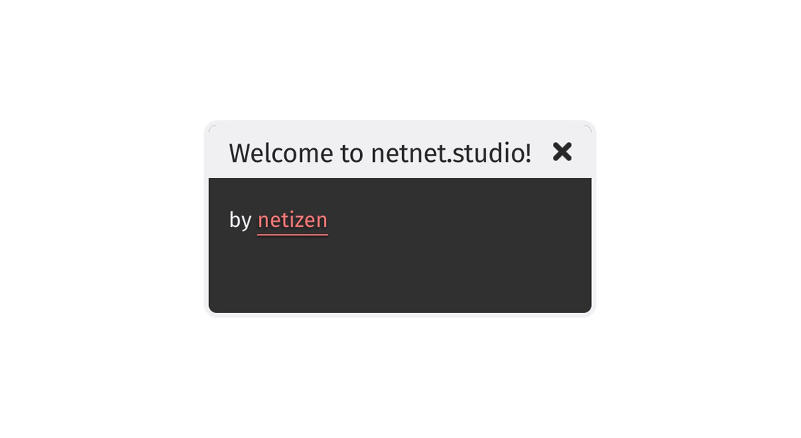
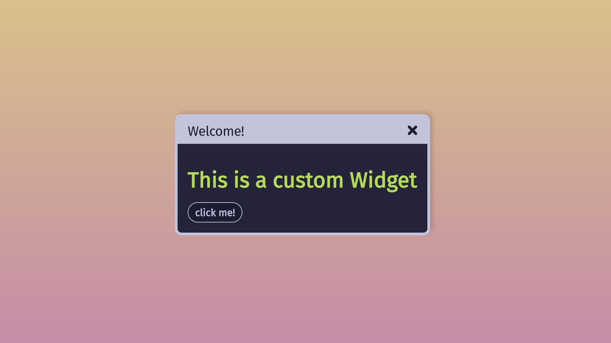
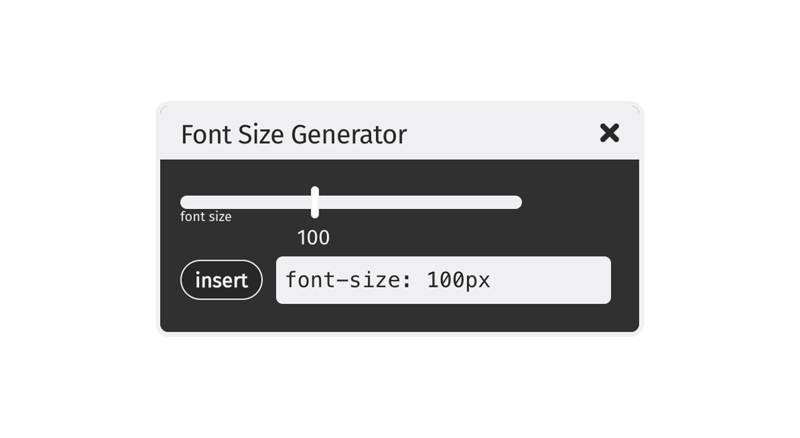

# Widgets



Widgets are multi-purpose independent windows that can be thought of as "plugins" or "addons" for netnet.studio. They're used in a variety of contexts to provide functions, utilities, and information. For example, widgets can be used during tutorials to open up various media types (images, videos, gifs, audio, texts, 3D objects, etc). They can also be their own miscellaneous utilities, such as a widget that explains some concept using interactive graphics. Widgets can also be GUIs that interact with the netitor: for example, a widget that generates snippets of CSS code. The sky's the limit!

The docs below explain how to use netnet's Widget system for creating all sorts of widgets.

- [The Widget System](#system)
- [Creating a Simple Widget](#simple)
  - [Properties and Methods](#props)
- [Creating a Video Widget](#video)
- [Creating a Custom Widget](#custom)
- [Creating a Code Generator Widget](#code-gen)

## <a id="system"></a> The Widget System

All of the logic for netnet's Widget system can be found in [www/widgets/index.js](https://github.com/netizenorg/netnet.studio/tree/main/www/widgets/index.js), so any bug fixes or modifications to the Widget system itself would happen there. The system creates a global `WIDGETS` object. You can test this object in your browser's developer console. Copy+paste one of the following lines for a demo:

```
// Returns an array of all the files currently loaded into the system.
// These are the actual JavaScript files used to generate different
// sorts of widgets. These are essentially the various widget classes.
// (to load a custom widget class see Creating a Custom Widget below)
WIDGETS.loaded

// Returns an array keys of every widget currently instantiated in netnet.
// These are the ids of the actual widgets themselves (rather than the
// JavaScript files used to generate them)
WIDGETS.instantiated

// Returns an array with references to the actual widgets objects
// themselves (ie. the instantiated widgets).
WIDGETS.list()
```

Widgets can be made by either using functionality provided in the `WIDGETS` object (detailed in [Simple](#simple)), or extending the base `Widget` class (detailed in [Custom](#custom)).

## <a id="simple"></a> Creating a Simple Widget



To create a new widget, use the `WIDGETS`'s `.create()` method. `.create()` takes an object that requires a `key` property with a unique id that isn't being used by another widget, in addition to any number of optional properties. You can use `WIDGETS.instantiated` to reference a list of unique keys for all currently instantiated widgets, and your key can be anything other than those. To test this out, try copy+pasting the following into the browser's developer console:

```
// to create the widget first run
WIDGETS.create({
  key: 'welcome-widget',
  title: 'Welcome to netnet.studio!',
  innerHTML: 'by <a href="https://netizen.org" target="_blank">netizen</a>'
})

// then to open the widget run
WIDGETS.open('welcome-widget')

// you can work on two at the same time
WIDGETS.create({ key: 'just-a-test' }).open()

// you can also close it by calling
WIDGETS.close('just-a-test')
```

### <a id="props"></a> Properties and Methods
Widgets have various properties, all of which can be set in the constructor by passing any of the following options to the `.create()` method:

```
WIDGETS.create({
  type: 'Widget',         // type of widget
  key: 'my-new-widget',   // the widget's id
  title: 'My New Widget', // the widget's title bar
  innerHTML: 'hi there',  // the widget's window content. html string or HTMLElement.
  closable: true,         // allows user to close the widget
  resizable: true,        // allows user to resize the widget
  listed: true,           // should widget be listed in search results?
  left: 20,               // position from left (x axis)
  right: 20,              // position from right (x axis) instead of left
  top: 20,                // position from top (y axis)
  bottom: 20,             // position from bottom (y axis) instead of top
  zIndex: 100,            // stacking value (z axis)
  width: 500,             // widget window width
  height: 500             // widget window height
})
```

You can interact with any instantiated widget directly by calling `WIDGETS['my-new-widget']`. Alternatively, you could pull it from the `WIDGETS.list()` array (as mentioned above). You can call the widget's various properties like `WIDGETS['my-new-widget'].resizable` or `WIDGETS['my-new-widget'].width`, and there is also a read-only `WIDGETS['my-new-widget'].opened` property which returns a boolean (`true` if the widget is currently opened, `false` if not).

You can also call various methods on an instantiated widget, such as:

```
// to open and close the widget
// similar to WIDGETS.open(id) and WIDGETS.close(id)
WIDGETS['my-new-widget'].open()
WIDGETS['my-new-widget'].close()

// to select some html content in the widget's innerHTML
WIDGETS['my-new-widget'].$(selector)
// for example this would return all the <a> elements with a class of pizza
WIDGETS['my-new-widget'].$('a.pizza')

// you can change the widget's position (and really any CSS)
// by passing an object to the update method, for example
WIDGETS['my-new-widget'].update({
  top: 50,
  right: 50
})

// if you want to animate/transition the change in position
// pass the number of milliseconds as a second argument
WIDGETS['my-new-widget'].update({ left: 10 }, 1000)

// by default, if no position is set in the constructor
// widgets will open in the center of the page.
// if you ever want to recenter a widget, call
WIDGETS['my-new-widget'].recenter()

// if there are other widgets on the page obstructing your widget
// you can call it to the front of the z stacking order
WIDGETS['my-new-widget'].bring2front()
```

Widgets also have an event system (like pretty much everything in netnet), which works like this:

```
// to register a new event listener
WIDGETS['my-new-widget'].on(event, callback)

// // you can listen for the 'open' and 'close' events for example
WIDGETS['my-new-widget'].on('open', (eve) => {
  console.log('My New Widget was just opened!')
})

// you can also unsubscribe the listener after it's called
// if you don't want it to ever fire on that event again
WIDGETS['my-new-widget'].on('open', (eve) => {
  console.log('My New Widget was just opened!')
  eve.unsubscribe()
})

// you can make up your own events to...
WIDGETS['my-new-widget'].on('test', (eve) => {
  console.log(eve.data)
})
// and then to emit a custom event you can do
WIDGETS['my-new-widget'].emit('test', { data: 100 })
```

## <a id="video"></a> Creating a Video Widget (Simple)

TODO (SIMPLE)

## <a id="custom"></a> Creating a Custom Widget



When the options and functionality provided above aren't enough for what you need to do with a widget, maybe because you need a method or property that doesn't exist yet, you can create your own custom widget by extending the `Widget` base class.

Custom widgets need to be defined in the [www/js/widgets](https://github.com/netizenorg/netnet.studio/tree/main/www/widgets) directory. An example file structure can be found in [www/js/widgets/example-widget](https://github.com/netizenorg/netnet.studio/tree/main/www/widgets/example-widget). Every custom widget lives in its own folder within /widgets/, where the folder name in kebab case (`example-widget`) must match your new widget class name in pascal case (`ExampleWidget`). Other optional files such as styles and optional netnet dialogue (`convo.js`, more to come on this later) live here too.
```
www/widgets/
 |
 |- example-widget/
    |- convo.js
    |- index.js
    |- styles.css
```

 `index.js` should look something like this. Note the unique `key` for our new widget must match its parent folder's name, both in kebab case.

```
class ExampleWidget extends Widget {
  constructor (opts) {
    super(opts)

    this.key = 'example-widget'
    this.title = 'Welcome!'
    this.innerHTML = `
      <h1>This is a custom Widget</h1>
      <button>click me!</button>
    `

    this.$('button').addEventListener('click', () => this.random())
  }

  random () {
    const r = Math.random() * 255
    const g = Math.random() * 255
    const b = Math.random() * 255
    this.$('h1').style.color = `rgb(${r}, ${g}, ${b})`
  }
}

window.ExampleWidget = ExampleWidget
```

Assuming you've saved the file above, you can check and see if your widget works by opening your browser's dev console and running:

```
WIDGETS.open('example-widget')
```

This is a contrived example, but you can see how this widget includes a custom method `random()` which wouldn't be possible using the simple widget approach explained above. You could now also do `WIDGETS['example-widget'].random()` in the dev console to run that custom method.

**NOTE:**

If you had tried to run `WIDGETS['example-widget'].random()` before `WIDGETS.open('example-widget')` you would have gotten an error saying `WIDGETS['example-widget']` is undefined. That's because the `.open()` method is doing some extra work behind the scenes.

If you had opened your dev console and checked the `WIDGETS.loaded` first, you'd notice that it does not include your new `example-widget/index.js` file. This is because netnet doesn't load all the custom widgets by default (loading all the widgets on page load delays the initial load time unnecessarily). Instead the widget system provides a load method, for example: `WIDGETS.load('example-widget')`, to load the widget when you need it. This will add it to the `WIDGETS.loaded` array, as well as instantiating it automatically, which adds it to the `WIDGETS.instantiated` array, at which point you can interact with it like any other widget.

The difference between `WIDGETS['example-widget'].open()` and `WIDGETS.open('example-widget')`, is that the latter checks to see if the widget has been loaded first and if not loads it for you, and then instantiates it before opening it.

The reason the widget system also instantiates it automatically is because the default assumption is that there is only ever meant to be a single instance of your custom widget. That said, if you're trying to create a new type of widget that's meant to be instantiated multiple times, you can let the widget system know that you don't want it auto-instantiated by including the following getter in your custom widget:

```
static get skipAutoInstantiation () { return true }
```

## <a id="code-gen"></a> Creating a Code Generator Widget (Custom)

The widget system provides some extra methods intended to make the creation of code generator widgets a little easier. A code generator widget is a custom widget designed for generating snippets of code to be injected into netnet's editor with the help of a GUI. A good example would be the [ColorWidget.js](https://github.com/netizenorg/netnet.studio/tree/main/www/widgets/color-widget)

Like any other widget it begins with creating a new file for your custom widget in the www/js/widgets directory. Let's create a font size generator widget in this example.

```
// font-size-generator/index.js
class FontSizeGenerator extends Widget {
  constructor (opts) {
    super(opts)

    this.key = 'font-size-generator'
    this.title = 'Font Size Generator'
    this._createHTML()

    // here we listen for cursor activity in netnet's editor
    NNE.on('cursor-activity', (e) => {
      if (!e.selection || e.language !== 'css') return
      // if css code in the editor has been selected/highlighted
      const css = this.parseCSS(e.selection) // let's parse the selection
      if (css && css.property === 'font-size') {
        // if we've selected a css declaration for font-size
        // update the sliders' value to match the value selected
        this.slider.value = parseInt(css.value)
        // and update the code field to match the value selected
        this.codeField.value = `font-size: ${css.value};`
      }
    })
  }

  _createHTML () {
    const div = document.createElement('div')

    // let's create an instance of the <code-slider> custom element
    this.slider = this.createSlider({
      value: 100,
      label: 'font size',
      change: (e) => { // when the slider's value changes
        // update the value of the code field
        this.codeField.value = `font-size: ${e.target.value}px;`
      }
    })

    // now let's create an instance of the <code-field> custom element
    this.codeField = this.createCodeField({
      value: 'font-size: 100px',
      change: (e) => { // when the field's value changes
        const css = this.parseCSS(e.target.value) // let's parse it's css
        if (css.property === 'font-size') { // if it contains font-size
          // update the slider's value to match the value enterd in the filed
          this.slider.value = parseInt(css.value)
        } else { // if the user changed the css property
          // change it back to font-size
          this.codeField.value = `font-size: ${this.slider.value}px`
        }
      }
    })

    // let's append both the slider and code field to the parent div
    // and update our widget's innterHTML
    div.appendChild(this.slider)
    div.appendChild(this.codeField)
    this.innerHTML = div
  }
}

window.FontSizeGenerator = FontSizeGenerator
```

This widget would end up looking something like this:


This widget makes use of a few special methods built into the base Widget class for creating a couple of different custom elements `<code-field>` and `<code-slider>` which are used to render the input field and slider seen in the gif above.

The options you can pass into the code field method are:

```
this.codeField = this.createCodeField({
  value: 'font-size: 12px', // the default value to display in the field
  readonly: false, // weather or not the user can change input field content
  update: ()_=> {/* function to run every time there's new input */},
  change: () => {/* function to run when the value in the field changes */}
})
```

The options you can pass into the slider method are:

```
this.codeField = this.createSlider({
  value: 100, // the default value to set the slider to
  change: () => {/* function to run when the slider value changes */},
  min: 0, // minimum value for the slider (default 1)
  max: 100, // maximum value for the slider (default 255),
  step: 10, // the sliders step value (default 1)
  label: 'font-size', // optional label to display below the slider
  bubble: '#ff0', // optional colored circle to display above the slider
  background: '#f00', // optional slider color
})
```

It also makes use of a parseCSS() method which can take a CSS declaration as a string and returns an objects with the declarations property and value parsed out. Some examples of the sorts of objects it returns are:

```
this.parseCSS('font-size: 24px;')
// returns: { property: 'font-size', value: ['24px'] }

this.parseCSS('padding: 5px 10px 5px 20px;')
// returns: { property: 'padding', value: ['5px', '10px', '5px', '20px'] }

this.parseCSS('transform: translate(10px, 20px) rotate(90deg)')
/*
  returns: {
    property: 'transform',
    value: [
      ['translate', '10px', '20px'],
      ['rotate', '90deg']
    ]
  }
*/
```
