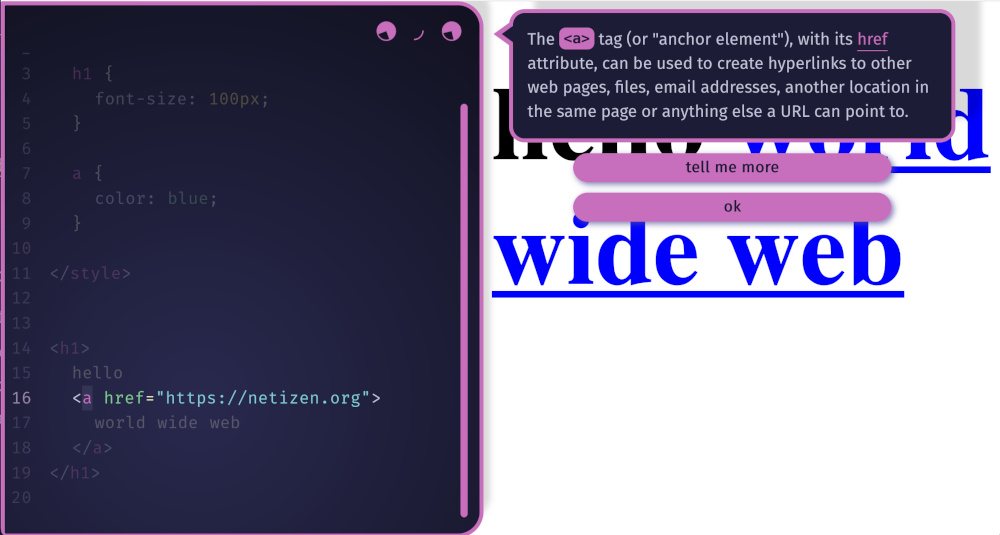
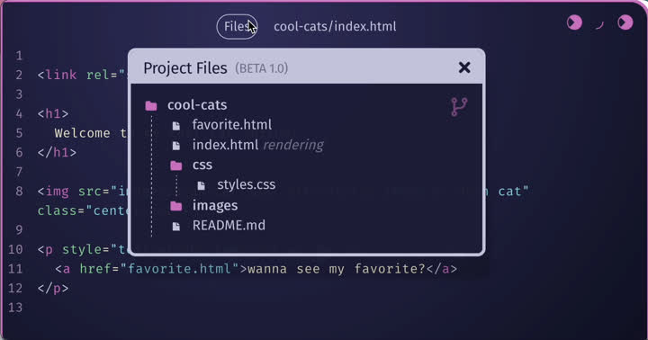
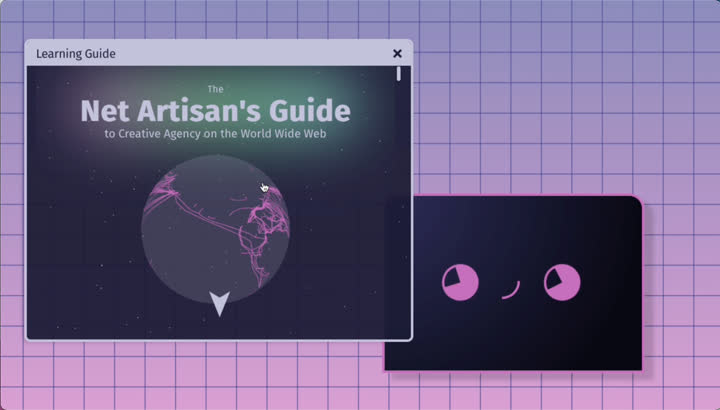

# Dear Educators,

netnet.studio has been developed iteratively for the last 5 years (in beta from 2020-2025),  alongside creative coding educators and students. It has been successfully used by hundreds of students across universities including the School of the Art Institute of Chicago, the University of Chicago, and the University of Waterloo among others.

By removing many of the technical hurdles beginners face, netnet.studio offers a smoother ramp into creative coding for the web, saving instructors hours in the classroom and reducing student frustration. Its self-revealing interface design also enables educators to introduce complex topics, like version control with Git, earlier than traditional tools allow, but no sooner than it's needed. The platform also provides tooling for instructors to create their own annotated demos, project templates, interactive tutorials and so much more!

🙏 If you find netnet.studio valuable in your classroom, consider asking your institution to enter into an [Institutional Support agreement](../supporters/institutional-support.md) with netizen.org. Supporting institutions receive priority support, curriculum consultation, and other benefits. This support also helps keep the platform free, open source, and actively maintained for everyone.

## Using netnet as a Classroom Code Editor

One of the simplest and most effective ways to use **netnet** in the classroom is as a browser-based code editor. There’s nothing to download or install—students can go straight to [netnet.studio/sketch](https://netnet.studio/sketch) and start coding instantly.

The editor includes all the standard tools you’d expect: line numbering, syntax highlighting, and code hinting, but it also adds features designed specifically for beginners.

- netnet is a **realtime editor** by default (this can be changed in the *Coding Menu > editor settings*) which means students get immediate feedback as soon as they start coding.

- Students can **double-click any piece of code** to get friendly explanations and reference links, helping them understand what each HTML element or CSS property does.

- netnet provides **friendly error messages** which not only help translate the standard JavaScript errors, but also spot common HTML and CSS mistakes. These messages catch syntax errors as well as common mistakes and bad practices, helping students develop better habits as they code.

### Sharing/Saving "Sketches"

While netnet supports the creation of full web **projects** (more on that below), **sketches** (a single HTML file) are a great way to share simple examples with students. To create a sketch simply type (or copy+paste) your code into the editor and press <b>CTRL+S</b> (or <b>CMD+S</b> on Mac). netnet will prompt you to either download your sketch (as an HTML file) or share it (as a netnet URL). When you generate a share link, the code is embedded directly in the URL itself (that’s why it’s so long).

You can use these as links in class notes, as well as to quickly send a student an example or snippet in response to a question. In fact sending sketches back and fourth is a quick and easy way to asynchronously write code with someone without loosing the history (each link retains it's own state).

### Annotate your sketch

You can also **annotate a sketch** using the **Demo Maker** widget. This tool lets you highlight specific lines of code and attach notes to them directly within the sketch. Once annotated, you can generate a **shareable URL** where netnet explains each highlighted line through its conversational passages.

*✏️ TODO: link to a demo example as well as the Demo Maker with loaded example*

Instead of writing a traditional article or blog post with code snippets scattered between paragraphs, this approach keeps everything in context, the full sketch remains live and interactive. netnet can guide students through the annotated code step by step, or they can explore it non-linearly by clicking the markers beside annotated lines or navigating through the **Notes** widget, which acts as a table of contents.

*✏️ TODO: link to the docs on how to use the Demo Maker*

### Multi-file Projects

In netnet, students can work in two ways: sketches and projects. A sketch is a single HTML file, perfect for quick experiments, exercises, or demonstrations. A project, on the other hand, is a full website that can include multiple HTML files, CSS and JavaScript files, and other assets like images, fonts, and video. Projects are also versioned and stored on GitHub, making them ideal for work that will be developed over time with the goal of eventually being published to the Web.

netnet projects not only make GitHub integration effortless (once connected to their GitHub account, students never have to leave netnet), but also helps them build real technical literacy. The **Project Files** widget teaches how file paths work and assists in writing them, while the **Version Control** widget explains what commits are and guides students through creating them. This way, students gain authentic, practical experience with modern web development workflows in an accessible and guided environment.

- **Automatic GitHub Repositories:**
  Creating a project in netnet automatically generates a GitHub repository, students simply name the project (netnet ensure good naming conventions), and the repo is created and linked to their GitHub account. There’s no setup required, making it a quick, accessible way to start working in a real development environment.

- **Guided Version Control:**
  As students work, netnet walks them through version control step by step. They learn to create commits and track changes through clear explanations and prompts. This gives them hands-on experience with Git, demystifying the command line.

- **One-Click Publishing:**
  Because projects are hosted on GitHub, students can publish their work to the web with a single click using *GitHub Pages*. This makes it easy to share finished projects publicly, showcase their progress, or present completed coursework online.

To learn more about these features refer to the [Student's Coding Doc](../students/coding.md)

## Using netnet as a "Flipped Classroom"

netnet’s **Learning Guide** makes it easy to support a *flipped classroom* model, where students learn core concepts independently, through interactive lessons, demos, and tutorials, before coming together in class to discuss, experiment, and build. Because the Learning Guide combines explanation, interactivity, and hands-on coding all in one place, students can engage with new material at their own pace, while instructors can dedicate class time to creative exploration, collaboration, and deeper problem-solving.

Each section of the Learning Guide is designed to be self-contained and accessible, so students can move through topics linearly or jump around based on their needs. The built-in interactivity means students aren’t just reading or watching, they’re actively experimenting with code as they go, with guided explanations from netnet. Educators can assign specific lessons or demos as pre-class activities, then use classroom time for guided practice, discussion, or project work that builds on what students explored individually.

### Learning Modes

The Learning Guide offers several **learning modes**, each supporting a different approach to how students explore and practice coding concepts. Some are guided and structured, while others encourage open-ended experimentation. Educators can mix and match these modes to suit different learners or lesson goals.

* **Guided Intros**
  Short, interactive lessons where netnet introduces core web concepts like HTML, CSS, and JavaScript. These use slide-like widgets and conversational passages to walk students through key ideas step by step.

* **Annotated Demos**
  Interactive examples that let students explore complete sketches annotated with notes and explanations. Each note highlights a specific line or section of code. Students can follow along sequentially or jump between notes to focus on the parts most relevant to them. As mentioned before, you can make your own Annotated Demos using the **Demo Maker** widget.

* **Guided Templates**
  Starter projects that help students move from examples to creation. netnet explains each part of the code as it writes it out, sometimes prompting students for input along the way. Once complete, students can immediately start building on the project. We don't have widget for creating these (yet), but if you have ideas for new templates you can submit those as open source contributions (see the [Contributors Doc](../contributors/README.md) for details)

* **Interactive Tutorials**
  Hypermedia lessons that blend video, text, and live code. Students can pause at any point to experiment with code or explore related widgets, making these ideal for self-paced or homework-based exploration. At the time of writing, these are all led by Nick Briz, but you can make your own hypermedia tutorials using the **Tutorial Maker** widget.

To learn more about these features refer to the [Student's Learning Doc](../students/learning.md)
