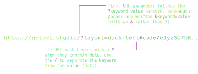

# Anatomy of a netnet URL

While visiting [https://netnet.studio](https://netnet.studio) is the common starting point, you can actually navigate to specific content directly using [URL parameters](https://en.wikipedia.org/wiki/Query_string) (the `?key=value` part of a URL) and [URL hashes](https://en.wikipedia.org/wiki/URI_fragment) (the `#value` part). You can also combine URL parameters and URL hashes, so long as the hash is written after the URL params, for example [https://netnet.studio/?layout=dock-left#code/eJyzSU7NK...](https://netnet.studio/?layout=dock-left#code/eJyzSU7NK0ktsuNSUPBIzcnJVwjPL8pJUQjPTElVCE9NUuSy0YeqAAAk0A2e)

This is one of the most useful features for educators, rather than telling students "open the Learning Guide, find the HTML section, click on the third demo," you can simply post a link in your course notes that opens netnet with that demo already loaded. The same goes for your own annotated examples or github starter projects.

Below is a breakdown of the different URL parameters and hashes netnet supports.

## URL Params

a netnet URL does not necessarily need to contain any URL parameters, but it can contain different combinations of any of the following:

- `?tutorial=[...]` the value of this param is the name of a tutorial to automatically load, for example https://netnet.studio/?tutorial=orientation you can also start the tutorial at a particular time point by specifying a value in seconds using the **t** param, for example: https://netnet.studio/?tutorial=orientatione&t=60 (this will start the tutorial 1min in)
- `?demo=[...]` the value of this param is the id of a demo (annotated code example) in netnet's database, for instance: https://netnet.studio/?demo=49
- `?template=[...]` the value of this param is the name of a template project to automatically load, for example: https://netnet.studio/?template=css-art
- `?w=[...]` the value of this param is the key name of any netnet widget you want automatically opened as soon as netnet loads, for example: https://netnet.studio/?w=learning-guide
- `?c=[...]` the value of this param is a shortcode, a reference to an entry in netnet's database for a CODE_HASH a student chose to shorten to avoid having such a long URL, for example: https://netnet.studio/?c=6
- `?layout=[...]` the value of this param is the type of layout netnet should display on load, options include: welcome, separate-window, dock-left, dock-bottom, full-screen. It assumes you are also sharing a sketch (either via a short **c** code or a **#code/** hash) for example: https://netnet.studio/?c=6&layout=dock-left
- `?gh=[...]` the value of this param contains info for a project hosted on GitHub. It should include the GitHub username and repository name separated by **/**, with an optional branch name (defaults to **main** if omitted), for example https://netnet.studio/?gh=netizenorg/artware-workshop/master

## URL Hashes

netnet hashes are one way to pass your own data into the netnet editor. These hashes must always come at the end of the URL, which means if URL parameters are present, the hash must be written after the URL query params.

- `#sketch` adding the **#sketch** hash to netnet's URL will automatically load netnet to it's 'dock-left' display with a blank file and skips the default greeting process, so you can jump right into coding, for example: https://netnet.studio/#sketch (this is what http://netnet.studio/sketch maps to)

- `#code/[...]` the code present in this hash is the compressed contents of the HTML/CSS/JS code that was in netnet's editor at the time a share link was generated. It always begins with **#code/** followed by the compressed code, for example: [https://netnet.studio/#code/eJyzSU7NK0kt...](https://netnet.studio/#code/eJyzSU7NK0ktsuNSUPBIzcnJVwjPL8pJUQjPTElVCE9NUuSy0YeqAAAk0A2e). This code can get pretty long, which is why there's also an option to create a short code URL (see the **c** URL param above). By default netnet displays sketches fullscreen, but you can optionally include the **layout** param to display the editor, for example: [https://netnet.studio/?layout=dock-left#code/eJyzSU7NK0kt...](https://netnet.studio/?layout=dock-left#code/eJyzSU7NK0ktsuNSUPBIzcnJVwjPL8pJUQjPTElVCE9NUuSy0YeqAAAk0A2e)

- `#demo/[...]` similar to **#code/**, except the compressed data also includes code annotations created with the **Demo Maker** widget. When loaded, netnet displays the annotated sketch and steps through the annotations automatically. For example: [https://netnet.studio/#demo/eJw9jcsKw...](https://netnet.studio/#demo/eJw9jcsKwjAQRX8ljtuIaIiPgAtBN/6CuIjptA1JEzATtJT+u4kLh4GBew9nJnA4gtrsD2K7k1JIcZQcgh4QFAAH0l0CFbL3HLweY6aSN9G4lceWCmBiU9FlvWu8vS/n31xPpbOhjaDuE7TR5L+G8FMl1NvEymr29Do4lhyS6Rf1pyVfnR0S2dCxRPpF2MD8mL8EWTdJ)
