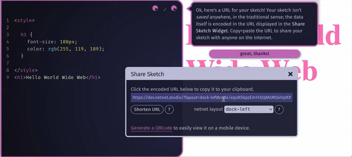

# Dear Students,

If you're new to code and want to learn how to craft your own corner of the web, then netnet.studio is for you! You can start by going straight to [netnet.studio](https://netnet.studio) and introducing yourself to netnet, you don't really need to read any of the stuff below (you'll learn it all on netnet.studio as you go). That said, if you're looking for a **User Guide** style manual, you'll find that here.

## coding in netnet

netnet.studio is an interactive learning platform (see the <b>Learning Guide</b> section below) where you learn not only by reading docs or watching videos but by making. It's also designed to act as a web-coding sketchbook, if you have an idea, the goal is to get you into a live editor with minimal friction so you can capture it in code before it’s lost. Let netnet know you want to code as soon as it loads, or jump straight to a blank sketch by navigating to [netnet.studio/sketch](https://netnet.studio/sketch).

The code editor is intentionally simple, but has unique features designed specifically for creative folks learning to code for the first time. As shown in the video above, it provides familiar tools like syntax highlighting, line numbers, and auto-complete, along with a few extras designed to support learning. For instance, double-clicking any piece of code brings up an explanation and relevant documentation. If netnet detects a possible issue, it marks the line with an orange (warning) or red (error) dot that you can click to read more. There are a number of other widgets which netnet opens (or suggests) for you to use when it's relevant as it did with the Color Widget in the video above.

 You can think of [netnet.studio/sketch](https://netnet.studio/sketch) as an infinite sticky pad, pressing <b>CTRL+S</b> (or <b>CMD+S</b> on Mac) will prompt you to either download your sketch (as an HTML file) or share it (as a netnet URL). Sharing your code as a URL is like pulling a sticky note off the pad, you need to decide where to stick it: send it to a friend, post it online, or save it somewhere safe. Once it's pulled off, it's no longer part of the pad, so if you lose that link, you lose the sketch (we don't record/save what you make on netnet, your code is compressed into the URL itself). If you want to keep something you made long-term, save the share URL somewhere safe or download it as an HTML file (you can turn it into an online **project**, more on that below).

## The Menu

You can open the menu at anytime by clicking on netnet's face...

| Main Menu Shortcuts | Action |
|---|---|
| **{SUPER} + L** | Open the Learning Guide |
| **{SUPER} + ;** (semicolon) | Open the Coding Menu |
| **{SUPER} + '** (quote mark) | Open the Search Bar |

###  netnet

When you first visit netnet.studio you'll be greeted by netnet, a conversation **passage** will appear above netnet's face with options for your responses. These conversation passages appear throughout the experience, it's netnet's primary mode for explaining things and presenting you with options. Remember, netnet is *classical AI*, meaning every word netnet says was written by a human (one of us!) not generated by a large language model. We've chosen it's words carefully, in order to be as clear and concise as possible and have designed netnet to communicate only what's absolutely necessary when it's necessary. So, if netnet says something, it's always worth taking a second to read what it has to say.

###  The Coding Menu

The **Coding Menu** is where you can launch different conversations with netnet for coding related tasks like creating, saving, or publishing your work. You can also adjust *settings* that control the editor’s look and behavior, such as theme, layout, or motion preferences. In addition, the menu lets you open various *widgets*, pop-up windows that provide focused tools or information, like **Share Sketch**, **Code Review**, or **Project Files**. When writing your own code in netnet, you’ll be working in either a sketch or a project.

- A ***sketch*** is a single HTML file in netnet.studio. Because HTML can include CSS, JavaScript, and other languages, you can do a lot in one file (see *Code Demos* widget for guided examples).

- A ***project*** is a full website or app with multiple code files (HTML, CSS, JS) and assets (images, videos, fonts, etc). Projects are stored as GitHub repositories (netnet walks you through the git process), giving you version control and free web hosting when you publish. (see *Template Starter Projects* widget for guided examples).

Visit the [coding docs](coding.md) to learn more about this menu and how to create **sketches** and **projects**.

###  The Search

On the surface netnet appears fairly simple, but as you start exploring the studio you'll come across different features, lessons and widgets. It can be hard to remember where exactly you came across a specific document or widget, which is why netnet also has a universal search bar. The search results color code different result types and lists where to find them. Clicking on a result will open up that widget, document, lesson, etc.

###  The Learning Guide

netnet’s **Learning Guide** is packed with educational content that starts from the basics and gradually builds toward more complex lessons and examples.  You can follow the Learning Guide from start to finish for a traditional progression, or explore it non-linearly based on your own interests and needs.

- Throughout the guide you'll find **Docs**, self-contained widgets that provide reference material or lessons. Some read like a textbook with explanations and diagrams; others work like an index for quick lookup of HTML elements, CSS properties, and similar topics.

Because everyone learns differently, the Learning Guide offers several *learning modes*, some designed for students who prefer structured, step-by-step instruction, and others for those who learn best through exploration and experimentation. Some topics appear across multiple modes by design, allowing learners to approach the same concept in different ways.

- **Guided Intros** are short, interactive lessons where netnet walks you through core web concepts like HTML, CSS, or JavaScript using conversational passages and slide-like widgets.

- **Annotated Demos** are example sketches for learning through remixing and experimentation. It’s a single HTML file with a Notes button, each note highlights a line or section of code you can explore or have netnet explain.

- **Guided Templates** are starter projects you can build from. netnet can generate and explain it line by line, sometimes asking for input along the way (like a code mad-lib). You can skip the walkthrough if you just want to start coding.

- **Interactive Tutorials** are hypermeida (video-based) lessons that blend history, theory, and practice. You can pause anytime to explore widgets or experiment with code directly in the editor.

Visit the [learning docs](learning.md) to read more about this widget and it's various "learning modes" and educational resources.
