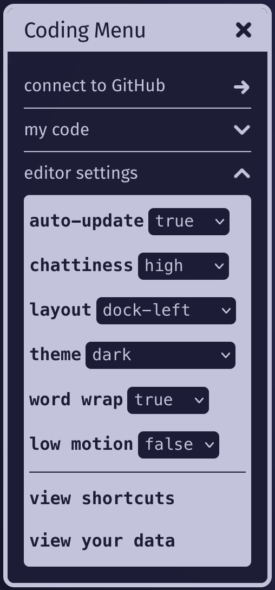
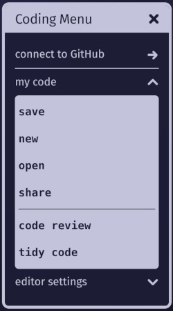
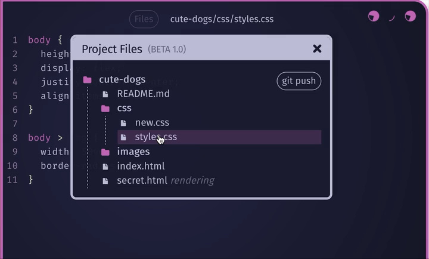
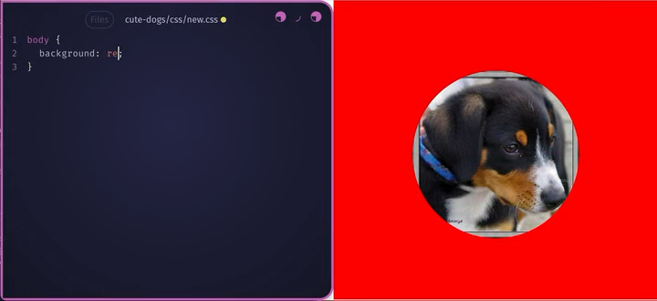
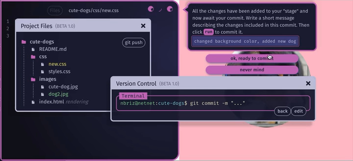
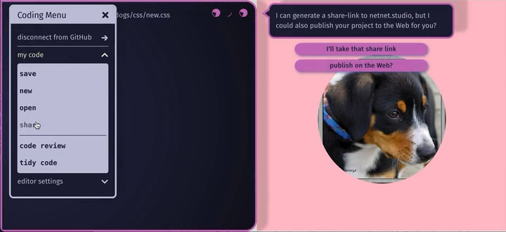

# Coding

As explained in the [introduction page](README.md) for students (review that first if you haven't), netnet.studio is an interactive learning platform (see [Learning Guide](learning.md) for more on that) where you learn not only by reading docs or watching videos but by making. That's why it's also designed to act as a web-coding sketchbook, if you have an idea, the goal is to get you into a live editor with minimal friction so you can capture it in code before it’s lost. The basic ideas are covered in [introduction page](README.md), here we'll get into the details of the **Coding Menu** as well as the difference between working on a **sketch** (a single HTML file) vs working on a **project** (a GitHub "repo" you can publish online).

##  The Coding Menu

You can open the Coding Menu anytime by clicking on netnet's face and selecting it from the main menu, or by using the <b>{SUPER} + ;</b> shortcut. It has a couple of sub-menus, like the <b>editor settings</b>, where you can adjust some of netnet's code editor details like:

  
  <ul>
    <li>
      <b>auto-update</b>: netnet is a realtime code editor, changes you make appear instantly in the rendered output. This works well for HTML and CSS, but can cause issues with JavaScript. Set this to "false" to disable auto-update and use <b>{SUPER}+Enter</b> to manually render changes.
    </li>
    <li>
      <b>chattiness</b>: As mentioned in the Sketching section above, netnet often provides feedback, explaining code you double-click and marking detected issues. Adjust this setting if you’d prefer netnet say less.
    </li>
    <li>
      <b>layout</b>: By default, netnet splits the screen, code on the left, output on the right, but you can choose from several layouts inspired by browser developer tools. You can also resize the editor by dragging its edge. You can also use the <b>{SUPER} + &gt;</b> and <b>{SUPER} + &lt;</b> keys to switch between layouts quickly.
    </li>
    <li>
      <b>theme</b>: Change netnet’s color theme to your preference, light, dark, or anything in between.
    </li>
    <li>
      <b>word wrap</b>: By default, long lines wrap to avoid horizontal scrolling, but you can disable this if you prefer.
    </li>
    <li>
      <b>low motion</b>: netnet includes motion and animation by default. For users with motion sensitivities, this setting reduces movement. If your system has "reduced motion" enabled, this will be on (and locked) automatically.
    </li>
    <li>
      <b>view shortcuts</b>: Click here anytime to see a list of all available shortcut keys.
    </li>
    <li>
      <b>view your data</b>: netnet stores no personal data on its servers; any shared information (like your username) is kept locally in your browser. You can view or delete it here.
    </li>
  </ul>

The <b>my code</b> sub-menu contains options for the code your working on:

  
  <ul>
    <li>
      <b>save</b>: clicking this button prompts the same passage that <b>{SUPER}+S</b> does, where netnet offers you a set of different options for downloading and sharing your code (including creating a new <i>project</i> if/when you've connected netnet to your GitHub account).
    </li>
    <li>
      <b>new</b>: Gives you the option to create a new <i>sketch</i> or <i>project</i>
    </li>
    <li>
      <b>open</b>: Gives you the option to upload an HTML file from your computer, and if you're connected to a GitHub account you'll also have the option to open a project (ie. a GitHub repository). You can also use the <b>{SUPER}+O</b> shortcut.
    </li>
    <li>
      <b>share</b>: When working on a *sketch* this opens up the Share Sketch widget (to create a sharable URL), when working on a *project* this gives you the option to create a sharable netnet URL as well as the option to **publish** your project to the web (using ghpages) with a public facing URL.
    </li>
    <li>
      <b>code review</b>: Opens the Code Review widget, which scans the code currently in the editor and lists any detected issues. When working with JavaScript, errors found by your browser’s developer tools (accessible with **Fn+F12** in most browsers) also appear here. Because standard error messages can be confusing for beginners, netnet translates them into clearer language when you click on them.
    <li>
      <b>tidy code</b>: Automatically formats your code to improve readability and consistency. It adjusts indentation, spacing, and alignment based on standard web formatting rules, helping keep your code clean and easy to follow.
    </li>
  </ul>

## Connecting to GitHub (Sketches vs Projects)

When writing your own code in netnet, you're always working on either a **sketch** or a **project**:

1. A **sketch** is a single HTML file in netnet.studio. Because HTML is a polyglot format (allowing you to mix HTML, CSS, JavaScript, and other languages) you can do a lot within one file (for example, all of netnet’s "demos" are single-file sketches). To save a sketch, press <b>{SUPER}+S</b>. netnet will prompt you to either download your sketch (as an HTML file) or share it (as a netnet URL).

2. A **project** is a full website that can include multiple HTML files, code files (CSS, JS, etc.), and other assets such as images, audio, video, or fonts. Projects are "versioned", meaning you can create save points as you work. They’re stored as repositories ("repos") in your personal GitHub account, which allows netnet to use Git for version control and GitHub’s free web hosting when you’re ready to publish your work to the Web. You don’t need to interact with Git or GitHub directly, netnet handles that for you, but since your code lives entirely on GitHub (never on our servers), you’re never locked in and can switch to another editor anytime.

To work on a **project** (a GitHub repository), first connect netnet to your GitHub account by pressing **Connect to GitHub** in the Coding Menu. If you don’t have an account, you can create one for free. Don’t worry if you’re new to GitHub, netnet introduces the basic Git concepts and manages the technical details for you.

### Project Files

When working on a **project**, netnet will display the path of the file you're currently working in on the top of it's editor. Next to that you'll find a **Files** button, clicking on this opens the **Project Files** widget, where you can upload, create and edit new folders/files.

**Clicking** on a folder will toggle (open/close) it's contents, clicking on a file will open that file in the editor. If the file is a media asset (like an image or video) it will open it in a separate widget. If you click on an HTML file specifically you will notice that it gets a label "rendering" placed beside it, this indicates which file is currently being rendered in netnet's output.

**Right-clicking** on a file or folder gives you the following options:
  - **rename**: netnet will ask you what you want to rename your folder or file to. It will ensure you follow "best practices" for writing file and folder names which will help prevent common issues later on.
  - **delete**: netnet will confirm whether or not you want to delete the file.
  - **copy relative path**: copys a relative path to your clipboard (which you can paste later) *from* the file you're currently editing *to* the file you copied the path of (if you don't know what a "file path" is, netnet can explain).
  - **move/update path**: netnet will ask you where you want to move this file/folder to
  - **upload file**: will open a window you can use to upload a file from your computer to the folder you right-clicked on
  - **new file**: netnet will ask you what you want to name the new file, ensuring you stick to proper formats and naming conventions. The file will be created inside the folder you right-clicked.
  - **new folder**: netnet will ask you what you want to name the new folder, ensuring you stick to proper naming conventions. The folder will be created inside the folder you right-clicked.

### Editing Files

When working on files in a project, netnet won't render the output until you save your changes locally. In the video above a CSS file is selected from the Project Files widget (instead of pressing the **X**, the widget is closed by hitting the **Esc** key, which can be quicker). After editing the CSS file a yellow dot appears next to the file name at the top of the editor. This indicates a change has been made that has not yet been saved locally. Once saved (either by clicking *Coding Menu > my code > save*, or in this case pressing **{SUPER}+S**) the dot will disappear, indicating the changes have been saved locally and the rendered output should update.

### Pushing (Uploading) to GitHub

Changes to a file (as well as creating or deleting a file) are saved "locally", meaning that they're stored temporarily in your browser as you work. The **Project Files** widget will color code any changed files: green for new files and yellow for edited files. The colors help you identify which parts of your project includes changes not yet backed up to GitHub.

In order to back up those changes you'll need to "commit" them to your GitHub repo. A commit is like a save point in your project's timeline. You can commit changes by pressing the  button in the **Project Files** widget and choosing the **git push** option.

netnet will give you the option to either have it create and push the commit for you or you can learn to use git yourself with netnet guiding you through the manual commit process using the **Version Control** widget.

This widget will walk you through the process of creating a new "commit" (a versioned "save point") and pushing (aka uploading) that to your GitHub repository. It has a terminal which displays the actual git commands you would have to run if you were working in any terminal, except that rather than typing the terminal commands yourself, netnet will write them for you and walk through it step by step. If you're new to version control it's worth reading the netnet passages to better understand what's going on at each step.

**PRO TIP**: Once you get the hang of it, you can *speed run* the process by pressing, *Enter > Enter > typing your commit message > Enter > Enter > Enter*

### Publishing Your Website

When you're ready to publish your project to the World Wide Web you can click on netnet's face to open the main menu, then *Coding Menu > my code > share*, netnet explains that it will use the "ghpages" service provided by GitHub to launch a web server on GitHub for your project. It then generates a publicly accessible URL you can share with anyone, your work is now live on the Web!

Once you publish a project you don't ever need to re-publish it, every time you make a new commit your live website gets updated as well (NOTE: as netnet explains, it does take a minute or two before you see those updates on the published website).
