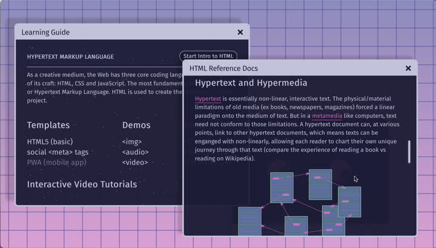
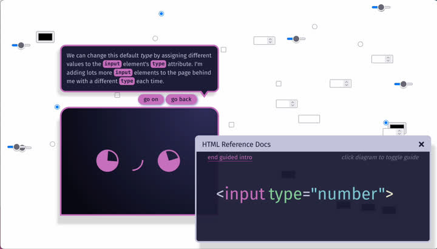
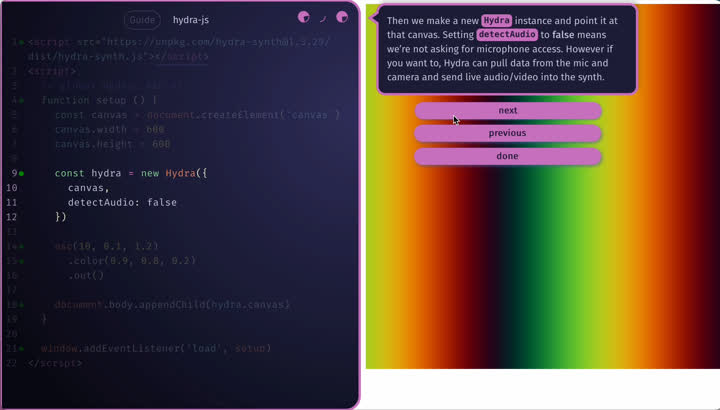
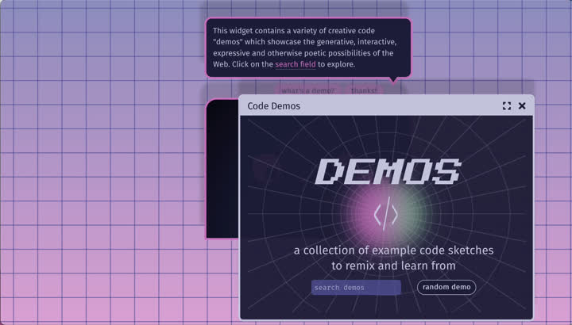
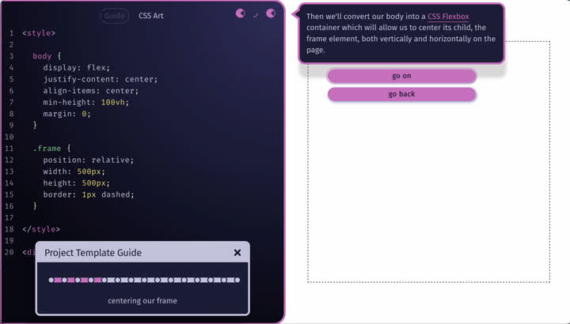
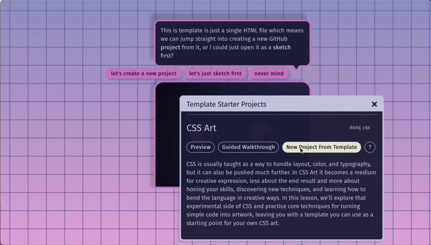
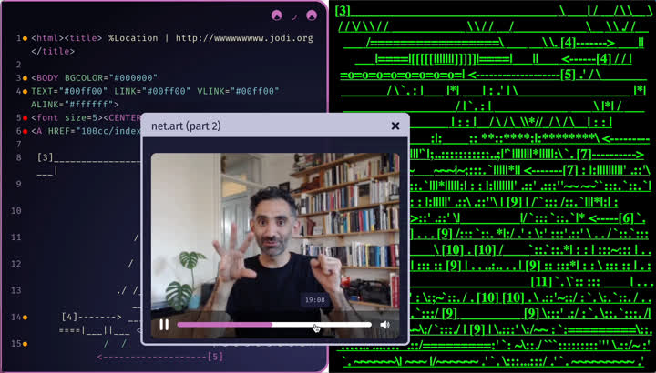

#  The Learning Guide

netnet’s **Learning Guide** is packed with educational content that starts from the basics and gradually builds toward more complex lessons and examples. You can open the Learning Guide anytime by clicking on netnet's face and selecting it from the main menu, or by using the <b>{SUPER} + L</b> shortcut. You can follow the Learning Guide from start to finish for a traditional progression, or explore it non-linearly based on your own interests and needs. You can scroll through the Learning Guide, but you can also click on the Internet globe to jump to the "Hyperlinks", and from there you can click on any section to jump to it.

## Docs (the text books)

Throughout the Learning Guide, you’ll find links to **Docs**, texts contained in their own widgets. Sometimes these act like a textbook, with paragraphs, diagrams, and code examples you can read through. Other times they serve more like a reference or dictionary, helping you look up HTML elements, CSS properties, and other key concepts as you need them.

**NOTE**: These are the same docs that pop-up when you double click a piece of code in the editor and ask netnet to *tell me more*

## Learning Modes (the interactive lessons)

The Learning Guide also includes a variety of interactive lessons. Because everyone learns differently, these lessons are offered in several ***learning modes***: some designed for students who prefer clear, step-by-step guidance, and others for those who learn best through experimentation and discovery. Some topics appear across multiple modes intentionally, giving you different ways to approach and reinforce the same idea. Below is a breakdown of the different **learning modes** you’ll encounter in the Learning Guide.

### Guided Intros

*Guided Intros* are Interactive introductions where netnet walks you through core web concepts, like HTML, CSS, or JavaScript, via short, conversational lessons. These use widgets that act like interactive slides and are navigated through passages (dialogues with netnet).

Many of netnet's widgets also contain guides which often begin as soon as you open up the widget or when you press any of the ? buttons within the widget. For example the <b>git push</b> widget not only allows you to create and push your git commits, it also introduces the concept of versioning and guides you through the commit process; the <b>web publish</b> widget not only allows you to publish your projects to the web, it also explains concepts like web hosting and DNS; etc.
### Annotated Demos

A *demo* is an annotated *sketch* designed for learning through remixing and experimentation. Like any sketch in netnet, it's a single HTML file, but it includes a demo title and a **Guide** button at the top of the editor. Each note corresponds to a line or section of code; you can have netnet explain the entire demo sequentially or jump to a specific note by clicking its green dot or selecting it from the Guide Widget.

Demos appear throughout the Learning Guide, but you can also explore them all in the *Code Demos* widget.

### Guided Templates

A *template* is a starter *project*, a set of files and folders you can build on. When you launch one, netnet can explain it line by line, writing and describing each part of the code as you go. Occasionally, it may ask for input through passages (almost like a coding mad-lib). You can skip the walkthrough if you just want to start coding, but the first time you open a template, it’s worth having netnet guide you.

Templates appear throughout the Learning Guide, but you can view them all in the *Template Starter Projects* widget.

### Interactive Tutorials

A *tutorial* is an interactive, hypermedia lecture, similar to a video tutorial on YouTube, but fully interactive. You can pause at any point to explore widgets that appear or experiment with code in the editor. Tutorials often blend history, theory, and practice, and can be navigated through the video’s progress bar.

