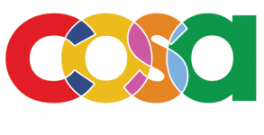

# Dear Supporters,

netnet.studio is a [netizen.org](http://netizen.org) project designed and developed by [Nick Briz](http://nickbriz.com/) and [Sarah Rooney](https://www.sarahrooney.net/) with help from a handful of [other contributors](https://github.com/netizenorg/netnet.studio/graphs/contributors). netnet.studio is free and open source, and always will be. If you find value in it, here's how you can help keep it going.

---

  

    <h3>How can individuals support?</h3>
    

      The best way to support netnet.studio is through our <a href="https://patreon.com/netnetstudio" target="_blank" style="font-weight: bold">Patreon</a>. Patreon supporters help fund ongoing development and get access to early features and community chat ($5/mo), voting in feature prioritization polls ($15/mo), monthly "office hours" QA live streams with the creators ($35/mo) and other behind-the-scenes content!
    

    

      If you'd prefer to give a one-time larger tax-deductible contribution, <a href="https://netizen.org/" target="_blank">netizen.org</a>, our 501(c)3 nonprofit fiscal sponsor (EIN: 81-2445948), can accept direct donations. Get in touch at <b>hi@netizen.org</b> to make arrangements.  
    

  

  

    <h3>How can institutions support?</h3>
    

      Universities and programs that use netnet.studio in the classroom can enter into an annual support agreement with netizen.org. This is a <b>professional services contract</b>, not a software license, that includes curriculum consultation, priority support, stability assurance, and institutional attribution. Pricing starts at $2,500/year for small programs.
    

    

      For full details, including IT and procurement documentation, see the <b><a href="institutional-support.html">Institutional Support page</a></b> and contact <b>hi@netizen.org</b>.
    

  

---

### Testimonials

For the past six years (2020–2026), netnet.studio has been in beta, developed iteratively alongside creative coding educators and students using it in the classroom. It has been used by hundreds of students across multiple universities including the School of the Art Institute of Chicago, the University of Chicago, and the University of Waterloo, among others.

> September 2026 will mark my fourth year using netnet in my classroom. I've now overseen about 450 students learning HTML and CSS from zero experience to building their own sites in a 12-weeks. Many make the generic, corporate-friendly “Hi, I’m Jasmine, a UX designer” page to help them land co-op placements, but plenty make something fun and strange—K-pop fan sites, an insect bestiary, fashion lookbooks—and they do it with a real measure of confidence. Netnet isn’t the final destination. Most of these students will graduate into professional-grade editors, and that’s exactly the point: it’s the bridge that gets them there.  
> The tool matters to me for another reason, one I find myself explaining to students every year. Netnet isn’t made by Apple or Adobe. There's no product-manager-and-focus-group provenance, no features sanded down until all the personality is gone. It’s open source, built by a small team of educators and designers who care about the craft of web design and the pedagogy of teaching the internet as something that is open, free, and hands-on. Despite learning p5.js in a CS context before they get to web design, my students arrive with almost no exposure to what open source is. Netnet gives me a way into that conversation about how not all software is rent-seeking and that there are software relationships where the user is not a consumer.
>
> — Greg J. Smith, University of Waterloo

<!-- > I'm once again using netnet in my web design class! I've had 120 UWaterloo students happily working with it this semester and 60 more slated for the winter. It's going really well, and I can't stress enough how netnet makes my life a little easier! 🙂 [...] THANK YOU AGAIN FOR MAKING THIS GREAT TOOL! Please pass my gratitude on to your team.
>
> — Greg Smith, University of Waterloo -->

You can read Prof. Greg J Smith's [full testimonial here](/docs/educators/testimonial.md). Students have also responded overwhelmingly positively in anonymous evaluations. Here's what some of them had to say:
 

> [netnet] was a great tool for me to get into making websites, I really loved it [...]. With the experience I gained from netnet [...], I ended up working at a company called teamLab after graduation doing web engineering, making websites for clients like banks and recruitment platforms. I'm now starting a new position in web SWE at Canonical (the company behind Ubuntu), and I really credit [your work] for sparking my interest in web engineering.
>
> — Marina Takara, University of Chicago (B.A. in Computer Science and B.A. in Media Arts and Design, 2025)

> netnet is awesome and really thoughtfully built.
>
> — anonymous student evaluation

> Since it's a browser-based platform, I didn't have to worry about setting up a local development environment or dealing with installations, which made it much easier to focus on learning HTML and CSS right away.
>
> — anonymous student evaluation

> [netnet] was one of the coolest parts of the class. I really appreciated the interactivity of the software, as it allowed me to learn by doing as well as listening.
>
> — anonymous student evaluation

> Coding on netnet really highlights the creative aspect of coding and obscures the more boring technical parts like git and version control. I think it's great for beginners and super user-friendly.
>
> — anonymous student evaluation

> netnet was great because I could see all of my changes take place immediately — this allowed me to experiment more.
>
> — anonymous student evaluation

> My favorite aspect of this course was NetNet! I loved the lectures, tutorials, etc. There's limitless information to be found and explored on that website.
>
> — anonymous student evaluation

---

### Initial Support

The initial beta versions of netnet were made possible thanks to financial support from the [Clinic for Open Source Arts](http://clinicopensourcearts.com/) and the [Contemporary Practices Department at the School of the Art Institute of Chicago](https://www.saic.edu/academics/departments/contemporary-practices).

|  |  |
|:---:|:---:|

### Institutional Support

Current institutional support provided by [Media Arts and Design at the University of Chicago](https://cms.uchicago.edu/undergraduate/major-minor/minor-media-arts-and-design)

|  |
|:---:|
