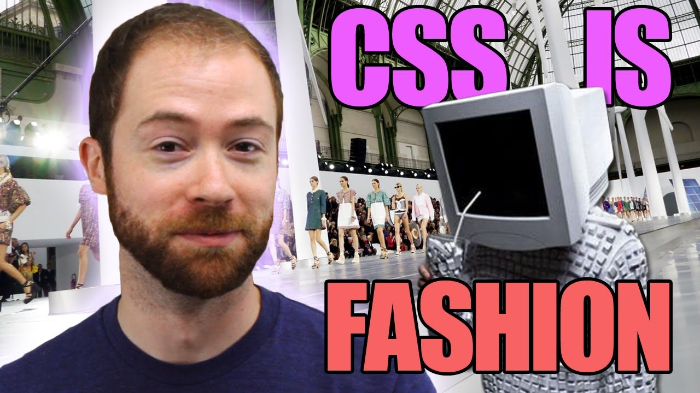
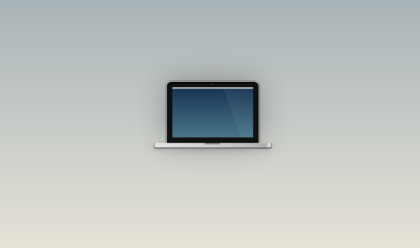
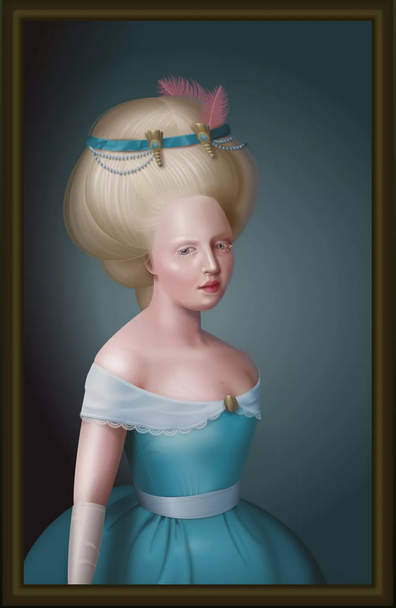

# CSS
## "Fashion changes, but style endures"

When the web was first introduced in 1990 there was only HTML code, which handled both structuring the content of a document as well as the style of its presentation. In the years that followed it became obvious that the <i>style</i> of a web document should be handled separately from the structure of it's content, and so there were a few different proposals for how that could be handled. One such proposal for a style coding language came from Håkon W Lie who <a href="http://www.w3.org/People/howcome/p/cascade.html" target="_blank">debuted CHSS</a> (Cascading HTML Style Sheets, later renamed CSS) at a Web conference in Chicago in 1994. The rest is history.


# A New Language

Around the same time that the first net.artists were creating their first HTML experiments, the creators of the Web were discussing the creation of a new coding language to accompany HTML.

**ASIDE:** [creators of the web?](creating-the-web.md)

At a Web conference in Chicago in 1994, Håkon W Lie debuted the first draft of what would eventually become a coding language called Cascading Style Sheets or CSS.

The goal behind CSS was to separate a project's "presentation", the way it looks, from it's structured content, all the HTML elements.

The separation of a document’s content and its presentation is a popular tech-design philosophy. It means you can display the same content (HTML) in different ways (ie. with different "styles") for different contexts: laptops, smart phones, in print, on a braille tactile device, etc.

It also means a text-to-speech app can understand what's "content" and what's not. Additionally, Web reader-views/apps can override the default CSS and use alternative "presentations".

Depending on how you implement your CSS, it also enables you to make site-wide changes in a single document which can make updating a site, or even redesigning the entire aesthetic, drastically easier.

Technically a web-page doesn't <i>require</i> CSS. As we've noticed in our previous HTML-only experiments, our web-page will always look like something. But if we ever want to change any aspect of how our HTML page looks, that's where CSS comes in.

As artists, writing CSS is about more than just changing "the defaults" however. As Internet culture video essayists "Idea Channel" explain, if the HTML default look is like a web-page's "clothes" CSS, in all it's expressive potential, is like "fashion"

[](https://netnet.studio/api/videos/css-idea-channel.mp4)

> "..an eye catching stylesheet, that's something different, that is fashion [...] clothing is functional, but fashion is used to purposely express something which is not explicitly stated otherwise" —<i> Idea Channel</i>

# CSS Art

Though CSS is typically understood to be the stylistic layer of a project, handling layout, color and typography, today it has grown into an incredibly expressive language.

Because CSS is now capable of handling all sorts of interactions and animations, for artists in the "CSS Art" scene it has become the central focus of the work itself.

The piece you see behind me, called "<a href="https://codepen.io/davidkpiano/pen/Xempjq" target="_blank">Cat Swinging on String</a>", was produced by CSS artist <a href="https://codepen.io/davidkpiano" target="_blank">David Khourshid</a>. This was done entirely with HTML and CSS, including the animation.

Typically things like interaction and animations are handled via programming languages like JavaScript, but CSS artists intentionally make it a point to avoid JavaScript in favor of producing work entirely out of CSS code, simply because they can.

Creating interactive animations is arguably much easier using a programming language like JavaScript, but the CSS artists are motivated by the challenge of pushing CSS to it's limits. For example, artist <a href="https://codepen.io/jcoulterdesign" target="_blank">Jamie Coulter</a> created an entire 8-bit style video game with CSS called <a href="https://codepen.io/jcoulterdesign/pen/NOMeEb" target="_blank">The Mine</a>


CSS artists often congregate and share their work on site's like <a href="https://codepen.io/trending" target="_blank">CodePen</a> where they will often tag their work with "CSS only", "Pure CSS" or "No JS" to emphasize this point.

Some go even further and create CSS compositions limiting themselves to a single HTML element, like this <a href="https://codepen.io/joshnh/pen/JCGoF" target="_blank">Single Element Pure CSS MacBook Pro</a> by Joshua Hibbert.



Besides the style tag containing the CSS code, notice that the only HTML tags belong to a single <code>&lt;i&gt;</code> element. Feel free to experiment a bit with his code if you're curious to see how it works.

While Joshua's piece is an unquestionably clever and creative use of CSS, the CSS thrown belongs to <a href="https://diana-adrianne.com/" target="_blank">Diana A Smith</a>, the greatest CSS virtuoso of all time (in this humble bots opinion).


Her works defy the browser's limitations and (must) baffle even the Web's creators. In order to pull off some complex compositions using only HTML and CSS Diana makes use of the most modern CSS properties available... which has an interesting side effect.

When the W3C creates new CSS properties, these only exist in theory, until the browser vendors actually build the new functionality into browsers. This usually takes some time, browsers like Chrome and Firefox are quick to implement these updates, but other browsers like Safari and Internet Explorer often lag behind.

Like the "form art" we discussed in the last lesson, this means that Diana's pieces will inevitably display differently in different browsers. The result of which are unintentional modernist remixes of her otherwise Renaissance style works.



.png)

.png)

.png)

.png)

# CSS Basics

But, before we can create our own CSS art masterpieces, we'll need to get acquainted with the basics.

CSS consists of a list of <b>properties</b> which can be assigned different <b>values</b> to change various characteristics of your HTML elements. You can apply CSS properties to a specific element on your page by writing some CSS code in that element's <code>style</code> attribute like this.

```html
<div style="font-size: 100px; color: green;"> hello! </div>
```

Here we change the <code>&lt;div&gt;</code> font-size to 100px and it's color to green. Notice that the property is always followed by a <code>:</code> (colon) and the value is always followed by a <code>;</code> (semi-colon). These are the two main pieces of syntax for a CSS "<b>declaration</b>" which is what we call a CSS property and value pair.

This is known as "inline styling", because we're writing the CSS directly in the same line of code as the HTML element. We typically don't write our CSS declarations inline though. What's more common is creating CSS <b>rules</b>.

Let's create a pair of <code>&lt;style&gt;</code> tags above our <code>&lt;div&gt;</code> and remove the <code>style</code> attribute from the element.

```html
<style>
  /* CSS rules go here */
</style>

<div> hello! </div>
```

In there we can declare a CSS rule, which contains two parts, a <b>selector</b> which specifies which element(s) the rules will be applied to, and a <code>{</code> <b>declaration block</b> <code>}</code>, surrounded by curly brackets, which contains the CSS property/value pairs, or "<b>declarations</b>", specifying how the element should be styled.

```html
<style>
  div {
    font-size: 100px;
    color: green;
  }
</style>

<div> hello! </div>
```


# CSS selectors

There are different ways of writing CSS <b>selectors</b>, in this example we have what's called a <i>type</i> selector, because it's specifying a type of element, in this case any and all <code>div</code> elements.

If we add another <code>&lt;div&gt;</code> to our page it will also have that CSS rule applied because it matches the <b>selector</b>.

```html
<style>
  div {
    font-size: 100px;
    color: green;
  }
</style>

<div> hello! </div>
<div> how are you? </div>
```

But, notice that if we add a <code>&lt;section&gt;</code> element to our page, the CSS rule we defined does not apply to it, because it does not match the <b>selector</b>.

```html
<style>
  div {
    font-size: 100px;
    color: green;
  }
</style>

<div> hello! </div>
<div> how are you? </div>
<section> goodbye! </section>
```

If we did want that particular rule to apply not only to <code>div</code> elements but also to <code>section</code> elements, then we could add that element name to our <b>selector</b>, separated by a comma. This is how we apply the same rule set to different selectors.

```html
<style>
  div, section {
    font-size: 100px;
    color: green;
  }
</style>

<div> hello! </div>
<div> how are you? </div>
<section> goodbye! </section>
```

There are many other kinds of selectors which give you different ways of targeting specific elements to apply your CSS rules to. The most common selector is likely to be the <i>class</i> selector which targets any element whose class attribute's value matches that of the class name.

Say for example we wanted to change the <code>font-family</code> (aka the typeface) of only the first <code>div</code> and not the second one. We could create a new CSS rule with a <i>class</i> selector and apply it only to that <code>div</code> using it\'s <code>class</code> attribute.

```html
<style>
  .fancy-font {
    font-family: fantasy;
  }

  div, section {
    font-size: 100px;
    color: green;
  }
</style>

<div class="fancy-font"> hello! </div>
<div> how are you? </div>
<section> goodbye! </section>
```

We can apply a class to as many different elements as we want. Here you can see I applied it to a <code>p</code> tag. This new element has its default <code>font-family</code> changed, but not it's size or color because those declarations are part of the <code>div, section</code> rule set which do not apply to <code>p</code> elements.

```html
<style>
  .fancy-font {
    font-family: fantasy;
  }

  div, section {
    font-size: 100px;
    color: green;
  }
</style>

<div class="fancy-font"> hello! </div>
<div> how are you? </div>
<section> goodbye! </section>
<p class="fancy-text">see ya soon!</p>
```

There's loads of other ways to write selectors. You can get real crafty and specific with them, for example if we wanted to target that second div only we could write a selector like this <code>div.fancy-font+div</code>.

```html
<style>
  .fancy-font {
    font-family: fantasy;
  }

  div, section {
    font-size: 100px;
    color: green;
  }

  div.fancy-font+div {
    font-style: italic;
    background-color: pink;
  }
</style>

<div class="fancy-font"> hello! </div>
<div> how are you? </div>
<section> goodbye! </section>
<p class="fancy-text">see ya soon!</p>
```

Anytime you see a selector you don't understand you can double click it and I'll explain it to you. But if you're curious to learn more about the various types of selectors take a look at these <a href="https://github.com/netizenorg/netnet.studio/blob/master/www/tutorials/css-intro/selectors.md" target="_blank">selector notes</a>.

Generally speaking, you can do 99% of what you want using only type selectors and class selectors. I could have just as easily done this, instead of using that fancy selector, and gotten the same effect.

```html
<style>
  .fancy-font {
    font-family: fantasy;
  }

  div, section {
    font-size: 100px;
    color: green;
  }

  .greet {
    font-style: italic;
    background-color: pink;
  }
</style>

<div class="fancy-font"> hello! </div>
<div class="greet"> how are you? </div>
<section> goodbye! </section>
<p class="fancy-text">see ya soon!</p>
```

But there are certain situations where you might need fancier logic in determining which elements you want to apply the CSS to, especially if, for example, you don't have access to the HTML itself and thus can't add a class attribute as I just did here.

This might be the case if and when you're creating a web scraper or a browser extention/add-on... but those are topics for another lesson. For now, just know that there are lots of ways to write <b>selectors</b> and if you'd like to learn more about them you can take a look at these <a href="https://github.com/netizenorg/netnet.studio/blob/master/www/tutorials/css-intro/selectors.md" target="_blank">selector notes</a>.

There is one last common bit of selector syntax I'd like to share with you though. Let's start with a new sketch for this one...

It's very common to change the default styles of links, or <code>a</code> elements, on your page.

```html
<style>
  p {
    font-family: sans-serif;
  }
</style>

<p>
  To learn more about CSS selectors check out these <a href="https://github.com/netizenorg/netnet.studio/blob/master/www/tutorials/css-intro/selectors.md" target="_blank">selector notes</a>, and for an even deeper dive, refer to the <a href="https://developer.mozilla.org/en-US/docs/Learn/CSS/Building_blocks/Selectors" target="_blank">Mozilla Developer Network's CSS selectors</a> page.
</p>
```

This is one of the first things web-developers will add to their CSS code. It's very common to use two properties in particular, changing that default blue color to something else as well as removing the default underline, which is a <code>text-decoration</code>.

```html
<style>
  a {
    color: #c76ebc;
    text-decoration: none;
  }

  p {
    font-family: sans-serif;
  }
</style>

<p>
  To learn more about CSS selectors check out these <a href="https://github.com/netizenorg/netnet.studio/blob/master/www/tutorials/css-intro/selectors.md" target="_blank">selector notes</a>, and for an even deeper dive, refer to the <a href="https://developer.mozilla.org/en-US/docs/Learn/CSS/Building_blocks/Selectors" target="_blank">Mozilla Developer Network's CSS selectors</a> page.
</p>
```

There's something called a <b>pseudo-class</b> which can be added to any selector by adding a <code>:</code> to the end. These specify alternative rules to be applied to that element when it is in a particular state.

For example, here we've created a CSS rule for the <code>a</code> selector's <code>:hover</code> state. This CSS rule will only apply to an <code>a</code> tag if and when you hover over it with your mouse.

```html
<style>
  a {
    color: #c76ebc;
    text-decoration: none;
  }

  a:hover {
    text-decoration: underline;
  }

  p {
    font-family: sans-serif;
  }
</style>

<p>
  To learn more about CSS selectors check out these <a href="https://github.com/netizenorg/netnet.studio/blob/master/www/tutorials/css-intro/selectors.md" target="_blank">selector notes</a>, and for an even deeper dive, refer to the <a href="https://developer.mozilla.org/en-US/docs/Learn/CSS/Building_blocks/Selectors" target="_blank">Mozilla Developer Network's CSS selectors</a> page.
</p>
```

# the "cascade"

You may have also noticed that the link's default font-family also changed even though we didn't explicitly specify that in the <code>a</code> selector's CSS rules.

This is because the <code>a</code> elements are all inside of the <code>p</code> element, and the <code>p</code> CSS rule has changed the default font-family from <code>serif</code> to <code>sans-serif</code>.

But if we were to add an <code>a</code> element after, and thus outside, our <code>p</code> it will not have that <code>sans-serif</code> font applied to it.

```html
<style>
  a {
    color: #c76ebc;
    text-decoration: none;
  }

  a:hover {
    text-decoration: underline;
  }

  p {
    font-family: sans-serif;
  }
</style>

<p>
  To learn more about CSS selectors check out these <a href="https://github.com/netizenorg/netnet.studio/blob/master/www/tutorials/css-intro/selectors.md" target="_blank">selector notes</a>, and for an even deeper dive, refer to the <a href="https://developer.mozilla.org/en-US/docs/Learn/CSS/Building_blocks/Selectors" target="_blank">Mozilla Developer Network's CSS selectors</a> page.
</p>

<a href="https://github.com/netizenorg/netnet.studio/blob/master/www/tutorials/css-intro/the-cascade.md">the cascade</a>
```

This effect, the fact that an element inherits certain styles from it's parent element, is part of how CSS rules "cascade". The effect of the cascade is often a point of confusion for beginners so I've put together some <a href="https://github.com/netizenorg/netnet.studio/blob/master/www/tutorials/css-intro/the-cascade.md">notes on that here</a>.

Don't feel pressured to memorize all that now, like everything else, getting a feel for the logic of CSS comes with time and practice.

CSS is a very unique language. It starts off feeling deceivingly simple, until you start to realize it's actually frustratingly complex. But if you stick with it long enough, and take time to experiment with it, perhaps even push it to extremes like CSS artists do, you'll find it's incredibly expressive.

That's it! Those are the basics! Now it's just a matter of experimenting with all the various properties CSS has to offer! You can check out <a href="https://developer.mozilla.org/en-US/docs/Web/CSS/Reference" target="_blank">a full list</a> on the Mozilla Developer Network.


## References

- [Bloom, Zach. The Languages Which Almost Became CSS. Eager. May 2017](https://eager.io/blog/the-languages-which-almost-were-css/)

- [Wium Lie, Håkon, Bert Bos. Cascading Style Sheets: Designing for the Web. Addison-Wesley Professional. April 2005.](https://www.w3.org/Style/LieBos2e/history/)

- [Sfetcu, Nicolae. Web Design & Development. 2014](https://books.google.com/books?id=jAGSAwAAQBAJ&lpg=PA1927&dq=Sfetcu%2C%20Nicolae.%20Web%20Design%20%26%20Development%3A%20Nicolae%20Sfetcu%2C%202014&pg=PT75#v=onepage&q&f=false)

- [Romano, Aja. How your web browser affects your online reality, explained in one image. Vox.com. 2018](https://www.vox.com/2018/5/3/17309078/digital-art-diana-a-smith-francine-coded-browser-art)

- [Pearson, Jordan. This Stunning Image Made With Pure Code Is Like a Mood Ring For Your Browser. VICE.com. 2018](https://www.vice.com/en/article/9kgx7p/painting-made-with-code-html-pure-css-browser-art-diana-smith?utm_source=vicetwitterca)
