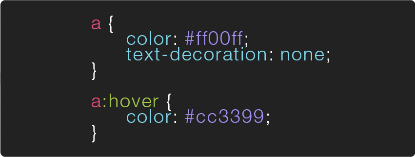

# CSS Selectors

here's an overview of most of the ways u can write CSS Selectors, to learn more indepth info visit the Mozilla Developer Network's page on [CSS selectors](https://developer.mozilla.org/en-US/docs/Learn/CSS/Building_blocks/Selectors)

---

`* { }` **Universal Selector** this rule will apply to all elements on a page

`p { }` **Type Selector** this rule will apply to all elements of the specified type (in this case `<p>`)

`.stuff { }` **Class Selector** this rule will apply to all elements w/a class attribute that matches it (for example `<div class="stuff">`), u can mix type/class selectors like this` p.stuff { }`, that will only target p tags with a `class="stuff"`


`#info { }` **ID Selector** this rule will apply to all elements w/an id attribute that matches it (for example `<div id="info">`)

---

here's a few selector examples designed specifically for selecting relatives ( elements that are related to each other in some way )

---

`p > a { }` **Child Selector** this rule will apply to all `<a>` elements directly inside of `<p>` elements ( ie. any `<a>` which is a "child" of a `<p>` )

`p a { }` **Descendant Selector** this selector is just like the previous one, except that it will apply to all the `<a>` elements inside of `<p>` (ie. it can be a child of a child of a child of `<p>` )

`h1+h2 { }` **Adjacent Sibling Selector** this rule will apply to all `<h2>` elements that directly follows an `<h1>` element

`h1~h2 { }` **General Sibling Selector** this rule will apply to all `<h2>` elements that follows an `<h1>` element ( doesn't have to directly follow, so long as they are "siblings" )

---

an element can have more than one CSS class, for example this div `<div class="item red">hello</div>` has two classes applied to it, each might do something specific. rather than creating a custom class for each type of element in ur page, u could create classes that are meant to be used more modularly && then add all that apply to any given element

---


`.big.red { }` **Class AND Class Selector** this rule will apply to any element that contains both the “big” and “red” class ( ex: `<div class="big red">hello</div>` ). if u leave a space between `.big .red {}` then it will become a Descendant Selector && apply to all elements w/a class of ‘red’ which are also children of elements w/a class of ‘big’, ex:

```html
<div class="big">
  <span class="red">hey!</span>
</div>
```

---

here's are a set of "attribute selectors" which enable u to create CSS rules that target elements based on the attributes they have (&& in most cases their values)

---

`[]` **Existence** the basic attribute selector, matches a specific attribute. ex: `a[target] { }` specifically targets the links on a page that also have a "target" attribute

`[=]` **Equality** selects elements w/a specific attribute + value, ex: `a[target="_blank"] { }` will effect all the links that have a target attribute set to `"_blank"`

`[~=]` **Space** selects elements w/a specific attribute whose value appears in a space seperated list, ex: `div[class~="center"] { }` will effect <`div class="title center"> welcome! <div>` as well as `<div class="sub center"> to my page <div>` as well as `<div class="center"> enjoy! <div>`

`[^=]` **Prefix** selects elements w/an attribute who's value starts w/a specific string, ex: `div[class^="t"] { }` will effect <div class="title"> welcome! <div>

`[*=]` **Substring** like prefix, except it selects elements w/an attribute who's value contains the specified string anywhere, ex: `div[class*="loo"] { }` will effect `<div class="lollapalooza"> shibang! <div>`

`[$=]` **Suffix** like the last couple, except it selects the element w/an attribute who's value contains the specified string at the end.

---


selector’s can also be followed by **pseudo-classes**, which specify a particular “state” the element can be in. the example below shows a very common use of the `:hover` pseudo-class.



similarly, selector’s can also be followed by **pseudo-elements** ( :: instead of : ), rather then specify a special state, pseudo-elements target a specific part of the targeted element, for example `p::first-letter { font-size:32px; }` will make the first letter of every `<p>` element 32px. a [full list of pseudo-classes](https://developer.mozilla.org/en-US/docs/Web/CSS/Pseudo-classes) is available on the mozilla developer network as well as a [full list of pseudo-elements](https://developer.mozilla.org/en-US/docs/Web/CSS/Pseudo-elements). u can also find a list of every CSS selector and property in CSS-Tricks.com's [almanac](https://css-tricks.com/almanac/).
