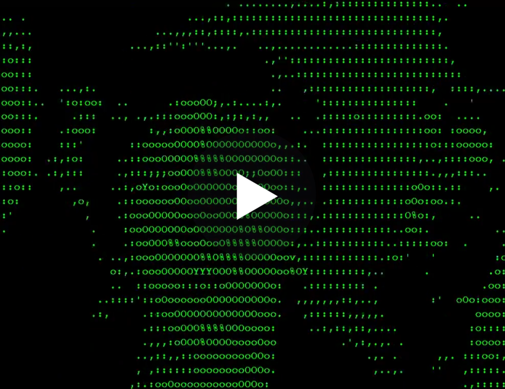

Right! I should probably explain what ASCII Art is, seeing as how I've referenced it a few times already. ASCII stands for the <a href="https://en.wikipedia.org/wiki/ASCII" target="_blank">American Standard Code for Information Interchange</a>, it's one of the earliest text encoding standards, established in 1960.

Computers only understand "machine code", the raw number values (usually represented in binary or hex) that make up all of the data and instructions inside the computer's memory. But because it's nearly impossible for humans to read and write raw binary code, standards were developed to map machine code values to specific textual symbols or "characters", ASCII is one such mapping.

In the early days of computers, before we had images, videos and other media types, all you ever saw on a computer screen were these ASCII characters. And so the earliest forms of art on the Internet where made entirely out of ASCII, hence the term ASCII art.

The first examples of ASCII art appeared on pre-Web Internet forums known as <a href="https://en.wikipedia.org/wiki/Bulletin_board_system" target="_blank">bulletin board systems</a> (BBS) and ranged from simple emoticons to elaborate compositions.

In the BBS days netizen folk artists formed groups known as "crews" to collaborate with each other and distribute their works via downloadable "art packs". Check out Internet archivst Jason Scott's documentary on BBSes to learn more about this early Internet <a href="https://www.youtube.com/watch?v=oQrBbm5ZMlo" target="_blank">ARTSCENE</a> which predates even the net.art movement.

In the 90s the net.art scene took ASCII art to a new level. Vuk Cosic made an etnire series of ASCII video remixes of classic films and Alexei Shulgin even made AR goggles for viewing the real world entirely in ASCII in realtime.

*The Birds by Vuk Cosic (1998), "Vuk Cosic combined programming and formal analysis to create projects that elaborated the pictoral possibilities and aesthetics already established. He coded tow freeware players that convert moving images into ASCII text and speech." —<i>Rachel Greene (from "Internet Art")*

*Super-i® by Alexei Shulgin (2007) are AR goggles which convert the real world in ASCII an other realtime filtered effects as well*

Even though it's one of the earliest Internet art sub-genres, artists like jodi.org still incorporate ASCII art into various aspects of their work today.

[return](README.md)
