# <i>Form</i>-alism
## the Web as a new artistic medium

For many artists, the Web was a means to an end. As we discussed in the last tutorial, for <a href="https://anthology.rhizome.org/communication-creates-conflict" target="_blank">irational.org</a> (Heath Bunting, Kayle Brandon, Rachel Baker, etc.) it was a tool for "hacktivist" intervention, for others like <a href="https://anthology.rhizome.org/brandon" target="_blank">Shu Lea Cheang</a> it was a new means to "explore the construction and perception of identity" (Tribe/Jana) and for others, like <a href="https://en.wikipedia.org/wiki/Learning_to_Love_You_More" target="_blank">Miranda July and Harrell Fletcher</a> a space to experiment with new forms of collaboration and participatory art. But the Web was also a new medium and for many artists, discovering, and perhaps also defining, what that meant was the most exciting part. What would be the Web's inherent features? it's aesthetics? it's dynamics? it's conventions? tropes? cliches? strengths? weaknesses? In this tutorial we'll look at a couple of different responses to this question by early net artists: jodi.org and "Form Art".

## jodi.org

No one has influenced the aesthetic of Internet art more than jodi.org. That's an opinion of course, but it's not a difficult argument to make. From minimalist ASCII art made entirely in text and distributed via emails, to maximalist desktop performances encompassing as many apps as their operating system could load into RAM, jodi.org managed to keep this aesthetic chaotically consistent.

> in 1993, at the start of the "dot com" boom, two European artists, Joan Heemskerk and Dirk Paesmans, paid a visit to California's Silicon Valley. When they returned home, they created jodi.org, a Web-site-as-art-work whose scrambled green text and flashing images seem to deconstruct the visual language of the Web. Heemskerk and Paesmans remixed found images and HTML scripts much as Dada artists played with the photographic imagery and typography of magazines and newspapers. Jodi.org changed the way many people think about the Internet, demonstrating that it didn't just provide a new way to publish information; it could also be an art medium like oil painting, photography, or video. Like other works of New Media art, jodi.org exploited an emerging technology for artistic purposes. —<i>Rachel Greene (from "Web Work")</i>.

And though browsing their work feels like perusing pure pandemonium, there's a consistent thematic thread running through their oeuvre. Whether their creating video game mods or authoring mysterious bot like social media profiles, their work is persistently asking: what is the true nature of the digital medium and what is (or should be) our relationship to it?

I could go on, but I'll let jodi.org explain it themselves.

[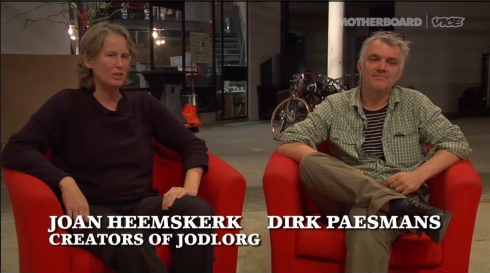](https://netnet.studio/api/videos/jodi-intro-a.mp4)

It's worth noting how rare, and somewhat bizarre, it is to hear jodi.org speak about their work so candidly. jodi.org rarely ever do interviews, and when they have they've often been over e-mail, consisting mostly of incomprehensible noisy glitch ASCII art. They've intentionally avoided writing a proper artist statement or artist bio (the kind every artist is forced to awkwardly write in the third person)

**ASIDE:** [incomprehensible emails?](glitchbots-aside.md)

This carefully crafted online persona has always been a very intentional part of their practice, and as Internet artist Rafaël Rozendaal explained in <a href="https://youtu.be/YuxLGvkg-3k" target="_blank">his video tour of jodi.org's work</a>, it's also reflected in the way they've chosen to share their work on their main homepage, the URL for which is also their collective name, <a href="http://jodi.org" target="_blank">jodi.org</a>

> Most artists start with a homepage with a resume and information, maybe a picture of the artist, and a list of works organized by category, and jodi never did that. They always said the web is a medium for art, it's not a medium for documentation" —<i>Rafaël Rozendaal</i>

And so, they've largely left it up to new media art curators and theorists to analyze their work, and as Dirk alluded to in the video, few works of net.art have been written about more than their piece <i>wwwwwwwww.jodi.org</i> (1995) aka the "misconfigured ASCII drawing".

> The front page is confusing, repetitive, discordant and alphanumeric, but the compositional effects are not what they seem: for behind this web page lies source code which reveals a cascade of traditional images and diagrams that are almost scientific or astrological. [...] Hiding coherent images in source code seems playful and riddling, a means of separating instructions (the HTML) from the completed task (the front page). This surreptitious divide of the browser is accomplished by radicalizing the source code into the pictorial, and radicalizing the executed task into the unreadable. —<i>Rachel Greene (from "Internet Art")</i>.

This is one of many examples where jodi.org brings the code to the foreground. As Rachel Green described in her book <i>Internet Art</i>, this piece flips the traditional relationship between code input and rendered output. Where typically it's the former (the code) which is opaque to most netizens and the latter (the rendered page) which is "readable", here jodi.org turns our expectations upside down, as they often do.

And while turning our exceptions upside down is classic jodi.org, this wasn't necessarily what jodi.org had set out to do as Dirk explains...

[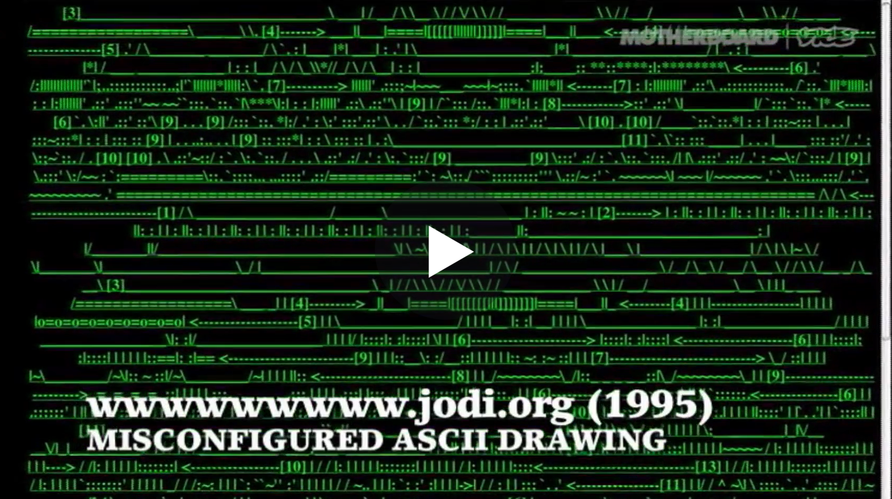](https://netnet.studio/api/videos/jodi-intro-b.mp4)

Initially, they were actually working on an ASCII art drawing, a popular sub-genre of new media art at the time. It was meant to be a mysterious pseudo-scientific looking diagram, the first of many mysterious pages which you begin to discover after clicking on it (the entire drawing is a giant link).

But after making a mistake in their HTML code, what they got instead was abstract ASCII gibberish. As we discussed in the last tutorial, jodi.org is known for embracing their mistakes rather than "fixing them". In this case they felt the broken drawing helped add to the mystery, not detract from it, and so they kept it.

**ASIDE:** [what's ASCII?](ASCII-aside.md)

Another interesting point Dirk makes is how they were concerned about how people might react, they were worried they might be crossing a line. From today's perspective it might be hard to imagine why anyone might think it would be unethical to upload a playful and abstract piece like this to the Web.

But in 1995, the most common way to get anything to appear on your personal computer was to either insert a CD, as Dirk mentioned, which you physically acquired from someone, or whatever you programmed yourself. For most folks, the Web was the first time anything appeared on their screen they didn't necessarily intend to put there themselves.

In this context, jodi.org's work often shocked and terrified netizens that worried their (very expensive) computers had caught a virus or been hacked! When you consider the fact jodi.org often modeled their aesthetic on computer viruses it's not surprising they received a lot of complaints like this.

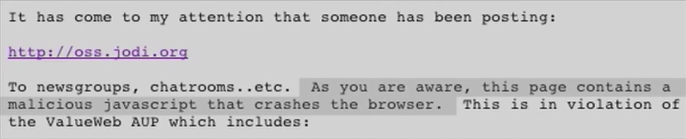

And though the web might no longer be what it was in 1995, it's exciting to see that even all these years later, when unsuspecting netizens stumble upon jodi.org's work today, it still manages to evoke shock, mystery and all sorts of glitchy delight.

[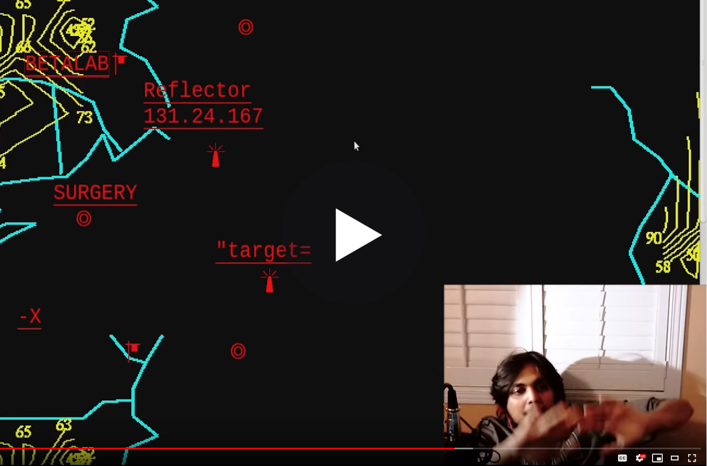](https://netnet.studio/api/videos/deep-web-youtuber-jodi.mp4)

*A <a href="https://www.youtube.com/watch?v=JMC7w8kXbUs&feature=youtu.be&t=25m40s" target="_blank">YouTuber/streamer</a> wonders onto jodi.org's classic piece while streaming himself diving through the deep web. After spending nearly 10mins navigating through the piece, the last thing he says with a smile on his face is "I'm so confused, I'm really really confused, I don't know what to say I'm scared", which in many ways, is exactly what jodi.org had hoped for (even all these years later)*


## Form Art

Like ASCII art, another popular <i>form</i>alist net.art sub-genre of the time which explored the Web's inherent aesthetic was "form art". The term was coined by net.artist Alexei Shulgin and was, in part, a response to jodi.org's take on Web aesthetics.

Form art referred to net.art created predominantly from <a href="https://developer.mozilla.org/en-US/docs/Web/HTML/Element#Forms" target="_blank">HTML form elements</a>. These are the HTML elements used to create things like buttons, drop down lists, check-boxes and text or password fields, as well other "form" components used in graphical applications.

```html
<!-- a button -->
<button> click me </button>

<!-- a drop-down list -->
<select id="pet-select">
  <option value="">--Please choose an option--</option>
  <option value="dog">Dog</option>
  <option value="cat">Cat</option>
  <option value="hamster">Hamster</option>
  <option value="parrot">Parrot</option>
  <option value="spider">Spider</option>
  <option value="goldfish">Goldfish</option>
</select>

<!-- a progress bar -->
<progress id="file" max="100" value="70"> 70% </progress>

<!-- a text field -->
<input type="text" placeholder="your username">
<!-- a password field -->
<input type="password" placeholder="secret password">

<!-- a radio button -->
<input type="radio">

<!-- a check box -->
<input type="checkbox" checked="true">
```

Rather than using these elements for their intended use, form art was an "absurdist" take on these elements, where artists used them to make playful (often interactive) formal experiments which "transformed the most bureaucratic, functional, and unsolved aspects of the web into aesthetic, ludic elements".

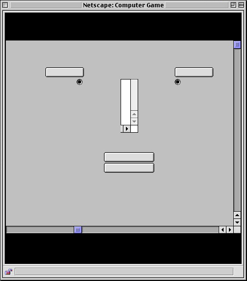

*a piece of form art by Alexei Shulgin from the original Form Art Competition website*

As we've discussed, the net.art movement's anti-establishment sentiments were one of it's defining characteristics. For these artists, one of the most exciting aspects of making work on the Internet is that they no longer needed the traditional art institutions to exhibit their work, they had the Web for that.

So, Form Art was also in part a response to art competitions, specifically the <a href="https://en.wikipedia.org/wiki/Prix_Ars_Electronica" target="_blank">Prix Ars Electronica</a> (which is like the Oscars or Grammys of new media art). Alexei first introduced the sub-genre in the form of a call for submissions to the "Form Art Competition".

> I was absolutely sure that art after the internet would never be the same and that an artist does not need to play traditional career games, including maintaining his or her own style. —<i>Alexei Shulgin</i>

One of the "winners" was <a href="http://easylife.org/form/competition/choose/choose.htm" target="_blank">Choose</a> (1997) by net.artist Kass Schmitt.

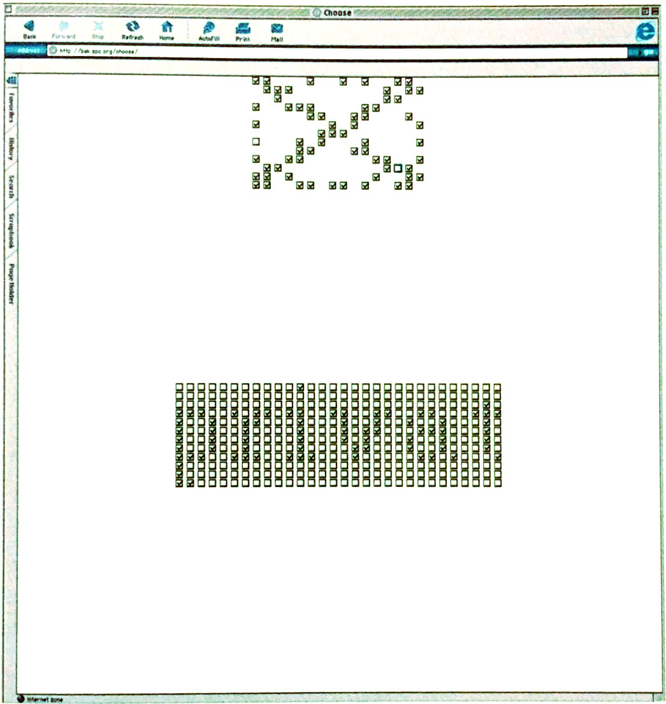

Form art wasn't the only satirical net.art "competition" at the time, Kass was also involved in organizing another satirical competition called <i>Mr.NetArt</i> with a group of cyberfeminists.

**ASIDE:** [what's cyberfeminism?](cyberfeminist-aside.md)

In a way, the form art "aesthetic" was in part informed by the artists that created these compositions and partly by the developers of web browsers, who are ultimately the ones defining what the <i>individual</i> form elements themselves look like.

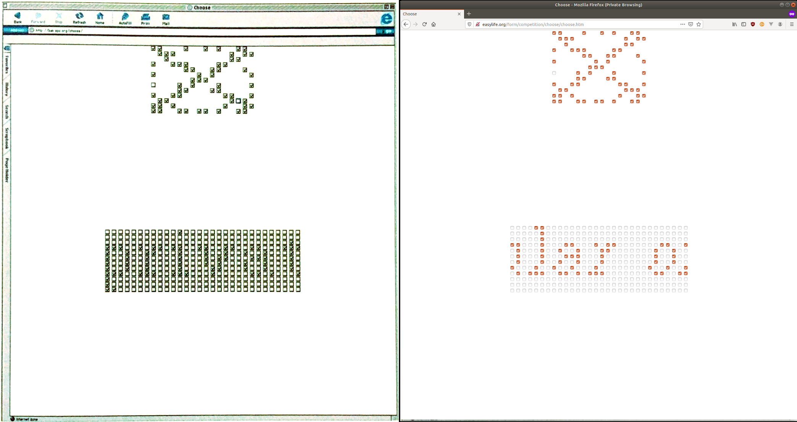

*<a href="http://easylife.org/form/competition/choose/choose.htm" target="_blank">Choose</a> by Kass Schmitt. On the left as it appeared on Internet Explorer (Mac) in the late 90s, on the right as it appears on Firefox (Linux) in 2020*

In this way, form art is never static because browsers are never static, they're constantly evolving and changing. The form elements are often updated to match the graphic design styles of the UI (user interface) of any given platform (the latest versions of Windows, Mac, Android, iOS or Linux).

And so, while the original HTML code has remained hosted on Alexei's server unedited since 1997, the rendered result of what that page looks like in the browser has continued to change over the years each time browsers have updated.


*<a href="http://easylife.org/form/" target="_blank">Form Art</a> by Alexei Shulgin as it appeared in Netscape (Windows) in the late 90s.*

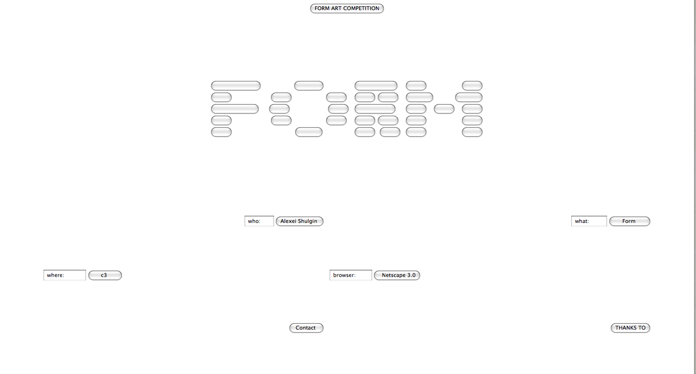

*<a href="http://easylife.org/form/" target="_blank">Form Art</a> by Alexei Shulgin as it appeared in unidentified (Mac) browser in ~2010.*

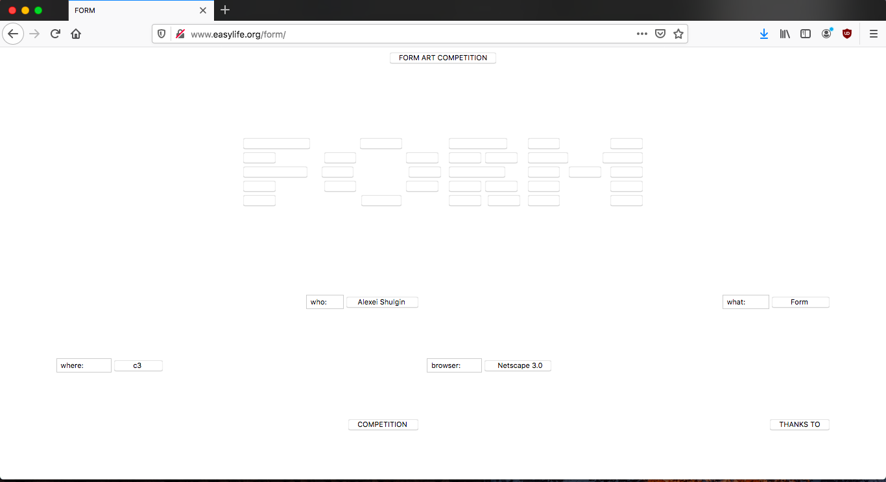

*<a href="http://easylife.org/form/" target="_blank">Form Art</a> by Alexei Shulgin as it appears in Firefox (Mac) in 2020.*


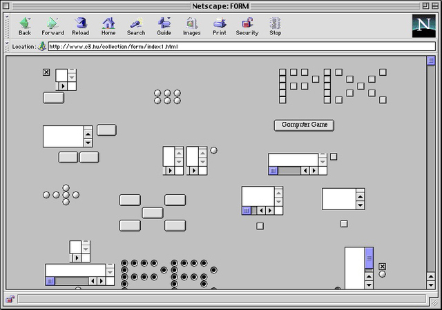

*<a href="http://easylife.org/form/index1.html?" target="_blank">Form Art</a> by Alexei Shulgin as it appeared in Netscape (Mac) in the late 90s.*


*<a href="http://easylife.org/form/index1.html?" target="_blank">Form Art</a> by Alexei Shulgin as it appeared in Chrome (Mac) in ~2010.*

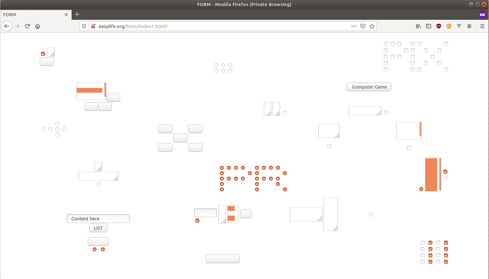

*<a href="http://easylife.org/form/index1.html?" target="_blank">Form Art</a> by Alexei Shulgin as it appears in Firefox (Linux) in 2020.*

----

> bringing them [form elements] in focus was a declaration of the fact that a computer interface is not a 'transparent' invisible layer to be taken for granted, [...] but something that defines the way we are forced to work and even think.  —<i>Alexei Shulgin</i>

On the one hand Form Art (in caps) refers to this particular "competition" and the series of works created in 1997, but because artists have continued to play with form elements this way ever since form art has also become an Internet art sub-genre.

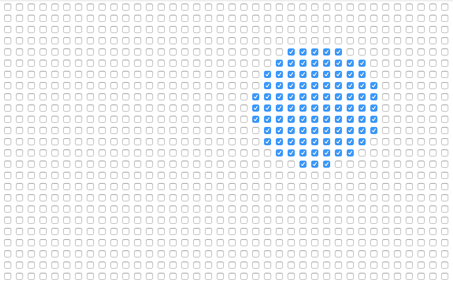

*<a href="https://mrdoob.com/lab/javascript/checkboxes/" target="_blank">Checkboxes Ball</a> by mr.doob (aka Ricardo Cabello) (~2010) as it appears on Firefox (Mac) in 2020*

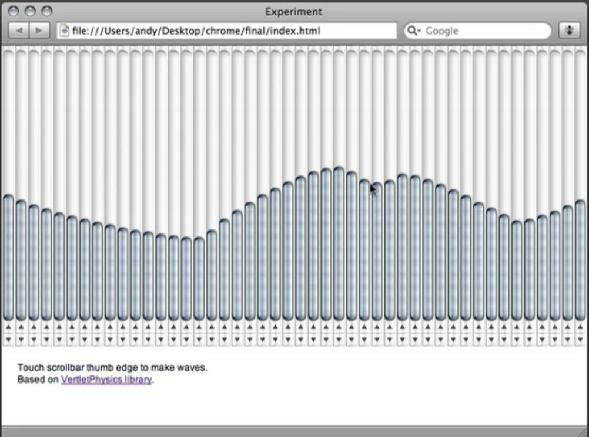

*A still from the 389 series by Andrej Yasev as it appeared on Safari (Mac) in 2009 (the works are no longer online but they have <a href="https://web.archive.org/web/20120401021522/http://the389.com/" target="_blank">been archived</a> by the Internet Archive and there is also <a href="https://vimeo.com/yazev" target="_blank">video documentation</a> on Vimeo)*

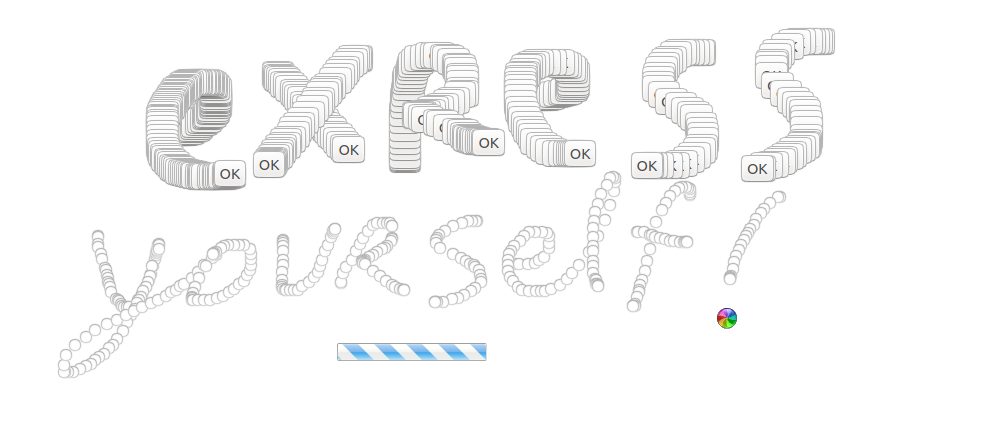

*<a href="http://poxparty.com/InterFacePainter/index.html" target="_blank">Interface Painter</a> by Pox (Ben Syverson and Jon Satrom) a photoshop-like "artware" application for creating form art.*

## in &lt;/closing&gt;

Soon we'll start discussing CSS, but before we do there's one last "pure HTML" Internet art piece I'd like to show you. In 2011 new media artists Evan Roth asked a conceptual question, what would it look like if he put every HTML element inside of every other HTML element in alphabetical order?

<a href="http://all-html.net/" target="_blank">This</a> was the result, a form-art-esque abstraction he called <i>all-html.net</i> which, in some sense, is a portrait of HTML itself a snapshot of it's "pure aesthetic" at the particular time and context (platform/browser) you view it in.

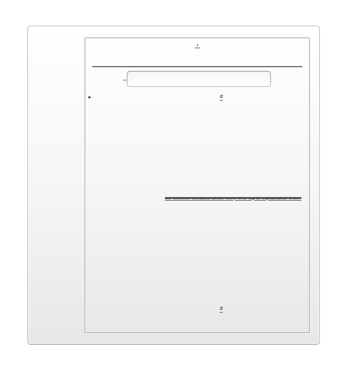

*<a href="http://all-html.net/" target="_blank">all-html.net</a> by Evan Roth as it appears on Firefox (Linux) in 2020*

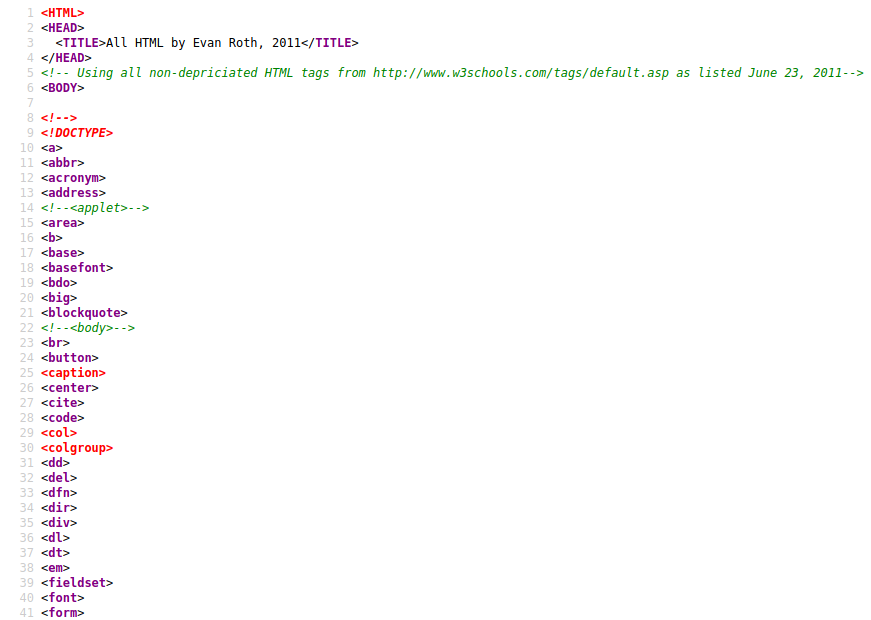

*A screenshot of all-html.net's source code*


## References

- [Greene, Rachel. Internet Art. Thames & Hudson. 2004](https://thamesandhudson.com.au/product/internet-art/)

- [Greene, Rachel. Web Work: A History of Internet Art. Artforum. May 2000](https://netart.rocks/files/webwork.pdf)

- [Tribe, Mark, Reena Jana. New Media Art. Taschen. May 2007](https://netart.rocks/files/webwork.pdf)

- [Kaplan, Zachary et al. Net Art Anthology. Rhizome.org. 2019](https://anthology.rhizome.org/)
