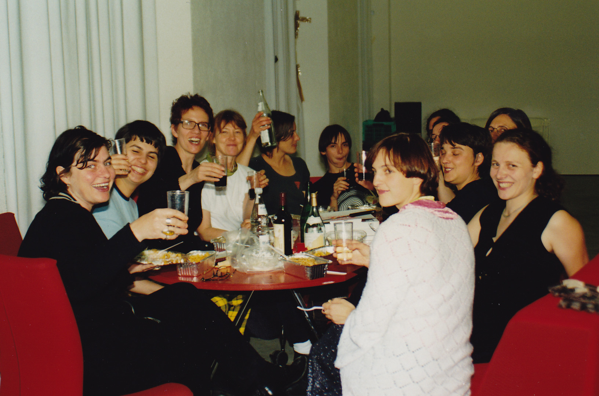
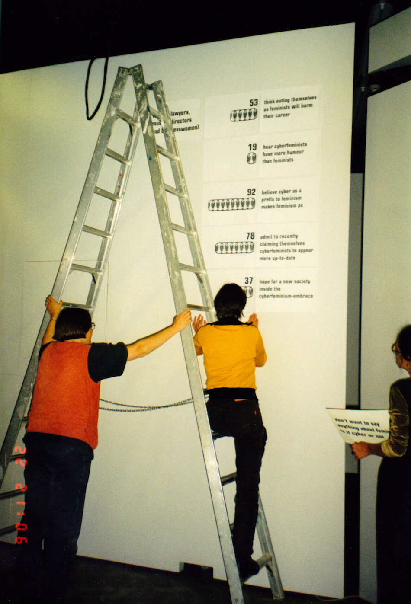
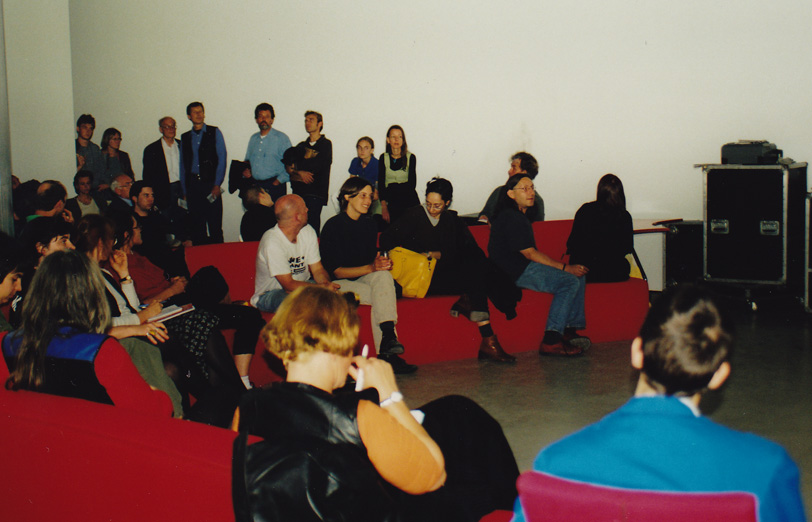
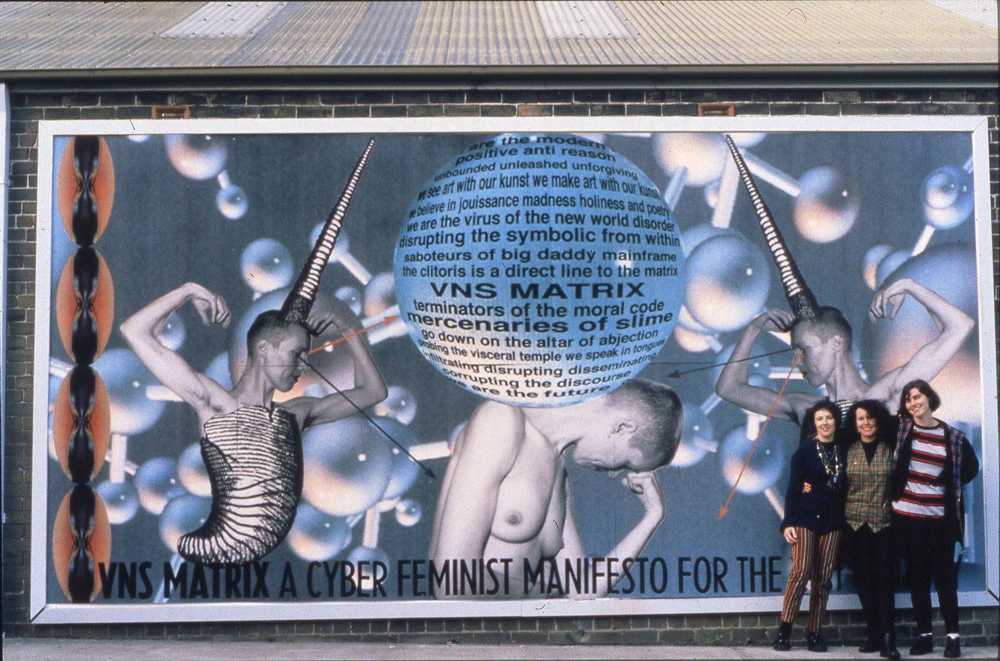

If I gave you a definition for cyberfeminism then I wouldn't be a good cyberfeminist. 1997, the year of the Form Art Competition, was also the year of the first <i>Cyberfeminist International</i>, it was organized by the <a href="https://www.obn.org/" target="_blank">Old Boys Network</a> a cyberfeminist alliance founded by net.artist <a href="http://www.artwarez.org/cv.0.html" target="_blank">Cornelia Sollfrank</a>.

The organizers of that first Cyberfeminist International decided they would resist defining the term, instead they wrote 100 Anti-Theses, which rather than defining what cyberfeminism <i>is</i> it defined what it <i>is not</i>. I realize that might not be a satifying anser to your question, so if you'd like a more in depth one, refer to Cornelia's <a href="https://www.obn.org/reading_room/writings/html/truth.html" target="_blank">The Truth about Cyberfeminism</a>.

Cyberfeminism was around before these organized efforts however. In 1991 the cyberfeminist net.art collective VNS Matrix (pronounced <i>venus</i>) released their legendary <a href="https://anthology.rhizome.org/a-cyber-feminist-manifesto-for-the-21st-century" target="_blank">Cyberfeminist Manifesto</a>, and 6 years earlier Donna Haraway had published her classic <a href="https://en.wikipedia.org/wiki/A_Cyborg_Manifesto" target="_blank">Cyborg Manifesto</a>.

*VNS Matrix's Cyberfeminist Manifesto on a billboard in Sydney Australia, where the collective was based*

It was the year after the first Cyberfeminist International that Kass Schmitt, along with Rachel Baker, Cornelia Sollfrank and Josephine Bosma, organized that Mr.NetArt competition mentioned before, in which, as Rachel Greene described, "the individual notion of the male artist-genius was exposed to ridicule".

Kass, as well as many of the other net.artists we've discussed, participated in other similar DIY gatherings of radical netizens discussing cyberspace, art and soclial issues like the <a href="https://archive.org/details/ArtServersUnlimiteddocumentaryvideo" target="_blank">Art Servers Unlimited</a> conference... but now we're getting way off topic, let's get back to her form art piece!

[return](README.md)
