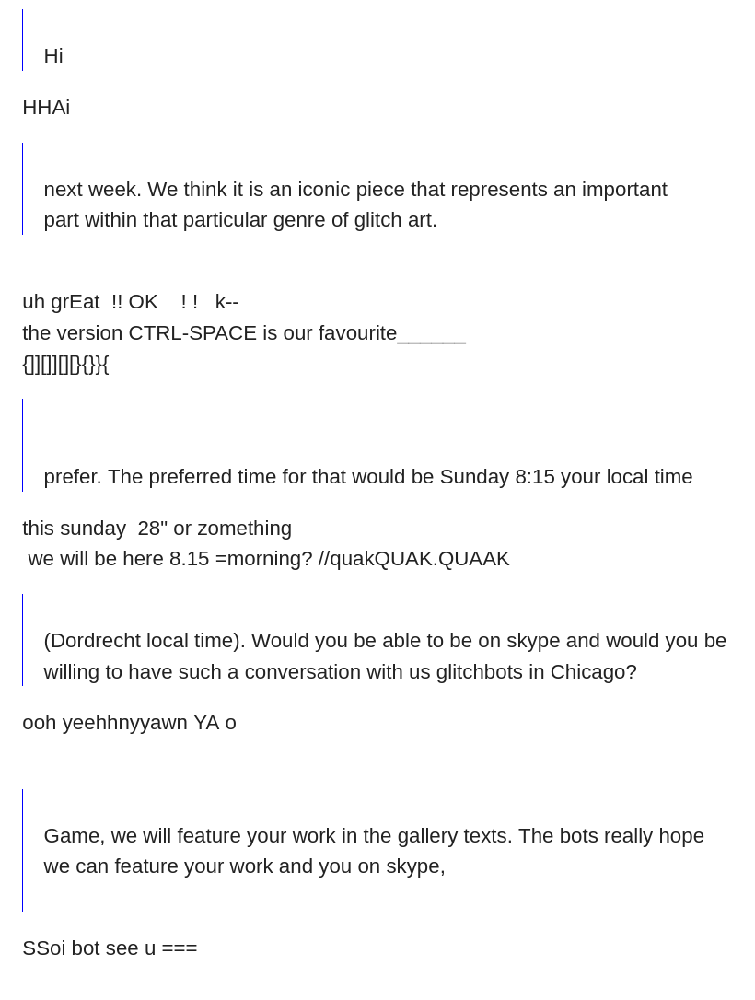
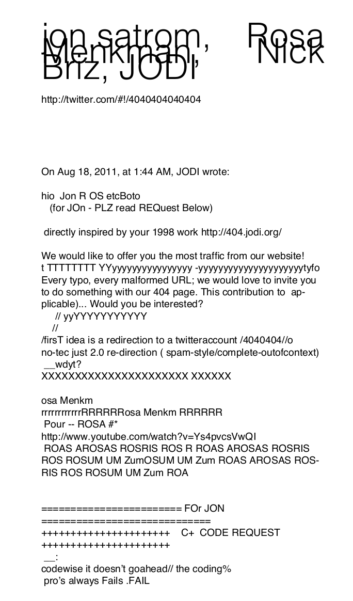

Well, nearly incomprehensible. You really had to take your time to decipher exactly what it was they were saying in response. Their responses appeared as though a malfunctioning bot was responding for them.

The organizers of the first first <a href="http://gli.tc/h/" target="_blank">GLI.TC/H</a> conference in 2010 modeled their communications on jodi.org's glitchy online persona. Nick Briz, Jon Satrom (both <a href="https://netizen.org" target="_blank">netizen.org</a> founders), Rosa Menkman and Evan Meaney remained anonymous for most of the events planning, communicating with partipants and press simply as "the glitchbots".

These glitchy correspondences got particularly meta when they invited jodi.org to present work at the conference as well as give a virtual lecture to the conference audience in Chicago. Take a look a this email exchange.

*screenshot of jodi.org's response to an invitation to share work and present a virtual lecture at the GLI.TC/H festival in Chicago, 2010*

Though jodi.org responded point by point to the glitchbots' email invite, the organizers weren't actually sure if jodi.org was going to show up on skype until the moment of the actual lecture. At which point they showed up on stream <a href="https://www.youtube.com/watch?v=rGQEwYJZzqo&list=PL3228E09A837979FB&index=16" target="_blank">upside down</a>... classic jodi.org.

The following year the glitchbots invited jodi.org to collaborate with them to produce the conference's official 404 page, which was in part a conference "easter egg" but also an homage to jodi.org's classic 1998 net.art piece <a href="http://404.jodi.org/" target="_blank">404.jodi.org</a>. This collaboration took place entirely over e-mail, with the glitchbots and jodi.org discussing the details of the project in a nearly incomprehensible exchange.

*This e-meail exchange is partly documented in <a href="https://netnet.studio/tutorials/form-alism/files/glitch-404.pdf" target="_blank">4040404040404</a>, from the 20111 <a href="http://gli.tc/h/READERROR/GLITCH_READERROR_20111-v3BWs.pdf" target="_blank">GLI.TC/H  READER[ROR]</a>.*

[return](README.md)
