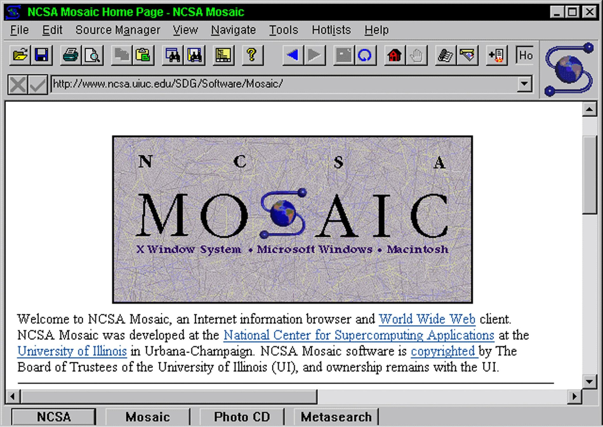
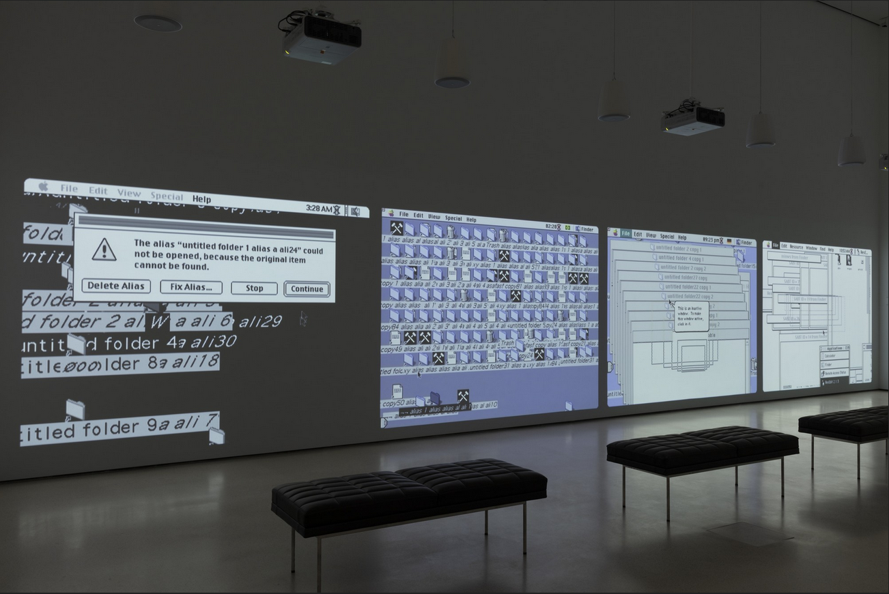
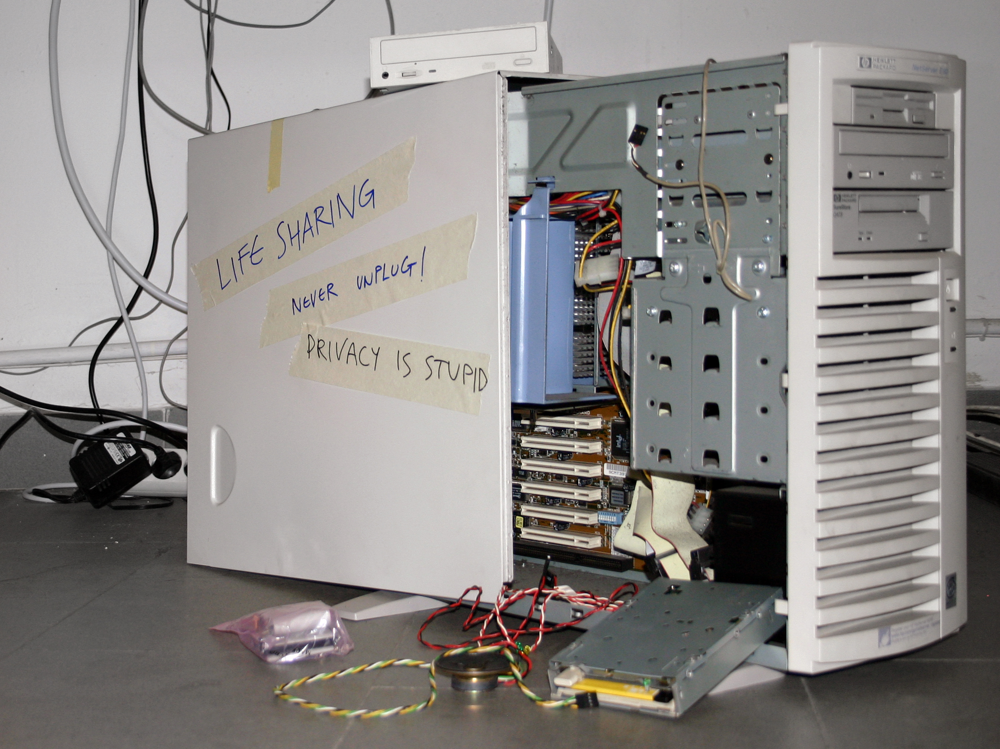

# View Source: King's Cross Phone In (1994)
## a "behind the browser" look at early net.art

Self proclaimed "artivist" (artist + activist), Heath Bunting was among the first wave of artists to embrace the Web as a space for artistic interventions. Here we'll take a look at one of his earliest, and most written about, pieces of "net.art" <i>King's Cross Phone In</i> (1994). "In this work, the web was used to transform a commuter hub, King's Cross train station (London), into a venue for social and musical spectacles." —<i>Rachel Greene (author of Internet Art)</i>.

---



The year is 1994, though the Web had been around for a couple of years, a browser called Mosaic (which would later evolve into Netscape Navigator) had just been developed at the University of Illinois ushering in the Internet boom of the 1990s, it was now easier than ever to access the Internet and, perhaps more importantly, understand it's potential.


> this Selfie taken by Kayle Brandon of herself and collaborator Heath Bunting shows the artists illegally crossing the border between <a href="http://irational.org/heath/borderxing/it.fr/" target="_blank">Pigna, Italy and Soarge, France</a> as part of their project <a href="http://irational.org/borderxing/home.html" target="_blank">BorderXing Guide</a>

It's easy to take the Web's self-publishing nature for granted  today, but for "artivists" (artists activists) and "<a href="https://en.wikipedia.org/wiki/Hacktivism" target="_blank">hacktivists</a>" (hacker activists) like Heath Bunting and Kayle Brandon, this was revolutionary. They could publish work considered too radical for traditional outlets and reach a much wider audience than was previously possible via other DIY methods.

For example, their legendary collaborative piece <a href="http://irational.org/borderxing/home.html" target="_blank">BorderXing Guide</a> (2002) a collection of instructions and documentation for how to surreptitiously cross European borders. For these artists the Internet is a means to an end; an online intervention for instigating offline situations.

The project contained routes and instructions for crossing various European borders undetected and without a passport. The site also included documentation from Heath and Kayle's own attempts at crossing these borders, with notes like "Spring and Autumn crossing recommended. Route has been used by refugees before successfully. Take enough food for 10 hour walk."

This way of using the Web is a theme across most of Heath's work, for example his project <a href="https://anthology.rhizome.org/communication-creates-conflict" target="_blank">Communication Creates Conflict</a> (1995) or this piece you see behind me <a href="http://www.irational.org/cybercafe/xrel.html" target="_blank">King's Cross Phone In</a> (1994).

This piece is technically very simple, but conceptually very exciting. Heath published the phone numbers to public telephone booths at London's King's Cross railway station along side instructions for how and when to call in, converting the heavily trafficked commuter hub into a "social and musical spectacle" for a day.

If we take a look at this canonical work of net.art's source code we can see that the 62 lines of code are as simple and straight forward as the concept itself.

```HTML
<TITLE>Cybercafe Net Art Projects - kings X Press Release.</TITLE>

<p>

<h1>@ kings x</h1>

<h3>phone in</h3>

<b>RELEASE</b><p>

During the day of Friday 5th August 1994<br>
the telephone booth area behind the destination board<br>
at kings X British Rail station will be borrowed<br>
and used for a temporary cybercafe.<p>

It would be good to concentrate activity around 18:00 GMT,<br>
but play as you will.<p>

TELEPHONE Nos.
<PRE>
0171 278 2207  .......................  0171 387 1736
0171 278 2208  .......................  0171 387 1756
0171 837 6028  .......................  0171 387 1823
0171 837 5193  .......................  0171 278 2179
0171 837 6417  .......................  0171 278 2163
0171 278 4290  .......................  0171 278 2083
0171 837 1034  .......................  0171 387 1362
0171 837 7959  .......................  0171 278 2017
0171 837 1644  .......................  0171 387 1569
0171 837 7234  .......................  0171 387 1526
0171 837 1481  .......................  0171 387 1587
0171 837 0867  .......................  0171 837 0298
0171 278 7259  .......................  0171 837 0399
0171 278 2502  .......................  0171 837 1768
0171 278 2501  .......................  0171 387 1398
0171 278 2275  .......................  0171 837 3758
0171 278 2217  .......................  0171 837 0933
0171 278 2260  .......................  0171 837 0499
</PRE>

Please do any combination of the following:<p>
(1) call no./nos. and let the phone ring a short while and then hang up<br>
(2) call these nos. in some kind of pattern<br>
(the nos. are listed as a floor plan of the booth)<br>
(3) call and have a chat with an expectant or unexpectant person<br>
(4) go to Kings X station watch public reaction/answer the phones and chat<br>
(5) do something different<p>

This event will be publicised worldwide<p>

I will write a report stating that:<br>
(1) no body rang<br>
(2) a massive techno crowd assembled
and danced to the sound of ringing telephones<br>
(3) something unexpected happened<p>

No refreshments will be provided/please bring pack lunch<p>

<hr>

heath@<A HREF="mailto:heath@cybercafe.org">cyber</a>cafe.org<br>

```

It's made using 9 of the most common HTML elements, <code>&lt;title&gt;</code>, <code>&lt;img&gt;</code>, <code>&lt;h1&gt;</code>, <code>&lt;h3&gt;</code>, <code>&lt;b&gt;</code>, <code>&lt;p&gt;</code>, <code>&lt;a&gt;</code>, <code>&lt;pre&gt;</code>, <code>&lt;br&gt;</code> and <code>&lt;hr&gt;</code>. If you're curious, you can find a full list of <a href="https://developer.mozilla.org/en-US/docs/Web/HTML/Element" target="_blank">HTML elements here</a>.

```HTML
<!DOCTYPE html>
```

Let's recreate it piece by piece, element by element, making some slight adjustments along the way in order to conform to modern web standards. For example, in 1994 pages didn't have <a href="https://developer.mozilla.org/en-US/docs/Glossary/Doctype" target="_blank">doctypes</a>, but these days it's important to let the browser know which era of HTML we created our work in, so we'll specify an HTML5 doctype.

```HTML
<title>Cybercafe Net Art Projects - kings X Press Release.</title>
```

Next we'll add the <a href="https://developer.mozilla.org/en-US/docs/Web/HTML/Element/title" target="_blank">title</a> element. Like most elements, it consists of an "opening tag" <code>&lt;title&gt;</code> and a "closing tag" <code>&lt;/title&gt;</code> surrounding the content we wish to denote as the "title" of our work.

Like the title of any work of art, this doesn't appear within the work itself, but rather is part of the piece's "didactic text", as we say in the art world, or "metadata" as we say in the computer world. This is what appears in web search results or social media cards when shared on platforms like Facebook or Twitter. It's also the title that shows up the browser tab or your browsers bookmarks.

In Heath's original work he wrote the <code>&lt;TITLE&gt;</code> tag in all caps, which was the convention back then, but today we write all element tag names in lower case, so we'll write ourse like this <code>&lt;title&gt;</code>

```HTML

```

The first element that visually appears in the work is the "cybercafe" logo. When we want to embed an image into an HTML page we use the <a href="https://developer.mozilla.org/en-US/docs/Web/HTML/Element/img" target="_blank">img</a> element. Unlike most elements the <code>&lt;img&gt;</code> element has no closing tag. When an element consists only of an opening tag it's referred to as a "void element" or "singleton".

```HTML

```

When we want to change specific details of any given element we do this by adding the necessary <a href="https://developer.mozilla.org/en-US/docs/Glossary/Attribute" target="_blank">attribute</a>, an attribute always has this form <code>name="value"</code>. Here we've added a <i>src</i> attribute to specify that we want to use the image tag to embed the specific image file <b>cclogo.gif</b>.

Because this image file is saved in the same folder that our HTML file is saved in, we only need to specify the filename, but had it been saved anywhere else, we would need to specify the file's path.

```HTML

```

Another modification we should make to Heath's original code is the addition of a second attribute for this image, an <a href="https://developer.mozilla.org/en-US/docs/Web/API/HTMLImageElement/alt" target="_blank">alt</a> attribute describing what this is an image of.

There are lots more people online today than there was in 1994, and in order to make sure our work is accessible to the widest and diverse group of netizens possible there are certain code considerations to keep in mind. In this case, alt attributes are used by screen-readers, and other assistive technologies, to read aloud the description of the image to someone who is visually impaired for example.

```HTML
<p>
```

The next element in Heath's original code is a <code>&lt;p&gt;</code> which we use to denote a paragraph of information. However, Heath has a total of 9 of opening <code>&lt;p&gt;</code> tags throughout his code, in places they don't belong, all of which are missing their corresponding closing <code>&lt;/p&gt;</code> tags! ...even the most influential net artists make plenty of coding mistakes.

There are specific rules regarding how HTML is supposed to be written, browsers assume you're following those rules and interpret your code based on that assumption. In programming, when a rule is broken the computer will usually present you with an <a href="https://developer.mozilla.org/en-US/docs/Web/JavaScript/Reference/Errors" target="_blank">error message</a> like this JavaScript error for example: "<a href="https://developer.mozilla.org/en-US/docs/Web/JavaScript/Reference/Errors/Identifier_after_number" target="_blank">SyntaxError: identifier starts immediately after numeric literal</a>"

But in the case of languages like HTML and CSS, rather than presenting an error message Web browsers do their best to correct your mistakes, based on what they think you <i>meant</i> to do. This is why Heath's piece displays perfectly even though he made plenty of mistakes. This unique characteristic of coding on the Web is both a blessing and a curse for artists.

On the one hand, mistakes are often great sources of inspiration and ideation. Internet artists like Joan Heemskerk and Dirk Paesmans (aka <a href="https://en.wikipedia.org/wiki/Jodi_(art_collective)" target="_blank">jodi.org</a>) defined their entire art career around embracing mistakes in computer systems. The fact that browsers do their best to render our broken code, rather than simply displaying an error message, makes them a rich space for, what net artist <a href="http://jonsatrom.com/" target="_blank">Jon Satrom</a> calls, "creative problem creating."

On the other hand, browsers auto-fixing mistakes means you might not realize you ever made a mistake, which means you might continue making those mistakes, until you've made so many the browser is unable to auto-correct. Knowing that you made a mistake is helpful information, especially for artists learning to code for the first time.

**NOTE**: one of the reasons for developing [https://netnet.studio](https://netnet.studio) was to create a coding environment that not only warns you if/when you make JavaScript mistakes (as professional browser developer tools do) but also when you make HTML and CSS mistakes (which browser developer tools do not do). Additionally, it does so in more human friendly language, because messages like "SyntaxError: identifier starts immediately after numeric literal" aren't all that helpful when you're still learning the lingo.

> The mistake is nothing wrong, the computer keeps working. Something wrong still works, there's nothing wrong with something wrong —jodi.org

So, with that said, we'll skip this <code>&lt;p&gt;</code> tag and fix Heath's mistakes as we go.

```HTML
<h1>@ kings x</h1>
```

Next we have a level 1 <a href="https://developer.mozilla.org/en-US/docs/Web/HTML/Element/Heading_Elements" target="_blank">heading element</a> or <code>&lt;h1&gt;</code> which are used to denote the start of a new section of an HTML document, for example the title of a news article.

```HTML
<h3>phone in</h3>
```

Next we have a level 3 <a href="https://developer.mozilla.org/en-US/docs/Web/HTML/Element/Heading_Elements" target="_blank">heading element</a> or <code>&lt;h3&gt;</code> notice that the default font size is smaller than that of the code>&lt;h1&gt;</code>. There are 6 levels of heading elements, each one's default font size being a big smaller than the next.

```HTML
<b>RELEASE</b>
```

Next we have <code>&lt;b&gt;</code> element which is used to "<b>b</b>ring attention to" a particular piece of content on our page. You might notice that while browsers render these elements in the default font size of 16px (pixels) it changes it's default font weight from "normal" to "bold".

```HTML
<p>
  During the day of Friday 5th August 1994
  the telephone booth area behind the destination board
  at kings X British Rail station will be borrowed
  and used for a temporary cybercafe.
</p>

<p>
  It would be good to concentrate activity around 18:00 GMT,
  but play as you will.
</p>
```

Next we have a couple of paragraphs, which we'll denote by correctly placing them in opening <code>&lt;p&gt;</code> and closing <code>&lt;/p&gt;</code> tags.

You might notice that despite the line break at the end of each of those lines in our code, the browser renders both paragraphs as one long line. This is because browsers ignore line breaks, these exist purely for the sake of the coder.

We could just as easily write all our code on a single line and it wouldn't make a difference to the browser... but it would make a difference to us, it's not very comfortable to work on a file made of a single long line.

```HTML
<p>
  During the day of Friday 5th August 1994<br>
  the telephone booth area behind the destination board<br>
  at kings X British Rail station will be borrowed<br>
  and used for a temporary cybercafe.
</p>

<p>
  It would be good to concentrate activity around 18:00 GMT,<br>
  but play as you will.
</p>
```

What Heath did in order to force line breaks in the specific spots he wanted was to use the <a href="https://developer.mozilla.org/en-US/docs/Web/HTML/Element/br" target="_blank">line break element</a> or <code>&lt;br&gt;</code>, which like the <b>img</b> element is a "singleton", meaning it has no closing tag.

That said, there is one element that will visually render any line breaks you include within it's opening and closing tag, the <a href="https://developer.mozilla.org/en-US/docs/Web/HTML/Element/pre" target="_blank">preformatted text element</a> or <code>&lt;pre&gt;</code>.

```HTML
TELEPHONE Nos.
<pre>
0171 278 2207	.......................	0171 387 1736
0171 278 2208	.......................	0171 387 1756
0171 837 6028	.......................	0171 387 1823
0171 837 5193	.......................	0171 278 2179
0171 837 6417	.......................	0171 278 2163
0171 278 4290	.......................	0171 278 2083
0171 837 1034	.......................	0171 387 1362
0171 837 7959	.......................	0171 278 2017
0171 837 1644	.......................	0171 387 1569
0171 837 7234	.......................	0171 387 1526
0171 837 1481	.......................	0171 387 1587
0171 837 0867	.......................	0171 837 0298
0171 278 7259	.......................	0171 837 0399
0171 278 2502	.......................	0171 837 1768
0171 278 2501	.......................	0171 387 1398
0171 278 2275	.......................	0171 837 3758
0171 278 2217	.......................	0171 837 0933
0171 278 2260	.......................	0171 837 0499
</pre>
```

Heath uses the <code>&lt;pre&gt;</code> element to list out the phone numbers for the King's Cross station phone booths. The London station had phone booths on either side of the lobby and Heath wanted to visually present them in the same order, and on the same side, as they appear in the station so that it would also function as a sort of map or overhead perspective of the telephones in the station.

You might notie that in addition to rendering any line breaks or spaces exactly as they appear in our code, the <code>&lt;pre&gt;</code> tags also display the content between them in a "monospace" typeface, rather than the default "serif" typeface of all the other elements.

Safe to assume this was intentional on Heath's part, as the uniformity of "monospace" typefaces also helps keep things aligned neatly, contributing to that "map" or "diagram" aesthetic.

```HTML
<p>
  Please do any combination of the following:
</p>

<p>
  (1) call no./nos. and let the phone ring a short while and then hang up<br>
  (2) call these nos. in some kind of pattern<br>
  (the nos. are listed as a floor plan of the booth)<br>
  (3) call and have a chat with an expectant or unexpectant person<br>
  (4) go to Kings X station watch public reaction/answer the phones and chat<br>
  (5) do something different
</p>

<p>
  This event will be publicised worldwide
</p>

<p>
  I will write a report stating that:<br>
  (1) no body rang<br>
  (2) a massive techno crowd assembled
  and danced to the sound of ringing telephones<br>
  (3) something unexpected happened
</p>

<p>
  No refreshments will be provided/please bring pack lunch
</p>
```

Reminiscent of the instruction sets written by <a href="https://en.wikipedia.org/wiki/Fluxus" target="_blank">Fluxus</a> and <a href="https://en.wikipedia.org/wiki/Conceptual_art" target="_blank">Conceptual</a> artists, like <a href="https://en.wikipedia.org/wiki/Yoko_Ono" target="_blank">Yoko Ono</a>  and others, the next section of this piece are the directions for any interested in participating in the performance which took play on Friday, August 5th 1994.

```HTML
<p>
  Please do any combination of the following:
</p>

<ol>
  <li>call no./nos. and let the phone ring a short while and then hang up</li>
  <li>call these nos. in some kind of pattern</li>
  <li>(the nos. are listed as a floor plan of the booth)</li>
  <li>call and have a chat with an expectant or unexpectant person</li>
  <li>go to Kings X station watch public reaction/answer the phones and chat</li>
  <li>do something different</li>
</ol>
```

Heath manually numbered the instructions but he could also have used an <a href="https://developer.mozilla.org/en-US/docs/Web/HTML/Element/ol" target="_blank">Ordered List element</a> or <code>&lt;ol&gt;</code>. By placing each instruction within a list elements, or <code>&lt;li&gt;</code> and placing those list elements within an ordered list element, the browsers know to automatically number each item.

This has the added benefit of handling the line breaks for us in addition to the automatic numbering. If we later decided to remove or add an additional step we wouldn't need to manually renumber each because the browser takes care of that for us.

If we had placed our <code>&lt;li&gt;</code> within an <a href="https://developer.mozilla.org/en-US/docs/Web/HTML/Element/ul" target="_blank">Unordered List element</a>, or <code>&lt;ul&gt;</code> then our items would be listed as bulleted points instead of numbers.

Finishing of the document, Heath adds another singleton element, the <code>&lt;hr&gt;</code> tag or <a href="https://developer.mozilla.org/en-US/docs/Web/HTML/Element/hr" target="_blank">Horizontal Rule</a>, also known as a "thematic break", which renders a Horizontal line across the page, below which he includes his contact email address.

```HTML
<a href="mailto:heath@cybercafe.org">heath@cybercafe.org</a>
```

He places his email within one of the most important HTML elements of all, the <a href="https://developer.mozilla.org/en-US/docs/Web/HTML/Element/a" target="_blank">Anchor element</a> or <code>&lt;a&gt;</code> tag. The anchor tag can be used a variety of different ways depending on what you specify in it's <b>href</b> attribute.

When we have a long HTML page, anchor tags can be used to create links which jump up or down to specific sections of an HTML page, rather than having to endlessly scroll. Anchor tags can also be used to automatically launch the mail app on a computer or smartphone which is how Heath is using it here.

By writing his email address as the value for the <b>href</b> attribute preceeded by the phrase "mailto:", when a user clicks on this link it will launch the mail app with his email address already included in the "send to" field of the app.

However, the most common use of the anchor tag is creating hyperlinks to other web pages hosted on the same site or elsewhere on the web. If we were to replace "mailto:heath@cybercafe.org" with a web address like "http://netizen.org" the clicking the link would redirect us to that website.

```HTML
heath@<a href="mailto:heath@cybercafe.org">cyber</a>cafe.org
```

One last detail I should mention. Though the way I've written the code here is the most common, Heath actually wrote it a little different. Instead of placing his entire email within the opening <code>&lt;a&gt;</code> and closing <code>&lt;/a&gt;</code> tags, he only included the word "cyber" within the link and actually places the rest of his email address outside the anchor element.

It's a tiny detail, but tiny details matter in art.

EOF! we've completed our remix, or "refactor" as we say in code lingo, of Heath Bunting's classic net.art piece <a href="http://www.irational.org/cybercafe/xrel.html" target="_blank">King's Cross Phone In</a>.

> The calls created a musical intervention that disrupted the daily routine of urban transportation hub, as commuters circulating through the station chatted with strangers from around the world who were ringing up to say hello. Network functionality was understood on the level of the friendly phone call, as public space was reconfigured aurally and socially. Bunting's modus operandi since 1994 has been to create works/events that ware as facile, low-tech, and straightforward as graffiti: simple subversions backed by anarchic conviction. To netizens he is something of a folk hero. —<i>Rachel Greene</i>.

In our era of social media, for better or worse, the Internet is regularly used to organize, mobilize and instigate offline activities, from the role Twitter played in the <a href="https://www.twitterandteargas.org/" target="_blank">Arab Spring</a> to the role Facebook played in the <a href="https://www.nytimes.com/2018/10/15/technology/myanmar-facebook-genocide.html" target="_blank">Myanmar genocide</a>.

Because these apps impose a specific structure around how information is shared as well as mediate the distribution of that information via their algorithmic feeds, anytime we use a social media platform to organize a call to action, we are (consciously or not) allowing the special interests of these platforms to influence various details of our work and it's distribution.

But these platforms are themselves built on top of the Internet's original hypertext platform, the people's platform, the World Wide Web! Unlike social media services the Web has no ulterior motive and so it doesn't attempt to control or influence the way you use it.

Rather than presenting you with a form to fill out, carefully crafted to provide the illusion of self-expression while also ensure data is collected in a manner that is organized for the explicit digestion of surveillance capitalist systems, the Web presents you with a blank canvas and a set of elements, building blocks to be organized in whatever way suits your specific interests.

Given this blank canvas, how might you create your own call to action for distribution on this global network? How might you craft HTML towards "artivist" ends? Use Heath's piece as a starting point for your own call for online and or offline participation, and don't forget to consider the details.


## netnet widget notes

### My%Desktop by jodi.org (MoMA)

<p>JODI recorded various versions of My%Desktop in front of live audiences, connecting their Macintosh to a camcorder and capturing their interactions with the user-friendly OS 9 operating system. The resulting “desktop performances,” as the artists call them, look at ways that seemingly rational computer systems may provoke irrational behavior in people, whether because they are overwhelmed by an onslaught of online data, or inspired by possibilities for play. What appear to be computer glitches are actually the chaotic actions of a user. “The computer is a device to get into someone’s mind,” JODI explained, adding, “We put our own personality there.”</p>

### Twitter and the Arab Spring

<p>Egyptians use their mobile phones to record celebrations in Cairo\'s Tahrir Square, the epicenter of the popular revolt that drove Hosni Mubarak from power in 2011. Twitter was often used to record happenings during the Arab Spring. Image: Mohammed Abed/AFP/Getty Images</p>

### Life Sharing by Evan and Franco Mattes'

<p>"For three years, the couple made the contents of their home computer accessible to the public. All of the contents–including files, emails, bank statements, and so on–were available in real time to be read, copied, and downloaded. Life Sharing was a proto-typical meditation on living online. Made long before social media’s widespread influence, the work pointed towards the blurring of the public and private spheres that characterize our current moment. " (source: <a href="https://anthology.rhizome.org/life-sharing" target="_blank">Net Art Anthology</a>)</p>


## References

- [Greene, Rachel. Internet Art. Thames & Hudson. 2004](https://thamesandhudson.com.au/product/internet-art/)

- [Greene, Rachel. Web Work: A History of Internet Art. Artforum. May 2000](https://netart.rocks/files/webwork.pdf)

- [Tribe, Mark, Reena Jana. New Media Art. Taschen. May 2007](https://netart.rocks/files/webwork.pdf)

- [Kaplan, Zachary et al. Net Art Anthology. Rhizome.org. 2019](https://anthology.rhizome.org/)
