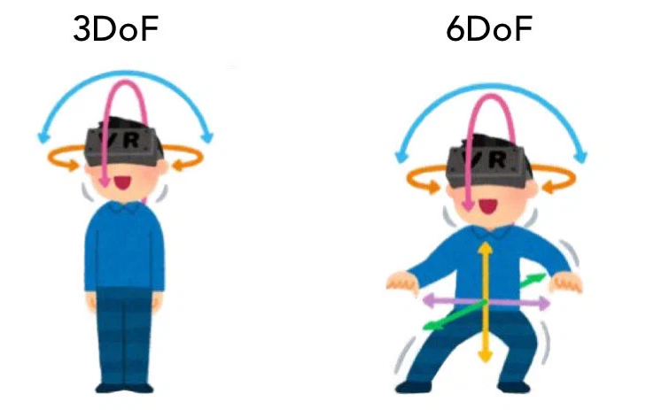
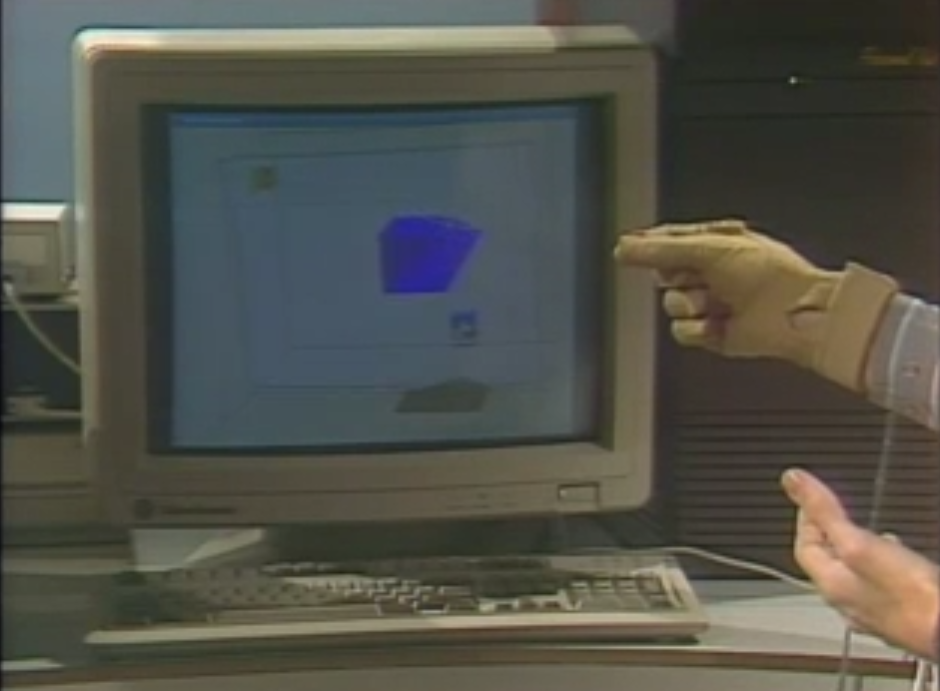
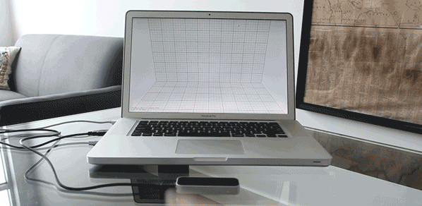
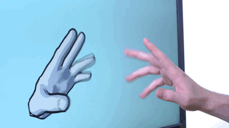
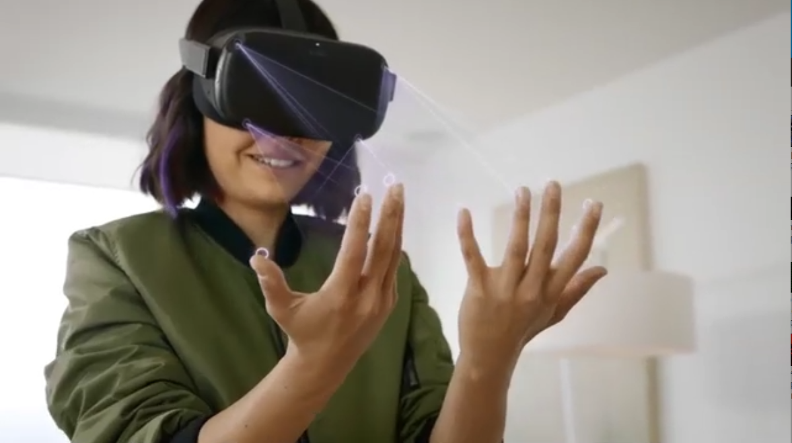
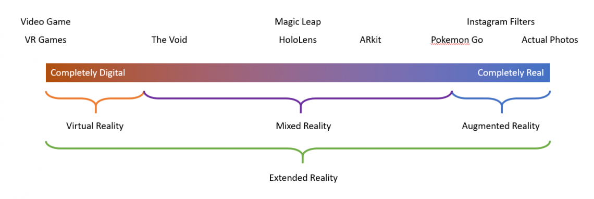

# WebVR Review
## Off Into Cyberspace

In this tutorial we'll review all the major concepts from the previous tutorials as well as ways to write our code more efficiently using "mixins". We'll also take a look at the latest VR headsets and peripherals as well as where to go to continue learning about WebVR.

## Virtual Reality

As we discussed in the intro to cyberspace tutorial, virtual reality has been around a long time, years even decades depending on when you start the clock, but VR has never been more accessible than it is today.

This is due in part to cheaper consumer hardware as well as the fact that we can now create virtual reality experiences on the World Wide Web using WebXR. XR stands for "miXed or eXtended reality" which includes everything from virtual reality (complete immersion in a virtual world) to augmented reality (overlaying a bit of the virtual world into our physical world).

Today it's being used in everything from <a href="https://www.youtube.com/watch?v=zGGVYT0cMHg" target="_blank">education</a>, to <a href="https://www.youtube.com/watch?v=mZStQT3o5xc&feature=youtu.be" target="_blank">surgical training</a>, as <a href="https://www.youtube.com/watch?v=GiJuPB7S2I4" target="_blank">evidence in court cases</a> and for <a href="https://youtu.be/sDc5lIj1VbY?t=731" target="_blank">physical therapy</a> and <a href="https://www.youtube.com/watch?v=GMttQHMjbJo" target="_blank">mental health</a>.

So it's no surprise that <a href="https://www.radiancevr.co/" target="_blank">artists</a> have been <a href="https://www.creativeapplications.net/?s=VR&submit=Search" target="_blank">experimenting</a> with VR as well.

As exciting as it all is, I would be remiss if I hadn't also mentioned some of the dangers discussed in one of the previous lessons.

Like so many other gadgets of our day, there are companies who see VR as yet another way to gather and monetize our data. New functionality, like <a href="https://www.wired.com/story/eye-tracking-vr/" target="_blank">eye tracking</a>, give tech companies yet another set of insights into our minds. As with all tech, it's important to keep a critical eye on the way VR effects society as it evolves.

That of course is only possible when you're wearing a VR headset... which at the moment you are not. This brings up a point we haven't yet discussed. How do we actually immerse ourselves in the digital world we've created? How do we <i>enter into</i> cyberspace?

Before I touch on that, let's recreate the scene from the first lesson by reviewing all the code concepts we've learned so far.

## Code Recap

Before we can use the <a href="https://aframe.io/docs/1.0.0/introduction/" target="_blank">A-Frame</a> library to create a virtual reality scene, we need to import the library into our project. We do this the same we import any other JavaScript library, by including a <code>&lt;script&gt;</code> with its <code>src</code> attribute pointing to library's location.

```html
<!DOCTYPE html>
<script src="https://aframe.io/releases/1.0.4/aframe.min.js"></script>
```

Once we've done that we can start using <a href="https://aframe.io/docs/1.0.0/introduction/" target="_blank">A-Frame</a>'s custom HTML elements, including the first and most important one <a href="https://aframe.io/docs/1.0.0/core/scene.html#sidebar" target="_blank">a-scene</a>.

```html
<!DOCTYPE html>
<script src="https://aframe.io/releases/1.0.4/aframe.min.js"></script>
<a-scene></a-scene>
```

We place all of our other <a href="https://aframe.io/docs/1.0.0/introduction/" target="_blank">A-Frame</a> elements between the opening and closing <a href="https://aframe.io/docs/1.0.0/core/scene.html#sidebar" target="_blank">a-scene</a> tags, including <a href="https://aframe.io/docs/1.0.0/primitives/a-sky.html#sidebar" target="_blank">a-sky</a> which we can use to create a background for our scene from an image.

```html
<!DOCTYPE html>
<script src="https://aframe.io/releases/1.0.4/aframe.min.js"></script>
<a-scene>
  <a-sky src="images/bg.jpg"></a-sky>
</a-scene>
```


We can use <a href="https://aframe.io/docs/1.0.0/core/entity.html" target="_blank">a-entity</a> to add objects and other entities to our scene. In this case we're creating a "plane" that's 6x6 meters, using our "tile.png" image as it's texture and setting it's opacity to 0.5 to make it partly transparent.


```html
<!DOCTYPE html>
<script src="https://aframe.io/releases/1.0.4/aframe.min.js"></script>
<a-scene>
  <a-sky src="images/bg.jpg"></a-sky>

  <a-entity id="floor"
    geometry="primitive: plane; width: 6; height: 6;"
    material="src: images/tile.png; opacity: 0.5"></a-entity>

</a-scene>
```

As I mentioned in the previous lesson, if the object is not placed in view of the camera we won't be able to see it. So we've either got to create an entity for our <a href="https://aframe.io/docs/1.0.0/primitives/a-camera.html#sidebar" target="_blank">camera</a> and adjust its position or we need to reposition our entity to place it in view. Here I've adjusted both it's <a href="https://aframe.io/docs/1.0.0/components/position.html#sidebar" target="_blank">position</a> and <a href="https://aframe.io/docs/1.0.0/components/rotation.html#sidebar" target="_blank">rotation</a>.

```html
<!DOCTYPE html>
<script src="https://aframe.io/releases/1.0.4/aframe.min.js"></script>
<a-scene>
  <a-sky src="images/bg.jpg"></a-sky>

  <a-entity id="floor"
    geometry="primitive: plane; width: 6; height: 6;"
    material="src: images/tile.png; opacity: 0.5"
    position="0 0 -4" rotation="-90 0 0"></a-entity>

</a-scene>
```

<a href="https://aframe.io/docs/1.0.0/introduction/" target="_blank">A-Frame</a> includes a few different built in <a href="https://aframe.io/docs/1.0.0/components/geometry.html#sidebar" target="_blank">geometries</a> for us to create entities from, but when we want to create an entity from our own 3D model we need to preload that file using the <a href="https://aframe.io/docs/1.0.0/core/asset-management-system.html#sidebar" target="_blank">asset management system</a>.

```html
<!DOCTYPE html>
<script src="https://aframe.io/releases/1.0.4/aframe.min.js"></script>
<a-scene>
  <a-assets>
    <!-- all assets get preloaded in here -->
  </a-assets>

  <a-sky src="images/bg.jpg"></a-sky>

  <a-entity id="floor"
    geometry="primitive: plane; width: 6; height: 6;"
    material="src: images/tile.png; opacity: 0.5"
    position="0 0 -4" rotation="-90 0 0"></a-entity>

</a-scene>
```

We'll start by loading our <code>QueenPalmTree.obj</code> file using the <a href="" target="_blank">a-asset-item</a> element. We'll also give that element an <code>id</code> so that we can reference in our next step.

```html
<!DOCTYPE html>
<script src="https://aframe.io/releases/1.0.4/aframe.min.js"></script>
<a-scene>
  <a-assets>
    <a-asset-item id="palm-obj" src="models/QueenPalmTree.obj"></a-asset-item>
  </a-assets>

  <a-sky src="images/bg.jpg"></a-sky>

  <a-entity id="floor"
    geometry="primitive: plane; width: 6; height: 6;"
    material="src: images/tile.png; opacity: 0.5"
    position="0 0 -4" rotation="-90 0 0"></a-entity>

</a-scene>
```

Now we can create an entity in our scene that loads that palm tree model referencing the asset by the id we assigned. Notice that I also gave it a custom <code>material</code>, changing it's default color and style, as well as specific position, rotation and scale values.

```html
<!DOCTYPE html>
<script src="https://aframe.io/releases/1.0.4/aframe.min.js"></script>
<a-scene>
  <a-assets>
    <a-asset-item id="palm-obj" src="models/QueenPalmTree.obj"></a-asset-item>
  </a-assets>

  <a-sky src="images/bg.jpg"></a-sky>

  <a-entity id="floor"
    geometry="primitive: plane; width: 6; height: 6;"
    material="src: images/tile.png; opacity: 0.5"
    position="0 0 -4" rotation="-90 0 0"></a-entity>

  <a-entity
    obj-model="obj: #palm-obj"
    material="color: #c76ebc; wireframe: true;"
    position="-0.62 0 -3.7"
    rotation="21 -64 -7"
    scale="0.18 0.18 0.18"></a-entity>

</a-scene>
```

We can reuse this asset as many times as we want. Now I've added a second element referencing the same asset id, but this time with different position and scale values.

```html
<!DOCTYPE html>
<script src="https://aframe.io/releases/1.0.4/aframe.min.js"></script>
<a-scene>
  <a-assets>
    <a-asset-item id="palm-obj" src="models/QueenPalmTree.obj"></a-asset-item>
  </a-assets>

  <a-sky src="images/bg.jpg"></a-sky>

  <a-entity id="floor"
    geometry="primitive: plane; width: 6; height: 6;"
    material="src: images/tile.png; opacity: 0.5"
    position="0 0 -4" rotation="-90 0 0"></a-entity>

  <a-entity
    obj-model="obj: #palm-obj"
    material="color: #c76ebc; wireframe: true;"
    position="-0.62 0 -3.7"
    rotation="21 -64 -7"
    scale="0.18 0.18 0.18"></a-entity>

  <a-entity
    obj-model="obj: #palm-obj"
    material="color: #c76ebc; wireframe: true;"
    position="-0.47 0 -3.9"
    scale="0.25 0.25 0.25"></a-entity>

</a-scene>
```

Let's load up some other models. Here I've added another obj to the asset manager and created a new entity in our scene for it.

```html
<!DOCTYPE html>
<script src="https://aframe.io/releases/1.0.4/aframe.min.js"></script>
<a-scene>
  <a-assets>
    <a-asset-item id="palm-obj" src="models/QueenPalmTree.obj"></a-asset-item>
    <a-asset-item id="bust1" src="models/bust1.obj"></a-asset-item>
  </a-assets>

  <a-sky src="images/bg.jpg"></a-sky>

  <a-entity
    obj-model="obj: #bust1"
    material="color: #e7e5c9; opacity: 0.7"
    position="0.63 0 -2.38"
    rotation="0 -59 0"
    scale="0.1 0.1 0.1"></a-entity>

  <a-entity
    obj-model="obj: #palm-obj"
    material="color: #c76ebc; wireframe: true;"
    position="-0.47 0 -3.9"
    scale="0.25 0.25 0.25"></a-entity>

  <a-entity
    obj-model="obj: #palm-obj"
    material="color: #c76ebc; wireframe: true;"
    position="-0.62 0 -3.7"
    rotation="21 -64 -7"
    scale="0.18 0.18 0.18"></a-entity>

  <a-entity
    obj-model="obj: #palm-obj"
    material="color: #c76ebc; wireframe: true;"
    position="-0.47 0 -3.9"
    scale="0.25 0.25 0.25"></a-entity>

  <a-entity id="floor"
    geometry="primitive: plane; width: 6; height: 6;"
    material="src: images/tile.png; opacity: 0.5"
    position="0 0 -4" rotation="-90 0 0"></a-entity>

</a-scene>
```

If we wanted to animate that entity we can use the <a href="https://aframe.io/docs/1.0.0/components/animation.html#sidebar" target="_blank">animation</a> component to specify exactly how we want that object to animate.

```html
<!DOCTYPE html>
<script src="https://aframe.io/releases/1.0.4/aframe.min.js"></script>
<a-scene>
  <a-assets>
    <a-asset-item id="palm-obj" src="models/QueenPalmTree.obj"></a-asset-item>
    <a-asset-item id="bust1" src="models/bust1.obj"></a-asset-item>
  </a-assets>

  <a-sky src="images/bg.jpg"></a-sky>

  <a-entity
    animation="property: position; to: 0.63 0.1 -2.38;
      dir: alternate; dur: 2000; easing: easeInOutQuad; loop: true;"
    obj-model="obj: #bust1"
    material="color: #e7e5c9; opacity: 0.7"
    position="0.63 0 -2.38"
    rotation="0 -59 0"
    scale="0.1 0.1 0.1"></a-entity>

  <a-entity
    obj-model="obj: #palm-obj"
    material="color: #c76ebc; wireframe: true;"
    position="-0.47 0 -3.9"
    scale="0.25 0.25 0.25"></a-entity>

  <a-entity
    obj-model="obj: #palm-obj"
    material="color: #c76ebc; wireframe: true;"
    position="-0.62 0 -3.7"
    rotation="21 -64 -7"
    scale="0.18 0.18 0.18"></a-entity>

  <a-entity
    obj-model="obj: #palm-obj"
    material="color: #c76ebc; wireframe: true;"
    position="-0.47 0 -3.9"
    scale="0.25 0.25 0.25"></a-entity>

  <a-entity id="floor"
    geometry="primitive: plane; width: 6; height: 6;"
    material="src: images/tile.png; opacity: 0.5"
    position="0 0 -4" rotation="-90 0 0"></a-entity>

</a-scene>
```

Now I've loaded up another model in the asset manager and created a new entity for it.

```html
<!DOCTYPE html>
<script src="https://aframe.io/releases/1.0.4/aframe.min.js"></script>
<a-scene>
  <a-assets>
    <a-asset-item id="palm-obj" src="models/QueenPalmTree.obj"></a-asset-item>
    <a-asset-item id="bust1" src="models/bust1.obj"></a-asset-item>
    <a-asset-item id="bust2" src="models/bust2.obj"></a-asset-item>
  </a-assets>

  <a-sky src="images/bg.jpg"></a-sky>

  <a-entity
    animation="property: position; to: 0.63 0.1 -2.38;
      dir: alternate; dur: 2000; easing: easeInOutQuad; loop: true;"
    obj-model="obj: #bust1"
    material="color: #e7e5c9; opacity: 0.7"
    position="0.63 0 -2.38"
    rotation="0 -59 0"
    scale="0.1 0.1 0.1"></a-entity>

  <a-entity
    animation="property: position; to: 0.63 0.1 -2.38;
      dir: alternate; dur: 2200; easing: easeInOutQuad; loop: true;"
    obj-model="obj: #bust2"
    material="color: #e7e5c9; opacity: 0.7"
    position="0.63 0 -2.38"
    rotation="0 -59 0"
    scale="0.1 0.1 0.1"></a-entity>

  <a-entity
    obj-model="obj: #palm-obj"
    material="color: #c76ebc; wireframe: true;"
    position="-0.47 0 -3.9"
    scale="0.25 0.25 0.25"></a-entity>

  <a-entity
    obj-model="obj: #palm-obj"
    material="color: #c76ebc; wireframe: true;"
    position="-0.62 0 -3.7"
    rotation="21 -64 -7"
    scale="0.18 0.18 0.18"></a-entity>

  <a-entity
    obj-model="obj: #palm-obj"
    material="color: #c76ebc; wireframe: true;"
    position="-0.47 0 -3.9"
    scale="0.25 0.25 0.25"></a-entity>

  <a-entity id="floor"
    geometry="primitive: plane; width: 6; height: 6;"
    material="src: images/tile.png; opacity: 0.5"
    position="0 0 -4" rotation="-90 0 0"></a-entity>

</a-scene>
```

## Cleaner Code Using Mixins

Though the <code>animation</code> and <code>obj-model</code> values are different for this new entity, it shares the same exact <code>material</code>, <code>position</code>, <code>rotation</code> and <code>scale</code> values as the last one.

I want to add two more models to finish out this "bust" which will also share the same exact <code>material</code>, <code>position</code>, <code>rotation</code> and <code>scale</code> values. This means we're going to have a lot of repetitive or redundant code.

In order to minimize code redundancy, <a href="https://aframe.io/docs/1.0.0/introduction/" target="_blank">A-Frame</a> includes the <a href="https://aframe.io/docs/1.0.0/core/mixins.html#sidebar" target="_blank">a-mixin</a> component. Notice that I've added this element to our asset manager and given it an id of "bust".

```html
<!DOCTYPE html>
<script src="https://aframe.io/releases/1.0.4/aframe.min.js"></script>
<a-scene>
  <a-assets>
    <a-asset-item id="palm-obj" src="models/QueenPalmTree.obj"></a-asset-item>
    <a-asset-item id="bust1" src="models/bust1.obj"></a-asset-item>
    <a-asset-item id="bust2" src="models/bust2.obj"></a-asset-item>
    <a-mixin id="bust"></a-mixin>
  </a-assets>

  <a-sky src="images/bg.jpg"></a-sky>

  <a-entity
    animation="property: position; to: 0.63 0.1 -2.38;
      dir: alternate; dur: 2000; easing: easeInOutQuad; loop: true;"
    obj-model="obj: #bust1"
    material="color: #e7e5c9; opacity: 0.7"
    position="0.63 0 -2.38"
    rotation="0 -59 0"
    scale="0.1 0.1 0.1"></a-entity>

  <a-entity
    animation="property: position; to: 0.63 0.1 -2.38;
      dir: alternate; dur: 2200; easing: easeInOutQuad; loop: true;"
    obj-model="obj: #bust2"
    material="color: #e7e5c9; opacity: 0.7"
    position="0.63 0 -2.38"
    rotation="0 -59 0"
    scale="0.1 0.1 0.1"></a-entity>

  <a-entity
    obj-model="obj: #palm-obj"
    material="color: #c76ebc; wireframe: true;"
    position="-0.47 0 -3.9"
    scale="0.25 0.25 0.25"></a-entity>

  <a-entity
    obj-model="obj: #palm-obj"
    material="color: #c76ebc; wireframe: true;"
    position="-0.62 0 -3.7"
    rotation="21 -64 -7"
    scale="0.18 0.18 0.18"></a-entity>

  <a-entity
    obj-model="obj: #palm-obj"
    material="color: #c76ebc; wireframe: true;"
    position="-0.47 0 -3.9"
    scale="0.25 0.25 0.25"></a-entity>

  <a-entity id="floor"
    geometry="primitive: plane; width: 6; height: 6;"
    material="src: images/tile.png; opacity: 0.5"
    position="0 0 -4" rotation="-90 0 0"></a-entity>

</a-scene>
```

We can place components in our <a href="https://aframe.io/docs/1.0.0/core/mixins.html#sidebar" target="_blank">a-mixin</a> that we want to reuse across multiple entities.

For example, here I've added those <code>material</code>, <code>position</code>, <code>rotation</code> and <code>scale</code> values being used on both our bust entities.

```html
<!DOCTYPE html>
<script src="https://aframe.io/releases/1.0.4/aframe.min.js"></script>
<a-scene>
  <a-assets>
    <a-asset-item id="palm-obj" src="models/QueenPalmTree.obj"></a-asset-item>
    <a-asset-item id="bust1" src="models/bust1.obj"></a-asset-item>
    <a-asset-item id="bust2" src="models/bust2.obj"></a-asset-item>
    <a-mixin id="bust" material="color: #e7e5c9; opacity: 0.7" position="0.63 0 -2.38" rotation="0 -59 0" scale="0.1 0.1 0.1"></a-mixin>
  </a-assets>

  <a-sky src="images/bg.jpg"></a-sky>

  <a-entity
    animation="property: position; to: 0.63 0.1 -2.38;
      dir: alternate; dur: 2000; easing: easeInOutQuad; loop: true;"
    obj-model="obj: #bust1"
    material="color: #e7e5c9; opacity: 0.7"
    position="0.63 0 -2.38"
    rotation="0 -59 0"
    scale="0.1 0.1 0.1"></a-entity>

  <a-entity
    animation="property: position; to: 0.63 0.1 -2.38;
      dir: alternate; dur: 2200; easing: easeInOutQuad; loop: true;"
    obj-model="obj: #bust2"
    material="color: #e7e5c9; opacity: 0.7"
    position="0.63 0 -2.38"
    rotation="0 -59 0"
    scale="0.1 0.1 0.1"></a-entity>

  <a-entity
    obj-model="obj: #palm-obj"
    material="color: #c76ebc; wireframe: true;"
    position="-0.47 0 -3.9"
    scale="0.25 0.25 0.25"></a-entity>

  <a-entity
    obj-model="obj: #palm-obj"
    material="color: #c76ebc; wireframe: true;"
    position="-0.62 0 -3.7"
    rotation="21 -64 -7"
    scale="0.18 0.18 0.18"></a-entity>

  <a-entity
    obj-model="obj: #palm-obj"
    material="color: #c76ebc; wireframe: true;"
    position="-0.47 0 -3.9"
    scale="0.25 0.25 0.25"></a-entity>

  <a-entity id="floor"
    geometry="primitive: plane; width: 6; height: 6;"
    material="src: images/tile.png; opacity: 0.5"
    position="0 0 -4" rotation="-90 0 0"></a-entity>

</a-scene>
```

Which means we can now remove those components from our entities and instead use the <code>mixin</code> component to reference the <code>id</code> of our new <a href="https://aframe.io/docs/1.0.0/core/mixins.html#sidebar" target="_blank">a-mixin</a> and A-Frame will do the rest for us, applying all the components in our mixin to those two entities.

```html
<!DOCTYPE html>
<script src="https://aframe.io/releases/1.0.4/aframe.min.js"></script>
<a-scene>
  <a-assets>
    <a-asset-item id="palm-obj" src="models/QueenPalmTree.obj"></a-asset-item>
    <a-asset-item id="bust1" src="models/bust1.obj"></a-asset-item>
    <a-asset-item id="bust2" src="models/bust2.obj"></a-asset-item>
    <a-mixin id="bust" material="color: #e7e5c9; opacity: 0.7" position="0.63 0 -2.38" rotation="0 -59 0" scale="0.1 0.1 0.1"></a-mixin>
  </a-assets>

  <a-sky src="images/bg.jpg"></a-sky>

  <a-entity
    animation="property: position; to: 0.63 0.1 -2.38;
      dir: alternate; dur: 2000; easing: easeInOutQuad; loop: true;"
    obj-model="obj: #bust1"
    mixin="bust"></a-entity>

  <a-entity
    animation="property: position; to: 0.63 0.1 -2.38;
      dir: alternate; dur: 2200; easing: easeInOutQuad; loop: true;"
    obj-model="obj: #bust2"
    mixin="bust"></a-entity>

  <a-entity
    obj-model="obj: #palm-obj"
    material="color: #c76ebc; wireframe: true;"
    position="-0.47 0 -3.9"
    scale="0.25 0.25 0.25"></a-entity>

  <a-entity
    obj-model="obj: #palm-obj"
    material="color: #c76ebc; wireframe: true;"
    position="-0.62 0 -3.7"
    rotation="21 -64 -7"
    scale="0.18 0.18 0.18"></a-entity>

  <a-entity
    obj-model="obj: #palm-obj"
    material="color: #c76ebc; wireframe: true;"
    position="-0.47 0 -3.9"
    scale="0.25 0.25 0.25"></a-entity>

  <a-entity id="floor"
    geometry="primitive: plane; width: 6; height: 6;"
    material="src: images/tile.png; opacity: 0.5"
    position="0 0 -4" rotation="-90 0 0"></a-entity>

</a-scene>
```

This will drastically reduce the amount of code we have to write when we add the next two pieces of our bust.

First I'll load those two other obj files using the asset manager.

```html
<!DOCTYPE html>
<script src="https://aframe.io/releases/1.0.4/aframe.min.js"></script>
<a-scene>
  <a-assets>
    <a-asset-item id="palm-obj" src="models/QueenPalmTree.obj"></a-asset-item>
    <a-asset-item id="bust1" src="models/bust1.obj"></a-asset-item>
    <a-asset-item id="bust2" src="models/bust2.obj"></a-asset-item>
    <a-asset-item id="bust3" src="models/bust3.obj"></a-asset-item>
    <a-asset-item id="bust4" src="models/bust4.obj"></a-asset-item>
    <a-mixin id="bust" material="color: #e7e5c9; opacity: 0.7" position="0.63 0 -2.38" rotation="0 -59 0" scale="0.1 0.1 0.1"></a-mixin>
  </a-assets>

  <a-sky src="images/bg.jpg"></a-sky>

  <a-entity
    animation="property: position; to: 0.63 0.1 -2.38;
      dir: alternate; dur: 2000; easing: easeInOutQuad; loop: true;"
    obj-model="obj: #bust1"
    mixin="bust"></a-entity>

  <a-entity
    animation="property: position; to: 0.63 0.1 -2.38;
      dir: alternate; dur: 2200; easing: easeInOutQuad; loop: true;"
    obj-model="obj: #bust2"
    mixin="bust"></a-entity>

  <a-entity
    obj-model="obj: #palm-obj"
    material="color: #c76ebc; wireframe: true;"
    position="-0.47 0 -3.9"
    scale="0.25 0.25 0.25"></a-entity>

  <a-entity
    obj-model="obj: #palm-obj"
    material="color: #c76ebc; wireframe: true;"
    position="-0.62 0 -3.7"
    rotation="21 -64 -7"
    scale="0.18 0.18 0.18"></a-entity>

  <a-entity
    obj-model="obj: #palm-obj"
    material="color: #c76ebc; wireframe: true;"
    position="-0.47 0 -3.9"
    scale="0.25 0.25 0.25"></a-entity>

  <a-entity id="floor"
    geometry="primitive: plane; width: 6; height: 6;"
    material="src: images/tile.png; opacity: 0.5"
    position="0 0 -4" rotation="-90 0 0"></a-entity>

</a-scene>
```

And now I'll add two new entities for these new models, both using the same mixin.

```html
<!DOCTYPE html>
<script src="https://aframe.io/releases/1.0.4/aframe.min.js"></script>
<a-scene>
  <a-assets>
    <a-asset-item id="palm-obj" src="models/QueenPalmTree.obj"></a-asset-item>
    <a-asset-item id="bust1" src="models/bust1.obj"></a-asset-item>
    <a-asset-item id="bust2" src="models/bust2.obj"></a-asset-item>
    <a-asset-item id="bust3" src="models/bust3.obj"></a-asset-item>
    <a-asset-item id="bust4" src="models/bust4.obj"></a-asset-item>
    <a-mixin id="bust" material="color: #e7e5c9; opacity: 0.7" position="0.63 0 -2.38" rotation="0 -59 0" scale="0.1 0.1 0.1"></a-mixin>
  </a-assets>

  <a-sky src="images/bg.jpg"></a-sky>

  <a-entity
    animation="property: position; to: 0.63 0.1 -2.38;
      dir: alternate; dur: 2000; easing: easeInOutQuad; loop: true;"
    obj-model="obj: #bust1"
    mixin="bust"></a-entity>

  <a-entity
    animation="property: position; to: 0.63 0.1 -2.38;
      dir: alternate; dur: 2200; easing: easeInOutQuad; loop: true;"
    obj-model="obj: #bust2"
    mixin="bust"></a-entity>

  <a-entity
    animation="property: position; to: 0.63 0.1 -2.38;
      dir: alternate; dur: 2400; easing: easeInOutQuad; loop: true;"
    obj-model="obj: #bust3"
    mixin="bust"></a-entity>

  <a-entity
    obj-model="obj: #bust4"
    mixin="bust"></a-entity>

  <a-entity
    obj-model="obj: #palm-obj"
    material="color: #c76ebc; wireframe: true;"
    position="-0.47 0 -3.9"
    scale="0.25 0.25 0.25"></a-entity>

  <a-entity
    obj-model="obj: #palm-obj"
    material="color: #c76ebc; wireframe: true;"
    position="-0.62 0 -3.7"
    rotation="21 -64 -7"
    scale="0.18 0.18 0.18"></a-entity>

  <a-entity
    obj-model="obj: #palm-obj"
    material="color: #c76ebc; wireframe: true;"
    position="-0.47 0 -3.9"
    scale="0.25 0.25 0.25"></a-entity>

  <a-entity id="floor"
    geometry="primitive: plane; width: 6; height: 6;"
    material="src: images/tile.png; opacity: 0.5"
    position="0 0 -4" rotation="-90 0 0"></a-entity>

</a-scene>
```

We've now recreated the scene from the first lesson using everything we've learned up to this point!

## VR Devices

I'll now return to the question I posed at the start of this lesson, how do we actually immerse ourselves in the digital world we've created? How do we <i>enter into</i> cyberspace?

There are a few different ways, but before we can "visit" our virtual world in VR we need it to exist on a server somewhere on the Web. As explained in previous lessons you can do this by saving your scene to your GitHub.

Once it's on GitHub I can ask them to "host" it for you by running the <b>shareLink()</b> function in my Functions Menu (which you can also find using my search). Once you do that I'll provide you with the URL to your sketch hosted on the GitHub servers.

You can of course host your project on any other server you prefer, the most important thing is that you need a Web address, or URL, for your publicly hosted project.

With that we can then "visit", or request a copy of, your project on a Web browser in any VR enabled device.

If you have a smartphone, you can turn it into a simple VR headset using <a href="https://arvr.google.com/cardboard/" target="_blank">Google Cardboard</a>. A-Frame will detect that you're on a mobile device and it will move the camera to match the orientation of your phone. So that the view updates accordingly as you "look around" with your phone.

Smart phones will only provide 3 degrees of freedom, or 3DOF. Meaning you can look around the scene, but you can't <i>move</i> around your scene.



If you want to be able to both look around and move around your virtual world, you'll need a VR headset that provides 6 degrees of freedom, or 6DOF. Something like the <a href="https://www.vive.com/us/" target="_blank">HTC Vive</a>, <a href="https://www.valvesoftware.com/en/index" target="_blank">Valve Index</a> or <a href="https://www.oculus.com/rift/" target="_blank">Oculus Rift</a>.

All those headsets require a computer with a decent graphics card on it to run properly. But there are also "stand alone" headsets which work on their own (the computer is built in) like the <a href="https://www.oculus.com/quest-2/" target="_blank">Oculus Quest</a> or the <a href="https://enterprise.vive.com/us/product/vive-focus/" target="_blank">HTC Focus</a>.

Of course, in order to have <i>full immersion</i>, it's not enough to simply move around inside your virtual world, we want to be able to interact with it as well!

This is why all of the aforementioned headsets include hand controllers. These controllers are also 6DOF, but Google also makes a 3DOF bluetooth device called the <a href="https://support.google.com/daydream/answer/7184597?hl=en" target="_blank">Daydream controller </a> which can be used with Google cardboard and other 3DOF headsets like the <a href="https://www.lenovo.com/us/en/VIRTUAL-REALITY-and-smart-devices/virtual-and-augmented-reality/lenovo-mirage-solo/Mirage-Solo/p/ZZIRZRHVR01" target="_blank">Lenovo Mirage</a>.

[](https://netnet.studio/api/videos/vr-today-vive.mp4)

In the 90s the most common type of VR controller were gloves. This allowed you to use all the various articulations of your fingers to interact with things in VR.

[](https://netnet.studio/api/videos/vr-glove.mp4)

Today devices like the <a href="https://developer.leapmotion.com/" target="_blank">LEAP motion</a> and even the Oculus Quest, use infrared technology to track our hands in virtual space without having to wear any gloves.





[](https://netnet.studio/api/videos/vr-today-quest.mp4)

But our <a href="https://aframe.io/docs/1.0.0/introduction/" target="_blank">A-Frame</a> projects won't include any sort of controller components by default. We'll need to add those as <a href="https://aframe.io/docs/1.0.0/introduction/interactions-and-controllers.html#vr-controllers" target="_blank">controls entities</a> ourselves. A-Frame includes built-in functionality for most all of the common controllers. Take a look at their documentation to learn how to implement the one you want.

## Whats Next?

Which brings me to my last point. We've only just begun to scratch the surface of what we can do with <a href="https://aframe.io/docs/1.0.0/introduction/" target="_blank">A-Frame</a>. I'd suggest taking a look at their documentation to get ideas for what else you can do with this library.

The A-Frame community is also constantly creating their own custom components which they share in the <a href="https://aframe.io/aframe-registry/" target="_blank">A-Frame Registry</a>. These are additional libraries you can add to your project to create <a href="https://github.com/supermedium/aframe-environment-component" target="_blank">entire environments</a>, <a href="https://www.npmjs.com/package/aframe-particle-system-component" target="_blank">particle systems</a> or introduce <a href="https://github.com/n5ro/aframe-physics-system" target="_blank">physics</a> and all sorts of other common functionality.

We've mostly been talking about VR, but as I mentioned before XR, or mixed/extended reality, is a spectrum with VR on one end and AR on the other. You can also use A-Frame to create AR projects using the <a href="https://github.com/chenzlabs/aframe-ar" target="_blank">A-Frame AR component</a>.



This is all possible because A-Frame is making use of the Web's WebXR API underneath which allows you to create virtual reality and augmented reality experiences in the browser.

A-Frame is itself built on top of another JavaScript library called <a href="https://threejs.org/" target="_blank">Three.js</a> which lets you create these sorts of scenes using JavaScript instead of HTML. Definitely check out that library as well if you're familiar with JavaScript.

That concludes our WebVR lesson! As you continue experimenting, keep in mind that virtual and augmented reality are developing technologies. So there's new devices, libraries and techniques coming out all the time! This is only the beginning!


## References

- [Paul, Christiane. Digital Art. Thames & Hudson. 2003.](http://www.immersence.com/publications/2003/2003-CPaul.html)

- [Virtual Reality, The Computer Chronicles. Stewart Cheifet Productions. 1992](https://archive.org/details/virtualreali)

- [Trench, Marianne. Cyberpunk. Intercon. 1990.](https://archive.org/details/cyberpunk_201410)

- [A-Frame.js, Open Source Library. <a href=\"https://github.com/ngokevin\" target=\"_blank\">Kevin Ngo</a>, <a href=\"https://github.com/dmarcos\" target=\"_blank\">Diego Marcos</a>, <a href=\"https://github.com/cvan\" target=\"_blank\">Christopher Robert Van Wiemeersch</a>, <a href=\"https://github.com/donmccurdy\" target=\"_blank\">Don McCurdy</a> and other <a href=\"https://github.com/aframevr/aframe/graphs/contributors\" target=\"_blank\">contributors</a>"](https://aframe.io/)
